# App测试

拿到一个项目一般是先测试单功能还是业务？  
——业务（先要确保基本功能能够走通）

- 怎么开展单功能测试？

    1. 熟悉需求：（核心）测试目的+条件
    2. 梳理测试点
    ◆ 功能（能不能）：
    ①显示：是否正常
    ②操作（含规则）：能否成功
    ◆ 非功能（后续单独测试）：
    ①APP专项：APP特有测试项（在不同设备上稳定运行）
    ②APP性能：APP对移动端设备的影响程度（稳定性、资源）
    3. 将测试点转化为测试用例
- 单模块测试步骤
    ① 熟悉需求
    ② 提取测试点、编写测试用例
    ③ 测试用例评审
    ④ 执行测试用例
    ⑤ 记录执行过程、登记跟进缺陷

## 一、App专项测试

### 专项测试范围

1.安装卸载升级
2.兼容性
3.push消息推送
4.交叉事件
5.用户体验

### 安装卸载升级

- 使用前：确保安装升级功能正常

#### 安装测试关注点

- 正常场景：
  - 来源：从不同的安装渠道安装（app商城，手机助手，直接下载apk）
  - 去向：在不同的操作系统版本上安装
  - 不同的安装路径（安装到手机上，安装到SD卡上）
  - 卸载后安装
  - 正在运行时覆盖安装
- 异常场景：
  - 安装时出现异常（关机、断网），恢复后能否继续安装
  - 安装时存储空间不足
  - 安装时手动取消后再次安装
  - 低版本覆盖安装高版本

#### 卸载测试关注点

- 正常卸载（app手动卸载，工具卸载）
- 运行时卸载
- 取消卸载
- 卸载异常中断
- 卸载后有无数据残留

#### 升级测试关注点

- 从临近版本升级
- 跨版本升级
- 不同渠道升级（应用商场、手机助手）
- 升级提醒成功（可不提醒、可以提示升级、强制升级）
- 应用内升级时非WIFI提醒
- 升级后要观察升级前的数据正常（当数据结构改变而开发没有处理好时很容易出现升级前的数据混乱）

### APP兼容性

测试范围：

- 手机型号
- 操作系统版本
- 分辨率屏幕尺寸
- 网络
- 应用兼容性

### Push消息测试

#### push消息推送设置

- APP服务器设置：
  - 推送内容
  - 推送时间
  - 推送频率
  - 推送人群
- 手机端设置
  - 通知权限
  - 消息接收设置
  - 消息显示设置

#### push消息测试关注点

- APP服务器设置测试点：
  - push消息是否按照指定业务规则发送
  - 当push消息针对特定用户时，检查收到的push与用户身份是否相等
- 手机端设置测试点
  - 通知权限是否按照设置生效
  - 消息接收设置是否按照设置生效
  - 消息显示设置是否按照设置生效
- 其他测试
  - app前台使用时，收到push消息是否会弹窗提示
  - app后台使用时，收到push消息是否会在通知栏显示
  - app被杀死后，收到push消息是否会在通知栏显示

### 交叉事件测试

#### 测试关注点

又叫（冲突、干扰）测试，是指一个功能正在执行过程中，另外一个事件或操作对该过程进行干扰的测试。
如：在App前台/后台运行同时接听来电或者下载文件等。

- 交叉事件测试关注点：
  - APP运行时接打电话；
  - APP运行时收发信息；
  - APP运行时查看应用推送
  - APP运行接上蓝牙设备
  - APP运行时接收文件弹窗提醒
  - APP运行时旋转屏幕
  - APP运行时切换网络（4G、Wi-Fi）；
  - App运行时使用相机、计算器等手机自带应用；
  - App运行时电量告警、插拔充电器。

### 用户体验测试

以主观的角度测试用户在使用App时的体验，包括但不限于：

- 界面是否友好、是否符合用户习惯
- 操作是否简单、是否容易上手
- 功能是否完善、是否满足用户需求
- 性能是否稳定、是否流畅
- 安全性是否高、是否保护用户隐私
- 关注手机的友好模式（老年模式，儿童模式）

## 二、APP性能测试

### 1.APP性能测试

- 通过**工具**或**命令**测试APP软件对于移动端硬件占用程度。
  - 工具：
    - **Android系统**：**solopi（开源）**、GT、PerfDog（收费）
    - **iOS系统**：Xcode开发者工具
    - **Harmony next系统**：DevEco Studio NEXT Developer、DevEco Testing Developer
  - 命令：
    - Android：adb命令

### 2.APP性能指标

- 软件运行原理图

  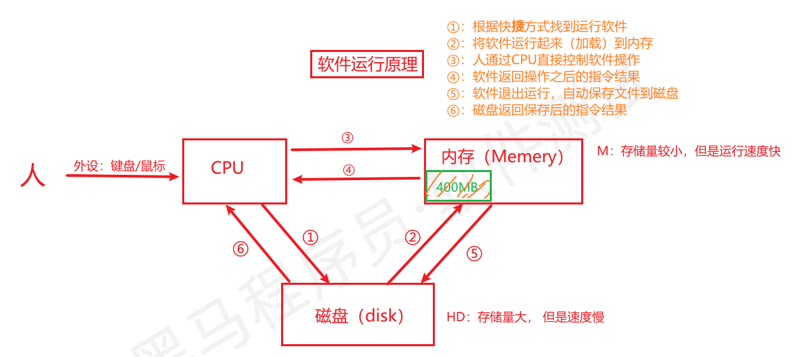

#### 2.1 内存测试

- 内存异常现象：闪退（crash）、内存长时间增高没有降低的趋势

  - 问题：内存泄露、内存溢出

- 使用APP，通过solopi的内存指标监控值

    > 1. 空间单位换算进率  （B：字节）
    >
    >    1GB=1024MB、1MB=1024KB、1KB=1024B
    >
    > 2. 模拟器总内存查看：设置中心--> 性能 --> 性能配置 【默认显示6GB】，总内存：6X1024MB=6144MB

  - 获取图表数据，看平均值（MB/s）

  - 结论：PSS变化趋势稳定在一个范围值【表示当前APP内存指标达标】

      ```yacas
      如下图测试后PSS平均值：87.16MB/s 
      结论：根据曲线图在87.16附近波动，没有持续的上升，退出程序时内存减少说明没有出现内存泄露问题，当前APP内存指标达标，测试通过。
      
      ```

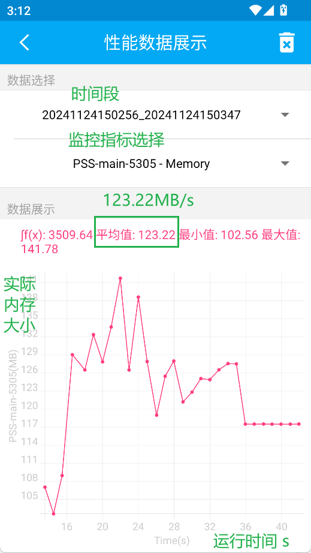

​

​

#### 2.2 CPU指标测试

- 异常现象：

  - CPU占比超高：超过80%
  - 设备发热、耗电量大
  - 程序运行慢、卡，程序出现ANR（无响应）

- 直接通过solopi查看运行APP之后**CPU占比平均值**，不超过80%达标

  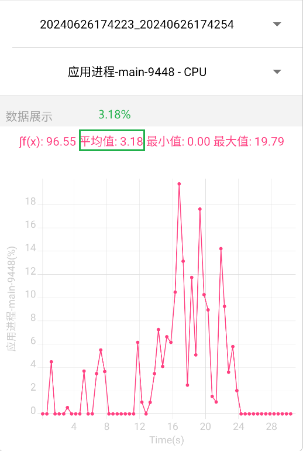

#### 2.3 流量指标测试

- 原则：希望APP运行过程中占用流量**越少越好**

  - 指标达标依据：和同行APP或者和自己过去版本比较是否有改进

  - 【扩展】流量优化策略

      > 面试：如何对APP流量测试指标给开发提出优化建议？

      ① 数据进行压缩（减少流量）

      ② 采用不同数据格式（减少流量）

      ③ 控制访问的频次

      ④ 运用缓存机制（主要文件缓存本地，减少实施获取）

      ⑤ 设置访问策略进行请求后台（WiFi网络、移动网络数据量变化）

  - 测试截图

      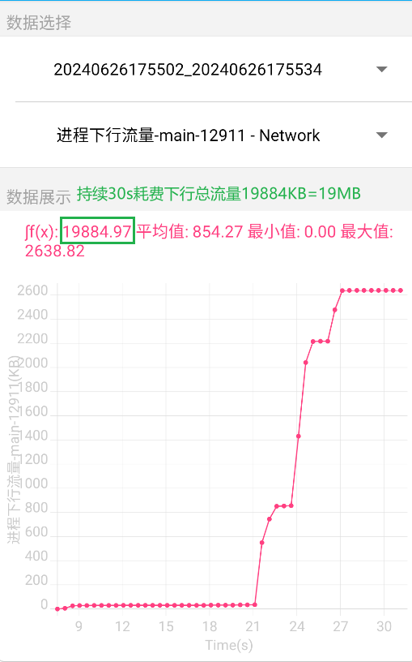

​

​

#### 2.4 电量测试

- 介绍：APP使用时，对电池电量的平均消耗程度

- 原则：APP使用耗电量**越少越好**

- 指标达标依据：和**同行（竞品）APP**或者和**自己过去版本比**（运营数据）是否有改进

- 电量优化策略

  > 面试：功耗过高如何优化？

  - APP定位仅使用时开启
  - 网络传输需要时传输（而非后台实施传输）
  - 屏幕亮度（根据需要自动调节）
  - 尽量不频繁唤醒屏幕/频繁的锁屏解锁

- 测试截图（solopi）

  > 电量测试：需要通过真机测试，模拟器不支持（模拟器没有电池）

  - 看一段时间内电量耗费程度（mW）

#### 2.5 流畅度测试

- 介绍：运行画面是否流畅（无卡顿/失真等）【主要针对游戏类、视频类APP】

- 原则：APP运行**越流畅越好**，需要通过FPS（24帧以上）体现，数值越大越流畅（FPS：60帧最佳）

- 测试截图（solopi：选游戏帧率）

  > 普通APP：静态页面较多，FPS数值低正常
  >
  > 特定APP：动态页面较多（游戏类、视频类等）FPS数值最少24帧

  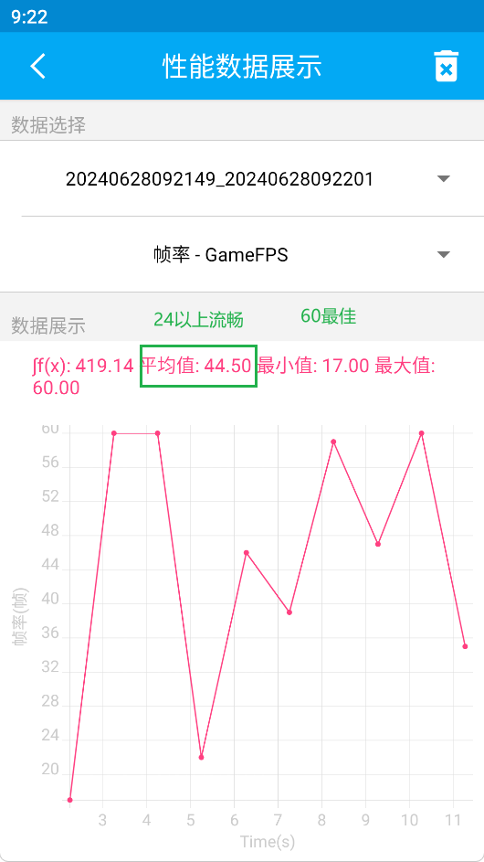

#### 2.6 启动速度测试

> APP响应快，用户的体验更好

- 介绍：从启动app到主页面加载完成的速度

- 分类

  - 冷启动：启动APP进程（进程未运行到运行）
  - 热启动：APP从后台切换到前台（进程运行中，页面从后台转前台）

- 原则：启动速度**越快越好**

- 指标达标依据：和**同行（竞品）APP**或者和**自己过去版本比**（运营数据）是否有改进

- 测试截图（solopi：启动耗时计算）

  ```yacas
  # 冷启动tpshopAPP时间大约为：4.7s左右
  # 热启动tpshopAPP时间大约为：2s左右
  注意：这里面有误差（有人操作占用时间）
  ```

  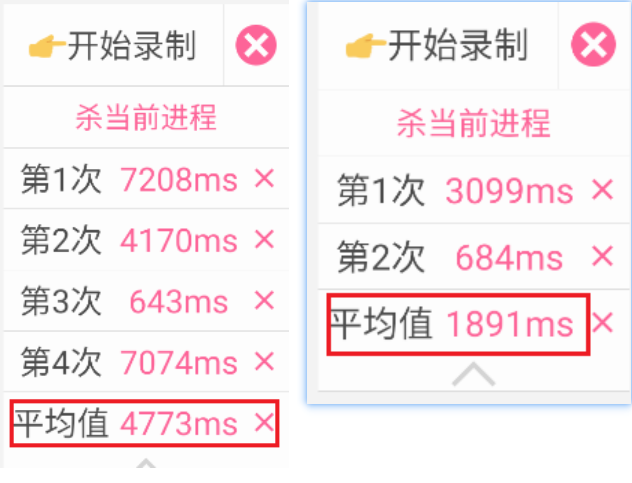

#### 2.7 稳定性测试

- 介绍：APP持久运行**不出现异常**问题【无：crash、ANR、卡顿、崩溃等】

- 测试方式

  - **命令行工具**：Android系统APP通过Android自带的monkey工具测试

  - 作用：模拟用户进行随机操作（触摸屏幕、滑动、 按键等）

  - 命令格式：`adb shell monkey -p 包名 -v 次数 > 日志文件.log`

    - 包名：任意APP唯一标记（类似于人的身份证号），一般按域名倒序命名【如：com.xxx.xxx】
    - 次数：模拟用户操作APP的次数（事件），一般是百万次数据量
    - 参数-v：表示日志详细程度。-v -v -v 最详细

  - 测试截图

    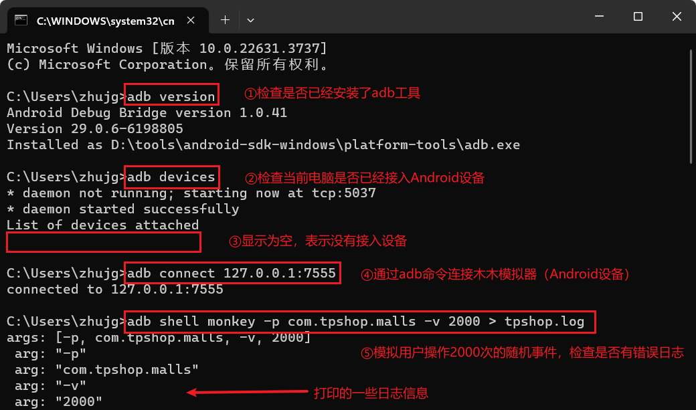

  - 测试结果：通过检查日志是否存在关键词【**CRASH，ANR,timeout,Exception,out leak,error**】，存在日志发APP开发并进一步确认是否是bug。

    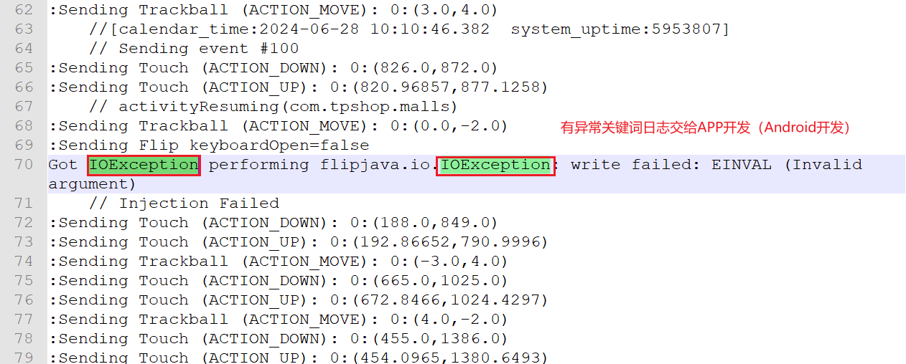

- 稳定性测试总结

  ```shell
  # 基础场景：随机3000次事件
  adb shell monkey -p com.tpshop.malls -v 3000 > d:\aaa\tpshop.log
  # 扩展场景：延迟0.5秒，忽略闪退和超时，执行2000次【总时长大约不超过18分钟】
  adb shell monkey -p com.tpshop.malls --throttle 500 --ignore-crashes --ignore-timeouts  -v 2000 > d:\aaa\tpshop.log
  ```
  
  > **面试场景题：**
  >
  > 1. APP稳定性测试目的是啥？—— 检查APP长时间运行是否出现异常【ANR、crash、timeout】
  > 2. 如何排查是否出现稳定性的问题？—— monkey运行后的日志中搜索关键词（ctrl+f）【ANR,timeout,Exception,out leak,error】，需要提交日志信息和Android开发确定是否是bug
  > 3. 一般一个APP稳定性测试多少次？—— 一般要求百万次以上（大约8小时左右），持续三轮以上。通过添加延迟参数 `--throttle 延迟毫秒`    `总时间（ms） = 延迟时间(ms/次) * 总次数`
  > 4. 如何确保monkey执行时，出现异常后，还能继续完成后续次数？—— 增加忽略闪退、忽略超时，让操作次数全部执行完毕 `--ignore-crashes  --ignore-timeouts`

## 三、adb命令

```yacas
# 介绍adb命令原因
1.命令使得测试更高效
2.应对面试
3.解决工具的能力边界
4.工具的操作本质还是调用命令
```

### 1.ADB介绍

- ADB（Android Debug Bridge）：Android调试桥，Android软件测试开发工作者常用的调试工具

- 应用场景：**安装卸载软件**、**管理安卓系统软件**、**启动测试**、**抓取操作日志**等【APP专项+稳定性】

- ADB环境：

  - 下载解压软件包

  - 配置环境变量

    > 作用：让软件/程序在任意路径下都能够启动运行（配置环境变量）
    >
    > 构成：三部分
    >
    > - adb 客户端
    > - adb 服务端
    > - adb daemon(系统自带守护程序)
    >
    > 注意：
    >
    > 1. daemon程序在Android手机/模拟器中自带
    > 2. 还可以连接真机（Android手机--用数据线，手机需要开启开发者模式）

  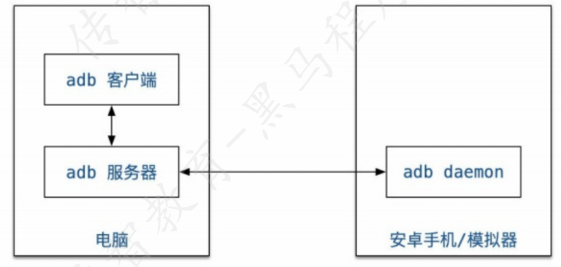

### 2.ADB常用命令

#### 2.1 连接设备及状态检查

- 检查接入的设备
`adb devices`

- 接入设备状态不正常（offline）
  1.重启模拟器/手机
  2.重启ADB服务
`adb kill-server`
`adb start-server`

- 连接设备
`adb connect IP:端口`

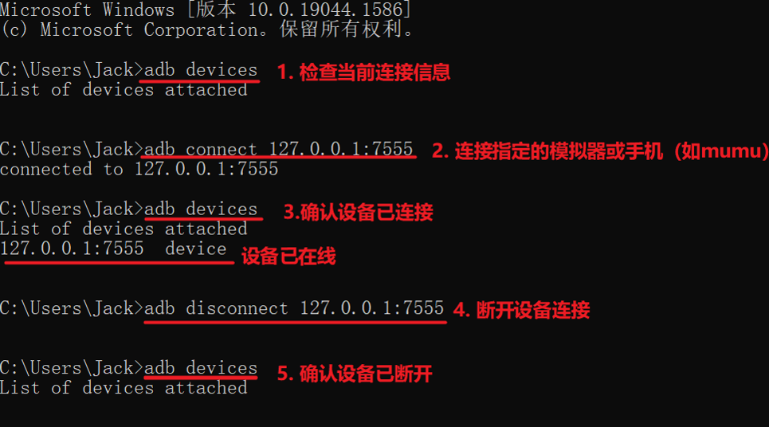

#### 2.2 adb安装卸载APP

> **场景：**测试Android设备过多，建议使用adb命令安装更高效
>
> **面试：**
>
> 1. adb安装APP软件和卸载APP软件有啥区别？
>    - 关键不一样，安装install，卸载uninstall
>    - 安装和卸载跟的内容不一样，卸载后跟包名

- 安装：`adb install apk路径`

- 卸载：`adb uninstall 包名`

  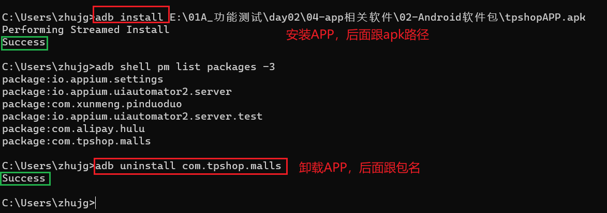

#### 2.3 查看安装的APP软件包

- 查看第三方软件包：`adb shell pm list packages -3`

- 查看正在打开软件包（和页面名Activity）：

  > 场景：为后续启动测试查看包名和页面名做准备
  
  - windows：`adb shell dumpsys window | findstr mCurrentFocus`
  - mac/Linux：`adb shell dumpsys window | grep mCurrentFocus`
  
  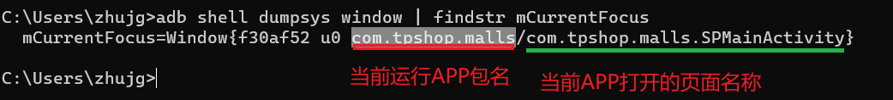

#### 2.4 app的启动和停用

> 场景：模拟人启动/停用APP
>
> 注意：
>
> - 启动：需要知道包名和页面名（注意是APP的**启动页**,不是进入的首页）
> - 停用：只需要知道包名即可

- 启动：`adb shell am start 包名/页面名`

- 停用：`adb shell am force-stop 包名`

    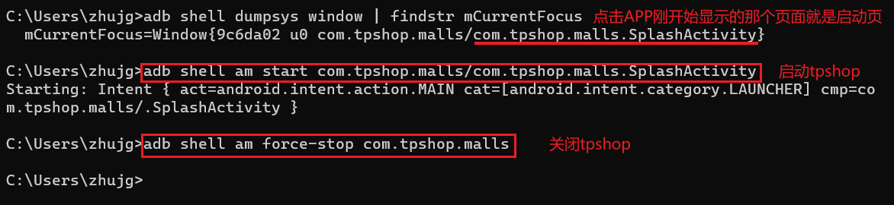

- 模拟APP启动测试

  - 启动：`adb shell am start -W -S -R 次数 包名/页面名`

    - -W：显示启动时间，主要看：TotalTime
    - -S：启动前先关闭程序进程
    - -R：后面跟重复测试的次数

  - 测试结果

      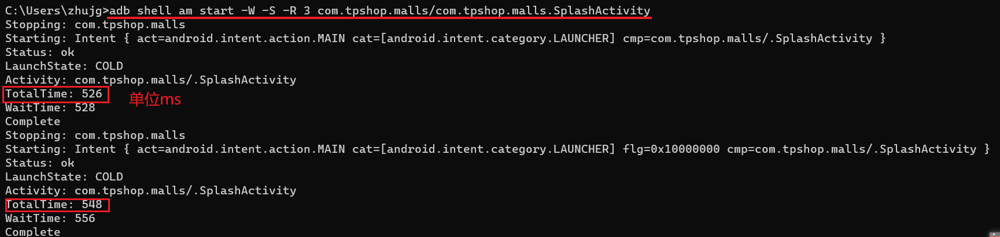

#### 2.5 查看APP端日志

> 面试场景：
>
> 1. 针对APP类型项目，测试过程中出现了不可复现的bug时，最好提前通过adb logcat打开日志并记录
> 2. 最好将日志重定向到指定的文件中，通过搜索关键词查询时间段/日志内容，提交开发进行进一步确认是否是bug
> 3. 日志内容包含：操作系统的日志和APP应用的日志

- 命令格式：`adb logcat > 日志文件名.log`
- 注意：强制结束用 `ctrl+c`


#### 2.6 文件上传下载

> 场景：如何将电脑文件传到手机/模拟器上；或者把手机/模拟器文件传到电脑上
>
> 注意：下载文件到电脑时，需要指定文件夹，否则可能会报错

- 上传：电脑文件上传手机 `adb push 电脑路径 手机路径`

- 下载：手机文件下载电脑  `adb pull 手机路径 电脑路径`

  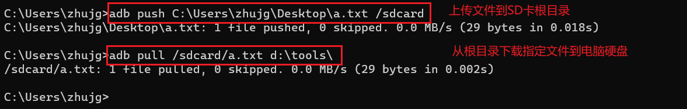

#### 2.7 内存查看

> 场景：获取正在运行的app占用内存比例

- 查看格式：`adb shell dumpsys meminfo 包名`

  - 如果不写包名：能看到设备总内存【Total RAM】

    

  - 带包名：能看到当前app实际使用的内存（total pss）

  - 计算：当前app占用内存% = Total PSS/总内存 *100%

    ```yacas
    如下截图：
    Tpshop的app内存占比= Total PSS / Total RAM = 82069/6093056 * 100% = 1.3%
    ```

    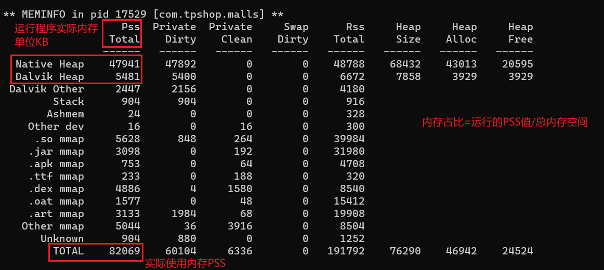

#### 2.8 查看CPU信息

> 场景：获取正在运行的app占用CPU比例（动态查看CPU及内存占用情况）

- 查看格式：`adb shell top`

- 说明：能够动态实时查看CPU及内存占比

  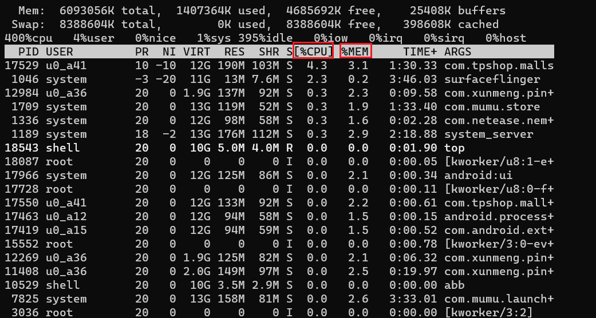

#### 拓展

- `adb shell dumpsys`：查询所有的系统服务相关信息
- ① 查看系统内存情况： `adb shell dumpsys meminfo`
  - 查看某个程序占用内存情况： `adb shell dumpsys meminfo 包名`
- ② 查看CPU占用情况： `adb shell dumpsys cpuinfo | findstr 包名`
- ③ 获取设备总电量信息： `adb shell dumpsys battery`
- ④ 获取某应用程序流量
  - 查看应用程序进程ID(PID)： `adb shell ps | findstr 包名`
  - 查看应用程序耗费流量： `adb shell cat /proc/PID/net/dev` 【PID指上述获取的进程ID】
  - 查看应用程序耗费实时流量： `adb shell watch -n xx cat /proc/PID/net/dev` 【每隔xx秒获取PID对应app的流量，单位为Byte】
- ⑤ 查看流畅度： `adb shell dumpsys gfxinfo 包名 | findstr "Janky frames"`

```txt
  注意事项：
  需要手机开启"GPU呈现模式分析"
  通过查看Janky frams获取丢帧率（丢帧越多越卡），正常达到24帧以上肉眼感知不出
  卡顿（60帧最佳）
```

## 四、项目发布（互联网+）

- 敏捷开发（scrum）模型

  > 理念：小步快跑（大项目拆分小块，不同敏捷小组同步进行实施）
  >
  > 迭代周期：一般2周（10个工作日）
  >
  > - 三种角色
  >   - PO（产品负责人）、SM（项目经理）、DT（开发团队）
  > - 五种会议
  >   - 需求决策会（立项）
  >   - 需求计划/评审会议
  >   - 每日立会（15分钟左右）
  >   - 迭代发布会
  >   - 迭代回顾会

  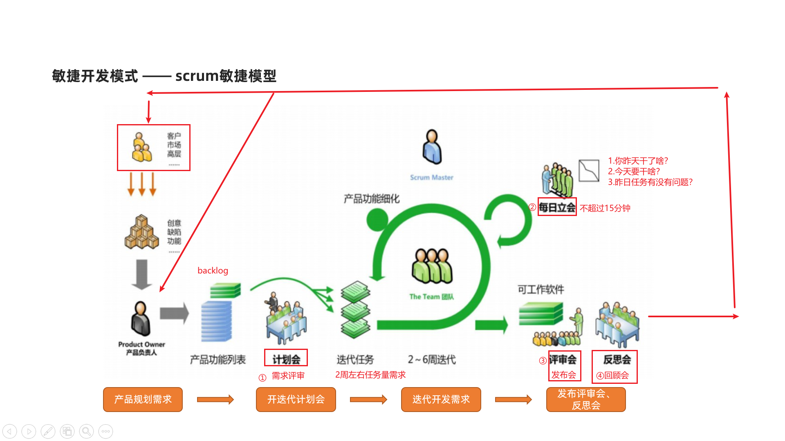

- **（服务器）上线前的发布策略：灰度发布**

  - 测试环境：

    - 本地测试环境
    - 预发布测试环境（测试团队完成整个系统测试后，准备上线前的最后一次测试）

  - 正式环境：（用户使用）

    > **面试题：**
    >
    > 1. 如何跟进项目的上线过程？
    >
    > 2. 项目上线的流程是啥？

    - 策略：灰度发布（预发布环境测试之后的版本发布上线的一种策略）

      ```yacas
      前提：一般项目中正式环境的服务器是一台还是多台？--> 多台
      1.先下线一部分服务器，更新新版本，在灰度环境下测试（第一次），测试没有问题然后再上线测试（第二次）
      2.同时将未更新的另一部分服务器下线
      3.测试已经上线后的新服务器（上线测试：新功能要测试+原有业务功能正常），测试需要提前上线使用的测试用例（选择正向优先级最高的）。
      4.如果测试没有问题，将下线的另一部分服务器更新后完成上线（第三次）
      5.如果第三步测试不通过，将新上线的服务器立即下线，然后恢复已下线旧服务器【回滚】
      6.排查问题【本次上线之后的问题，查日志（缓存问题）】
      ```

  - APP发布

    > 测试要求：发布之后，需要下载安装进行基本功能验证

    - Android版本：apk

    - iOS版本：ipa
