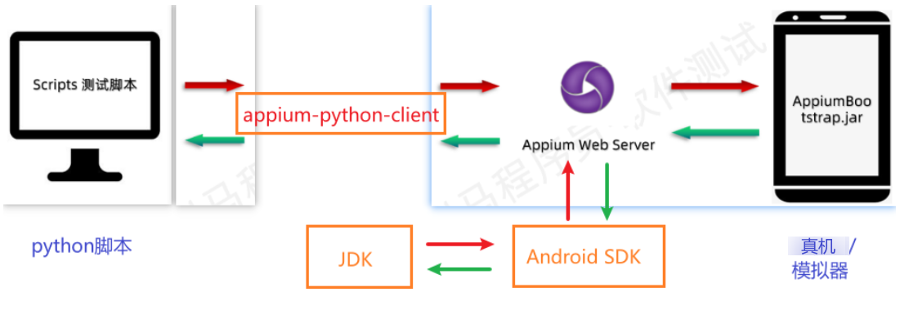
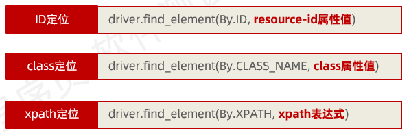
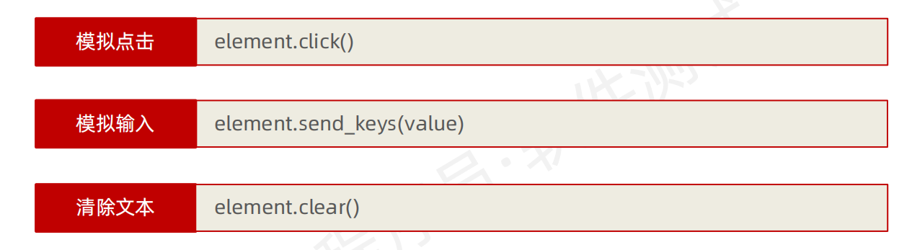

# Appium 移动端自动化测试

## 移动端自动化测试工具介绍
- Appium
    ⚫ 开源；
    ⚫ 支持Native App、Web App、Hybird App；
    ⚫ 支持Android、iOS；
    ⚫ Server也是跨平台的，你可以使用Mac OS X、Windows或者Linux；
    ⚫ 用Appium自动化测试不需要重新编译App；
    ⚫ 支持很多语言来编写测试脚本，Java、Javascript、PHP、Python、C#、
    Ruby等主流语言；


## 移动端测试

### 移动端环境搭建

```yacas
1.JDK：Java开发工具包，提供Java程序的开发及运行环境
2.Android SDK：提供Android开发相关的工具包（含adb、UIautomatorViewer），该工具包依赖于JDK
3.Appium Web Server：一个web服务器，为脚本客户端请求提供解析服务（API），转发给移动端设备
https://github.com/appium/appium-desktop/releases/tag/v1.22.3-4
4.appium-python-client：appium的python客户端，运行python脚本和Appium Server之间通信
5.python脚本：基于python解释器+pycharm的集成开发工具编写的自动化脚本
注意：详细搭建过程参考课堂资料docx文档
```



### 移动端自动化技术

- appium服务介绍

  ```yacas
  官方的文档:
  英文版:
  https://github.com/appium/appium/blob/1.x/docs/en/writing-running-appium/caps.md
  中文版:
  https://github.com/appium/appium/blob/1.x/docs/cn/writing-running-appium/caps.md
  ```

- 定位元素工具：`uiautomator viewer`

  ```yacas
  1.uiautomatorviewer是一个Android SDK自带的元素定位工具，它主要用于检查Android应用的UI布局和组件，以及相关的属性
  2.它通过截屏分析XML布局文件的方式，来展示应用的UI布局结构，并允许用户查看各个控件的相关属性
  3.在解压后的路径 ..\android-sdk-windows\tools 下，可以通过双击uiautomatorviewer.bat（Windows系统）或uiautomatorviewer（Mac/Linux系统）文件来启动该工具
  ```

  

- 定位元素方法

  ```python
  # 导包
  import time
  from appium import webdriver
  from appium.options.android import UiAutomator2Options
  # 配置设备信息
  des_caps = {
      "platformName": "Android",  # 平台名称，Android 或 iOS
      "deviceName": "mumu",  # 设备名称（可以随便写）
      "platformVersion": "12",  # 设备系统版本号
      "appPackage": "com.tpshop.malls",  # 待操作app包名
      "appActivity": ".SplashActivity"  # 启动页名称
  }
  # 实例化加载设备信息
  opt = UiAutomator2Options().load_capabilities(des_caps)
  # 实例化驱动对象
  driver = webdriver.Remote("http://127.0.0.1:4723/wd/hub", options=opt)
  # 等待5秒
  time.sleep(5)
  # 关闭驱动对象
  driver.quit()
  
  ```

  

- 常见定位元素方法

  - 通过UIautomator viewer 抓取App页面信息

    

  - 使用ID定位【对应界面的resource-id的值】

    ```python
    ```

    

### 移动端操作

- **项目**：完成tpshop商城app客户单下单业务流程自动化测试

- **常见API方法**

  - **swipe滑动**

    ```yacas
    driver.swipe(start_x, start_y, end_x, end_y, duration=0)
    start_x: 起点X轴坐标 
    start_y: 起点Y轴坐标 
    end_x: 终点X轴坐标 
    end_y: 终点Y轴坐标
    duration: 滑动这个操作一共持续的时间长度，单位:ms, 
    ```

  - 获取包名

    ```yacas
    # 检查设备是否连接
    adb devices
    # 手动连接mumu
    adb connect 127.0.0.1:7555
    # 查看当前运行app包名及Activity名
    windows下：adb shell dumpsys window | findstr mCurrentFocus
    macOS下：adb shell dumpsys window | grep mCurrentFocus
    ```


- APP元素定位方法

    - 导包：
    ```python
    from appium.webdriver.common.appiumby import AppiumBy
    ```
  

  - 按照ID定位

    ```yacas
    通过resource-id属性值定位，最常用
    ```

  - 按照CLASS定位

    ```yacas
    通过class属性值定位，会重复的概率比较高
    ```

  - 按照XPATH定位

    ```yacas
    属性值的构成：value = "//class的值[@属性名='属性值']"
    ```

  - 按照坐标定位

    ```yacas
    # 通过UiAutomatorViewer的bounds属性值[810,1785][1080,1905]  点击定位
    driver.tap([(810,1785),(1080,1905)],duration=0)
    # 注意：使用坐标时，如果分辨率发生了变化，就得重新获取坐标值
    ```
- app元素操作

    - click点击
    ```python
    driver.find_element(By.ID, "com.tpshop.malls:id/btn_login").click()
    ```
    - 输入
    ```python
    driver.find_element(By.ID, "com.tpshop.malls:id/et_login_account").send_keys("13000000000")
    ```
    - 清除
    ```python
    driver.find_element(By.ID, "com.tpshop.malls:id/et_login_account").clear()
    ```
    - tap点击
    ```python
    driver.tap([(810,1785),(1080,1905)],duration=0)
    ```
    至多支持5个坐标点，每个坐标点的格式为(x, y)，单位为像素，duration为点击持续时间，单位为毫秒


## 其他api方法
- 各类操作
```markdown
跳转应用：driver.start_activity(appPackage,appActivity)
获取包名：driver.current_package
获取界面名：driver.current_activity
关闭APP：driver.close_app()
关闭驱动：driver.quit()
安装app:driver.install_app(app_path)
卸载app:driver.remove_app(app_id)
判断app是否安装：driver.is_app_installed(app_id)
置于后台：background_app(seconds)
```
- 获取元素信息-文本、位置和大小
```markdown
ele.text  # 获取元素的文本内容
ele.location  # 获取元素的位置信息，返回一个元组 (x, y)
ele.size  # 获取元素的大小信息，返回一个元组 (width, height)
```
- 获取元素属性
```markdown
ele.get_attribute('属性名')  # 获取元素的属性值
```
注意：获取属性值对应的属性名和实际UIAutoMatorViewer
 显式的不一定一致！！！！
 如：
 元素的`class`属性在UIAutoMatorViewer中显示为`class`，而在代码中获取时使用的是`className`

- 截图
```python
driver.get_screenshot_as_file('截图保存路径.png')
```
- 获取手机网络
```python
driver.network_connection
```
- 发送键到设备
```python
driver.press_keycode(keycode)
```
- 操作通知栏
```python
driver.open_notifications() # 打开通知栏
```
- 拖拽
```python
driver.drag_and_drop(ele1, ele2)
```
    - origin_el：滑动开始的元素
    - destination_el： 滑动结束的元素


