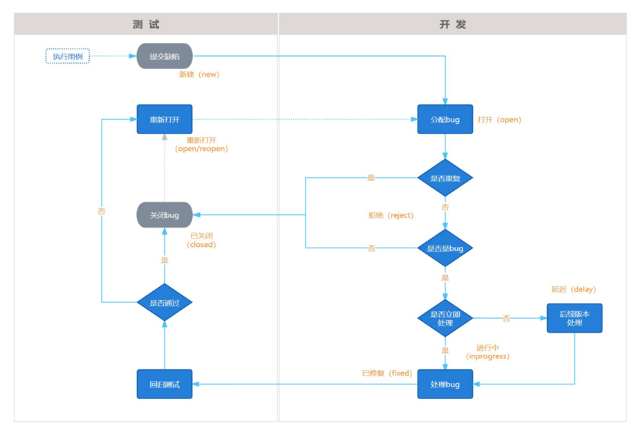
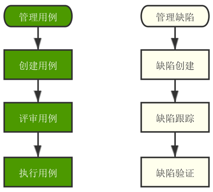

# 自动测试理论学习
## 基础知识
- 软件：控制计算机硬件的工具
- 软件系统构成：客户端+服务端+数据库
- 软件测试：用技术手段验证软件是否满足使用需求
- 软件测试目的：减少软件BUG，保障软件质量，降低软件潜在风险
- 主流技能：    
    - 功能测试
    - 自动化测试
    - 接口测试
    - 性能测试
### 软件测试分类：
- 按阶段划分：
    - 单元测试：针对程序源代码进行测试（开发）
    - 集成测试（接口测试技能）：又称组装测试，针对模块之间功能交互进行测试
    - 系统测试（功能测试技能）：对整个系统进行全面测试
    - 验收测试：以用户代表为主进行验证，是否符合预期需求（用户）
- 按代码可见度划分：
    - 黑盒测试：
        - 源代码不可见
        - UI功能可见
        - 只关注数据输入结果输出
    - 白盒测试：
        - 源代码可见
        - 代码逻辑可见
        - UI功能不可见
        - 只关注代码本身语法逻辑
    - 灰盒测试
        - 部分源代码可见
        - UI功能不可见
        - 输入输出+部分代码逻辑
    - 其他测试
        - 冒烟测试：对核心功能进行验证
            - 保障提测内容具有可测性
        ```mermaid
        graph LR
        A[开发编码] ---> B[自测]
        B ---> C[提测]
        C ---> D[冒烟测试]
        D ---> E[全面测试]
        E ---> F[软件测试]
        A ---> F
        D --->|不通过| A
        ```
        - 回归测试:对已修复的BUG/更新后的功能再次进行测试
            - 保障修复后的功能不影响其他功能
            - 保障修复后的功能符合需求
        ```mermaid
        graph LR
        A[开发编码] ---> B[软件测试]
        B ---> C[发现缺陷]
        C ---> D[开发修复]
        D ---> E[回归测试]
        E ---> F[结束]
        A ---> D
        E --->|不通过| D
        ```
### 质量模型：
- 功能性：软件是否具有某方面能力
- 性能：多用户同时使用能否满足要求（时间，资源）
- 兼容性：在不同设备/平台上能否正常使用
- 易用性：易学易用，用户粘性好
- 安全性：敏感数据存储/传输安全
- 可靠性：长时间运行稳定，不出现异常
- 可维护性：代码质量好，文档完善
- 可移植性：在不同平台上运行稳定
### 测试流程
- 需求评审
- 测试计划设计
- 测试用例设计
- 测试用例执行
- 缺陷管理
- 测试报告  
## **测试用例设计**
- 测试用例：用户使用的案例
- 为了特定的目的编写的可执行文档
- 写测试用例的目的：
    - 防止漏测
    - 实施测试的标准
    - 测试人员工作量化的体现
### 测试用例编写格式说明(八要素)：
- 用例编号：项目_模块_编号(英文简称)
- 用例标题：预期结果(测试点)
- 模块/项目：所属项目或模块
- 优先级：表示用例的重要程度或者影响力p0-p4(p0最高)
- 前置条件：要执行此条测试用例，有哪些前置操作，没有可以不写(没有它无法进行)
- 测试步骤：描述操作步骤(怎么做的过程)
- 测试数据：操作的数据，没有可以为空
- 预期结果：期望达到的结果
### 如何编写测试用例：
- 明确测试目的
- 基于需求覆盖各种可能场景
- 根据用例模板编写对应文档
### 测试用例设计方法（针对黑盒测试）：
- 等价类划分
- 边界值分析
- 判断表法
- 场景法
- 错误推断法
### **等价类划分法**：
- 适用场景：针对有批量数据测试的场景，无法穷举测试时可以使用
- 页面功能常常包括以下元素：
    - 输入框（典型代表）
    - 下拉列表
    - 单选复选框
- 等价类：在所有测试数据中，按具有某种**共同特征**的数据集合进行划分
    - 有效等价类：满足需求的数据集合 --> (全部满足)
    - 无效等价类：不满足需求的数据集合 --> (只要有一个不满足即可)
- 步骤
    - 1.明确需求 --> 搞清楚测试目的和条件
    - 2.划分有效和无效等价类 --> 有效  无效
    - 3.提取数据编写测试用例 --> 选择不同类里面一组数据写用例
- 通过选取不同等价类中的代表性案例，就可以实现对测试用例的覆盖
- 选取无效案例时，确保只有一个条件不满足，多个条件不满足没有意义
### **边界值分析法**：
- 适用场景：针对有边界范围的批量测试无法穷举时，数据的输入场景（重点在边界）
- 范围节点：
    - 上点：边界上的点（刚好等于）
    - 离点：举例上点最近的点（刚好大于，刚好小于）
    - 内点：区间范围内的点（区间范围内的数据）
- 步骤：
    - 明确需求（测试目的+测试条件）
    - 确定有效和无效等价类
    - 确定边界范围值（和步骤2合并）
    - 提取数据编写测试用例
- 可以和等价类划分法结合使用
- 范围优化：
    - 结论：7个点优化成5个点
    - 上点，内点必选
    - 离点：根据范围区间开闭，选择开内闭外，即开区间选择内部的离点，闭区间选择外部的离点
    - 可以说是上点和离点的属性是相反的，上点有效时，离点无效；上点无效时，离点有效
### **判定表法**
- 定义：是一种以表格形式表达多条件逻辑判断的工具
- 组成：
    - 条件桩：列出问题中的所有条件，列出条件的次序无关紧要。 
    - 动作桩：列出问题中可能采取的操作（可以有多个），操作的排列顺序没有约束。 
    - 条件项：列出条件对应的取值，所有可能情况下的真假值。 
    - 动作项：列出条件项的、各种取值情况下应该采取的动作结果。
- 规则：
    - 判定表中贯穿条件项和动作项的一列就是一条规则 
    - 假设有n个条件，每个条件的取值有两个(0,1)，全组合有2的n次方种规则
- 步骤：
    - 明确需求
    - 画出判断表：
        - 列出条件桩和动作桩
        - 填写条件项，对条件进行全组合
        - 根据条件项的组合确定动作项
    - 根据规则编写测试用例
- 适用场景：
    - 有多个输入条件，多个输出结果，输入条件之间有组合关系，输入条件和输出结果之间有依赖(制约/因果)关系
    - 适用条件个数不宜过多（不超过4个，如果超过建议使用因果图法）
### **场景法(流程图法)**
- 说明：场景法也可以叫流程图法，是用流程图描述用户的使用场景，然后通过覆盖流程路径来设计测试用例
- 适用场景：
    - 根据用户正常使用的各种业务场景（功能组合），验证产品是否满足需求的过程
    - 一般开发提测之后，先进行业务流程测试
- 使用步骤：
    - 根据流程图找出路径（多少条）
    - 根据路径编写用例（每条路径对应一条用例）
### **错误推测法**
- 通过经验/智慧推测系统可能出现的问题
- 一般遵循2/8原则，即80%的问题源于20%的模块（已经出现过问题的模块）
- 适用场景：
    - 时间紧迫：时间紧张且任务量大时，根据之前项目类似经验找出易出错的模块重点测试 
    - 时间宽裕：通过该方法列出之前出现问题较多的模块再次测试1
## 软件的缺陷及管理
- 定义：软件在使用过程中存在的任何异常问题都叫软件的缺陷，简称bug
- 缺陷判断标准：
    - 软件未实现需求(规格)说明书中明确要求的功能 –> 少功能
    - 软件实现的功能超出需求(规格)说明书指明的范围 –> 多功能
    - 软件出现了需求(规格)说明书中指明不应该出现的错误 –> 功能错误
    - 软件未实现需求(规格)说明书中虽未明确指明但应该实现的要求 –> 隐性功能错误
    - 软件难以理解，不易使用，运行缓慢，用户体验不好 –> 不易使用
- 缺陷原因分析：
    - 需求分析问题：需求描述不易理解，有歧义、错误等
    - 设计问题：设计文档存在错误或者缺陷
    - 编码问题：代码出现错误
    - 运行阶段：软硬件系统本身故障导致软件缺陷
- 缺陷的生命周期：缺陷注入、缺陷发现、缺陷清除
### 缺陷报告的构成和编写
- 【前置】用例执行步骤
    - 待测用例：准备待测试用例，最后添加一列执行结果
    - 待测软件：开发提测后，运行待测软件
    - 判断结果：判断实际结果是否和预期一致，一致测试通过（pass），不一致（fail）提交缺陷报告
- 缺陷构成的核心要素：
    - 缺陷的标题：
        - 描述缺陷的核心问题
        - 测试条件+实际结果（预期结果）
    - 缺陷的预置条件：
        - 缺陷产生的前提
        - 和用例预置条件一致
    - 缺陷的复现步骤：
        - 复现缺陷的过程
        - 测试步骤+测试数据
    - 缺陷的预期结果
        - 希望得到的结果
        - 和用例预期结果一致
    - 缺陷的实际结果
        - 实际得到的结果
        - 和用例预期结果不一致
    - 缺陷的必要附件
        - 图片，日志等信息（证据）
        - 可选项
- 缺陷的其他要素
    - 缺陷报告编号：
        - 缺陷的唯一性标志
        - 根据工具自动生成
    - 严重程度：(破坏程度：主要给产品，开发看)
        - 严重（S1）：主功能
        - 一般（S2）：次要功能
        - 微小（S3）：易用性、界面
        - 建议（S4）：建议性问题
    - 缺陷优先级：(严重程度，主要给开发看)
        - P0:2小时内修复
        - p1:24小时内修复
        - p2:3~5天内修复
        - p3:当前版本修复
        - p4:未来版本修复
    - bug问题：
        - 功能问题（代码错误、设计缺陷、数据）
        - 兼容性问题、性能问题、易用性问题
        - 其他问题（UI界面、架构等）
    - 缺陷状态：(缺陷的生命周期)
        - New:新建
        - Open:打开
        - Closed:关闭
        - Postponed:延期
        - Reopened:重新打开
### 缺陷管理
- 面试官提问：
    - 你是如何处理缺陷的？
    - 测试和开发是如何交互的？
- 缺陷跟踪流程：
    - 目的：搞清楚工作中如何跟开发协同处理bug，直到bug修复完成（关闭）
    
- 缺陷报告编写规范
    - 准确性：描述的信息是正确的
    - 简洁易懂：描述的简单易理解
    - 具体：有细节且是真实有效的
    - 次序清晰：描述缺陷的过程有条件，有先后顺序
- 注意事项
    - 可复现：缺陷可以复现
    - 唯一性；一个缺陷上报一个问题
    - 规范性：符合公司或者项目规范
- bug不可复现怎么办？
    - 从严重级出发，严重级别低，可以暂时不考虑（后续尝试复现）；级别高，需要分析排查
    - 思考自己的测试过程，是否和设计步骤，思考测试环境
    - 寻求协助：测试老员工，开发协助（记录出现问题的时间，查询对应时段的日志，分析日志） 
    - 如果没有日志，需要开发给一个有调试日志的版本，后续连续跟踪三个版本后，再未复现，此时放弃
    - 后续版本再次出现，直接转/提正式bug，详细描述你的复现过程
- 不可复现的bug如何处理？
    - 由内到外：替换+排除+外援
### 缺陷管理工具
- 主流：
    - 国内：禅道（部分免费）
    - 国外：JIRA（收费）
- 其他：
    - QC,TAPD,PingCode,Bugzilla...
- 禅道介绍：
    - 特点：
        - 国产、免费、开源、简单、轻量级
        - 三管融合(产品管理、项目管理、质量管理)
- 使用流程：

## 项目实战
### 如何展开测试
- 需求评审
    - 看懂理解，达成一致
    - 找出重点，预估时间
    - 谁主导 -->产品经理（评审会）
    - 谁参与 --> 产品，开发测试
    - 评审目的 --> 
        - 对于需求的理解一致
        - 找重点，预估时间
- 编写测试计划
    - 预估重点时间
    - 谁写？测试负责人
    - 写什么？时间范围方法资源
- 用例编写
    - 提取测试点+质量模型+用例设计方法
    - 基于分析编写用例
- 用例执行
    - 用例准备，添加执行结果
    - 缺陷管理，提交BUG
- 缺陷管理
    - 跟踪缺陷管理
- 测试报告
    - 测试完成标志
    - 谁写？每个人都写，最后由一人汇总
    - 写什么？过程记录【用例数，BUG数，资源】
    - 自动化后可由代码生成测试报告