# 接口测试

- 什么是接口测试？
    - 基于不同的输入参数，校验接口响应数据与预期数据是否一致
    - 接口：系统之间数据交互的通道
    - 硬件接口
    - 软件接口
- 为什么要学接口测试？
    - 提前介入测试、尽早发现问题
    - 中级测试工程师必备技能
- 接口测试学什么？
    - 接口测试用例设计
    - 工具实现接口测试
    - 代码实现接口测试

## 基于项目学习接口测试

### 项目背景
```markdown
项目名称：客达天下
项目类型：销售管理系统（CRM）
项目特点：
    ① 前后端分离
    ② 功能通用性强
项目地址：
http://kdtx-test.itheima.net/
账号：admin
密码：HM_2023_test
```
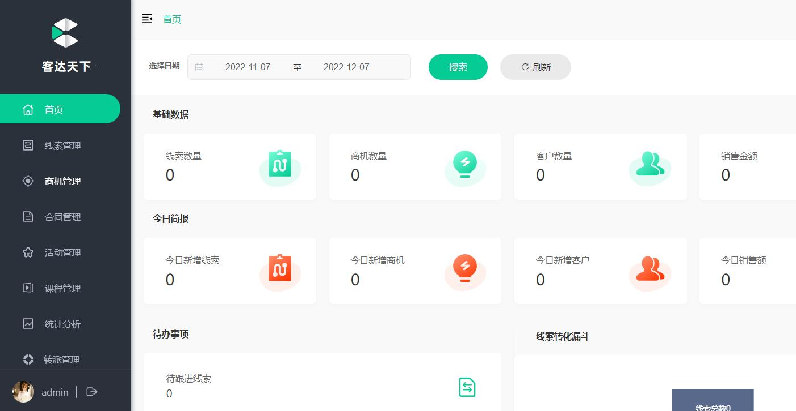

### 熟悉项目

- 项目角色：销售人员、销售经理、财务人员等
- 项目业务：线索管理、合同管理等
- 项目技术：
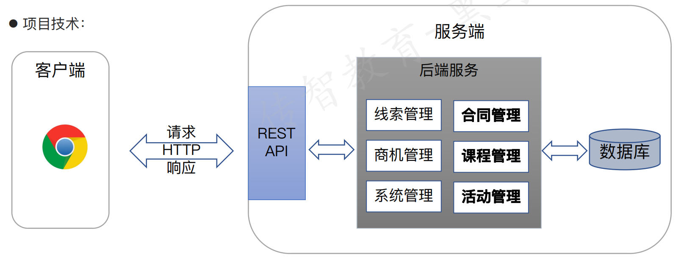

### 接口测试流程
- 测试流程
    1. 接口文档分析
    2. 设计测试用例
    3. 脚本开发
    4. 执行脚本
    5. 缺陷跟踪
    6. 测试报告

- 测试工程师视角：
    1. 接口用例设计；测试点转测试用例
    2. 冒烟测试（接口调试）
    3. 接口测试（正向+逆向）
    4. 接口回归（自动化）
    5. 缺陷管理
    6. 测试报告吧 

## 协议
### URL
- URL：是互联网上标准资源的地址，一般称为统一资源定位符
- 组成：协议 :// hostname[:port] / path / [? 查询参数1 & 查询参数2]
- 示例：    
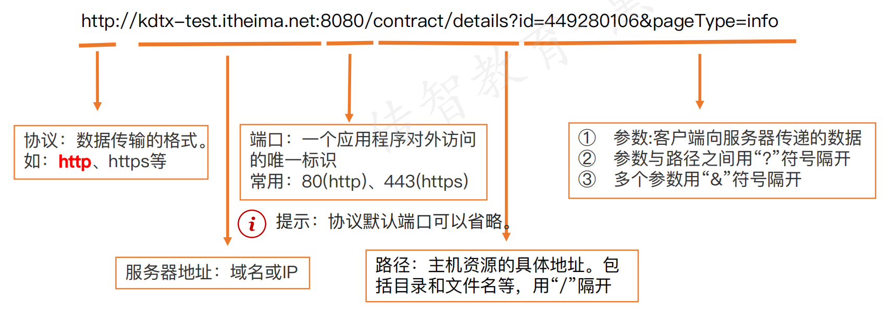

### HTTP协议
- HTTP：超文本传输协议，基于请求与响应的应用层协议
- 作用：规定了客户端与服务器之间信息传递规范，是二者共同遵守的协议
- 组成：
    - HTTP请求：定义请求数据格式
        - 请求行、请求头、请求体
    - HTTP响应：定义响应数据格式
        - 状态行、响应头、响应体
#### HTTP请求-请求行
- 位置：请求数据第一行
- 作用：说明请求方法、访问的资源、协议版本
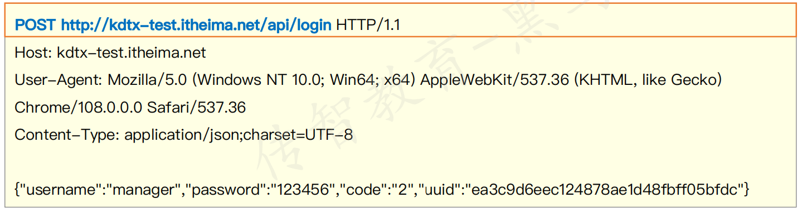
- 常用请求方法：
    - `GET`：从服务器获取资源
    - `POST`：从服务器提交数据
    - `PUT`：从服务器更新资源
    - `DELETE`：从服务器删除资源

#### HTTP请求-请求头
- 位置：请求数据第二行到空白行之间
- 作用：通知服务器客户端请求信息
- 特点：请求头部由键值对组成，每行一对
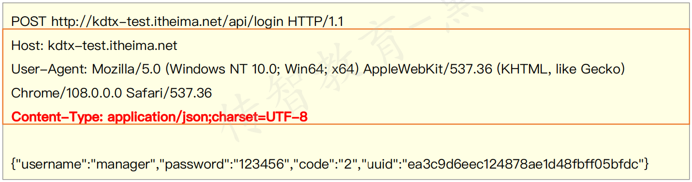
- Content-Type：请求体数据类型
    - text/html：HTML格式
    - image/jpeg：jpg图片格式
    - application/json：JSON数据格式
    - application/x-www-form-urlencoded: 表单默认的提交数据格式
    - multipart/form-data：在表单中进行文件上传时使用

#### HTTP请求-请求体
- 位置：空白行之后的内容
- 作用：传输数据实体
- 【注意】：请求体常在POST、PUT方法中使用
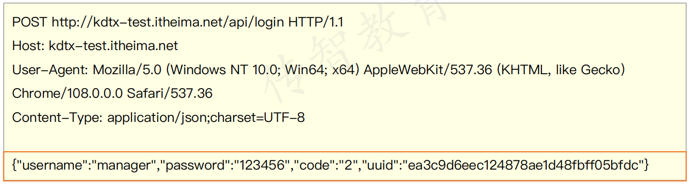
- 请求报文中可以没有请求体数据

#### HTTP响应
- HTTP响应：服务器接收到客户端请求后，返回给客户端的信息
- 组成：状态行、响应头、响应体

#### HTTP响应-状态行
- 位置：响应数据的第一行
- 作用：描述服务器处理结果
- 内容: 状态行由协议版本号、状态码、状态消息组成
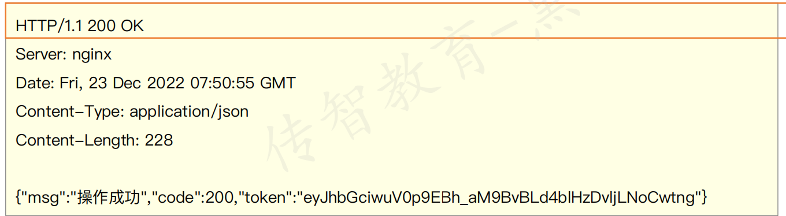
- 响应状态码：
  - 2xx：成功,如200、201
  - 3xx：重定向,如301、302
  - 4xx：客户端错误,如404（未找到）、400（请求错误）、401（未授权）、403（禁止访问）
  - 5xx：服务器错误,如500、502
  - 一般客户端出问题，状态码以4开头；服务器端出问题，状态码以5开头
- 常见响应码：
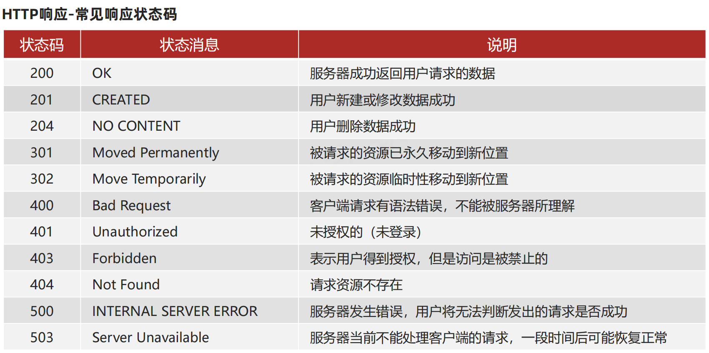

#### HTTP响应-响应头
- 位置：第二行开始到空白行之间
- 作用：描述客户端要使用的一些附加信息
- 特点: 响应头由键值对组成，每行一对
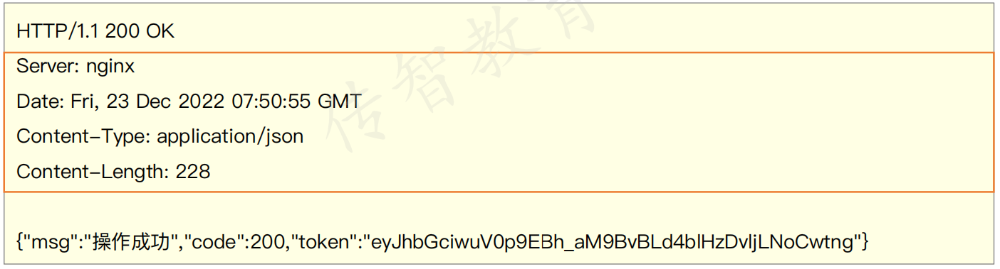

#### HTTP响应-响应体
- 位置：响应数据空白行之后
- 作用：服务器返回的数据实体
- 特点: 有图片、json、xml、html等多种类型
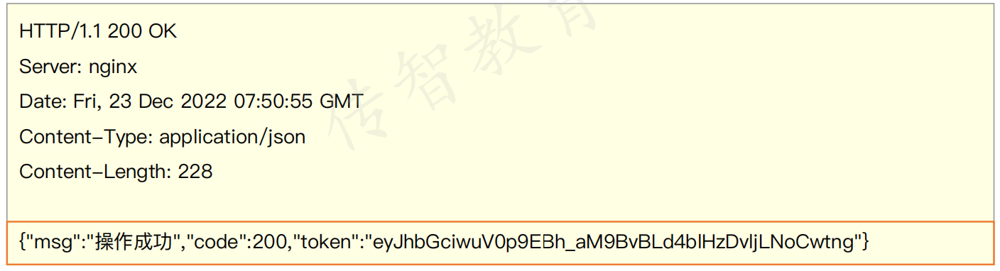

## 接口

### 接口规范
- 作用：让前端开发与后台接口开发人员更好的配合，提高工作效率
- 常见接口规范：`RESTful`接口风格
#### RESTful接口风格
- 作用：一种网络应用程序的设计风格和开发方式，提供了一组设计原则和约束条件
- 示例：
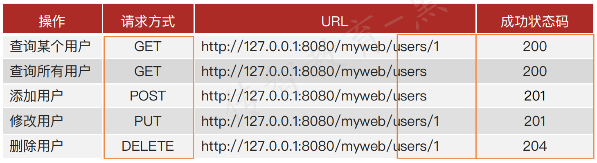
- 特点：
    - 请求 API 的 URL 用来定位资源
    - 通过标准HTTP方法对资源进行增删改查操作
    - 利用HTTP状态码返回状态信息

## JSON数据格式
- 是什么：
    - JSON的全称是”JavaScript Object Notation”，JavaScript对象表示法，它是一种基于文本，独立于语言的轻量级数据交换格式
- 作用：一种轻量级的数据交换格式，易于阅读和编写，同时也易于机器解析和生成
- 特点：
    - 数据结构简单，易于理解和使用
    - 数据格式紧凑，占用空间小
    - 支持数组、对象、字符串、数字、布尔值和null等数据类型
- 语法规则：
    - {}大括号保存对象
    - 数据采用键值对表示
    - 多个数据由逗号分隔
    - JSON键 必须是字符串类型, 必须使用英文双引号
    - JSON值 可以是以下类型：
        - 数字(整数或浮点数)
        - 字符串(使用双引号)
        - 逻辑值(true 和 false)
        - 数组 -> []
        - 对象 -> {}
        - 空值: null
- 示例：
```json
{
    "name": "张三",
    "age": 18,
    "gender": "男",
    "hobby": ["篮球", "足球", "跑步"],
    "address": {
        "province": "北京",
        "city": "北京",
        "district": "东城区"
    }
}
```
## 接口测试流程
- 接口用例设计与评审
- 接口调试
- 接口测试
- 回归测试
- 缺陷跟踪
- 测试总结 

### 提取测试点
#### 接口文档解析
- 为什么要进行接口解析？
    - 熟悉接口的相关信息，为设计接口用例做准备
- 接口解析要关注的核心要素
    - 请求报文：请求方法/请求路径/请求数据
    - 响应报文：响应状态码/响应数据

接口文档示例：
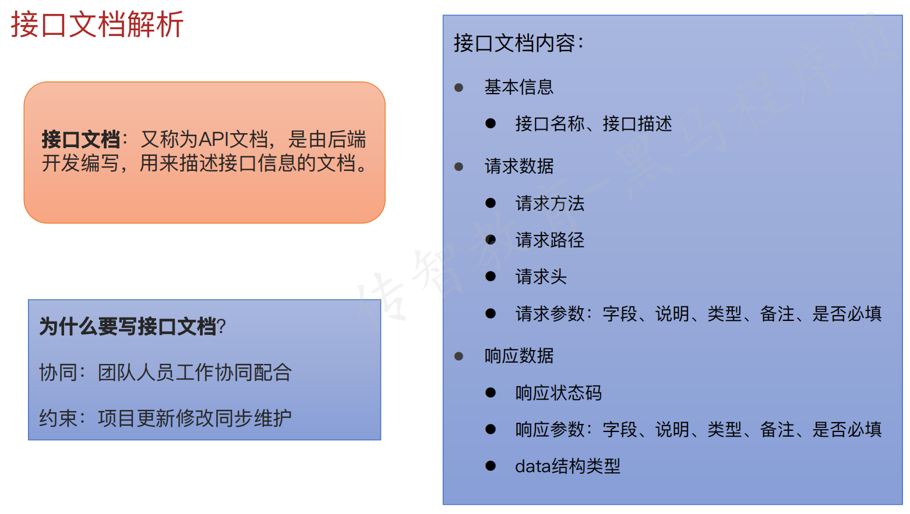

- 请求数据
1. URL
2. 请求方法
3. 请求头
4. 请求参数类型
5. 请求参数
- 响应数据
1. 响应状态码
2. 响应数据

#### 接口测试用例设计
- 基于接口文档，提取测试点
- 基于测试点设计测试用例，覆盖正常流程、异常流程、边界值等
- 测试用例要素：

| ID    | 模块     | 用例名称     | 优先级 | 接口名称   | 前置条件   | 请求URL                     | 请求类型 | 请求头                       | 请求参数类型 | 请求参数 | 预期响应状态码 | 预期返回数据                        |
|-------|----------|--------------|--------|------------|------------|-----------------------------|----------|------------------------------|--------------|----------|----------------|-------------------------------------|
| TC001 | 用户管理 | 获取用户信息 | P0     | getUserInfo | 用户已登录 | http://example.com/api/user | GET      | {"Authorization": "Bearer token"} | -            | -        | 200            | {"id": 1, "name": "张三", "age": 25} |
- 即：
    - 测试用例ID：TC001
    - 模块：用户管理
    - 用例名称：获取用户信息
    - 优先级：P0
    - 接口名称：getUserInfo
    - 前置条件：用户已登录
    - 请求URL：http://example.com/api/user
    - 请求类型：GET
    - 请求头：{"Authorization": "Bearer token"}
    - 请求参数类型：-
    - 请求参数：-
    - 预期响应状态码：200
    - 预期返回数据：{"id": 1, "name": "张三", "age": 25}