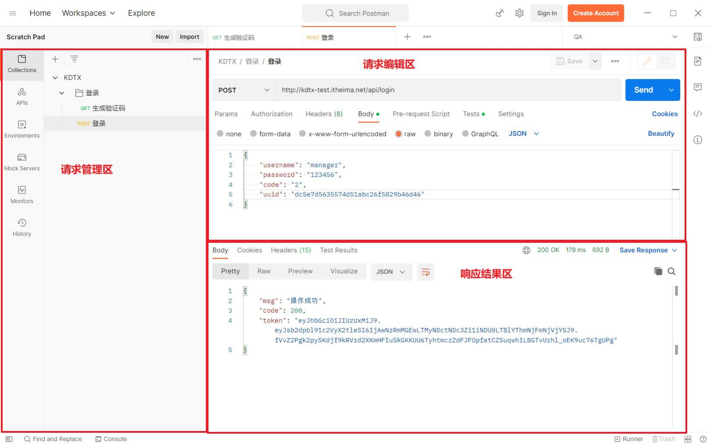
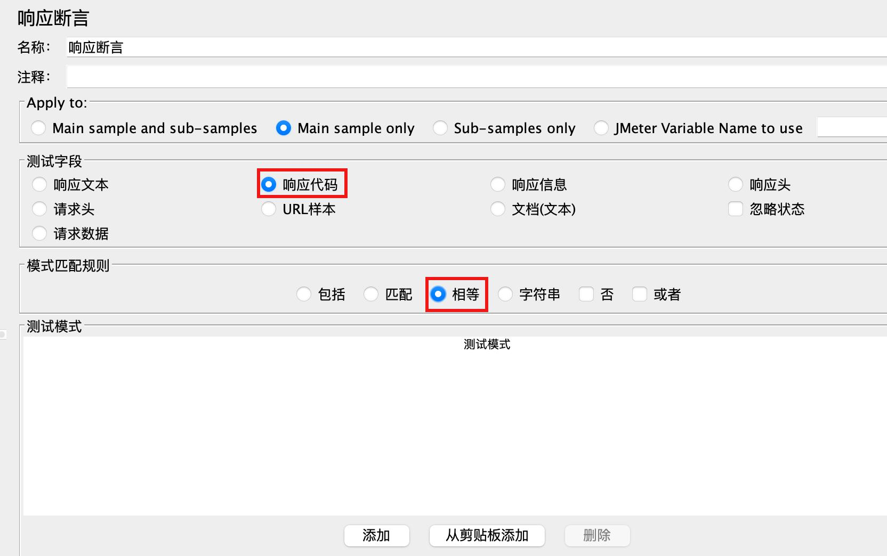

# 接口测试

- 什么是接口测试？
    - 基于不同的输入参数，校验接口响应数据与预期数据是否一致
    - 接口：系统之间数据交互的通道
    - 硬件接口
    - 软件接口
- 为什么要学接口测试？
    - 提前介入测试、尽早发现问题
    - 中级测试工程师必备技能
- 接口测试学什么？
    - 接口测试用例设计
    - 工具实现接口测试
    - 代码实现接口测试

## 基于项目学习接口测试

### 熟悉项目

- 项目角色：销售人员、销售经理、财务人员等
- 项目业务：线索管理、合同管理等
- 项目技术：


### 接口测试流程
- 测试流程
    1. 接口文档分析
    2. 设计测试用例
    3. 脚本开发
    4. 执行脚本
    5. 缺陷跟踪
    6. 测试报告

- 测试工程师视角：
    1. 接口用例设计；测试点转测试用例
    2. 冒烟测试（接口调试）
    3. 接口测试（正向+逆向）
    4. 接口回归（自动化）
    5. 缺陷管理
    6. 测试报告吧 

## 协议
### URL
- URL：是互联网上标准资源的地址，一般称为统一资源定位符
- 组成：协议 :// hostname[:port] / path / [? 查询参数1 & 查询参数2]
- 示例：    


### HTTP协议
- HTTP：超文本传输协议，基于请求与响应的应用层协议
- 作用：规定了客户端与服务器之间信息传递规范，是二者共同遵守的协议
- 组成：
    - HTTP请求：定义请求数据格式
        - 请求行、请求头、请求体
    - HTTP响应：定义响应数据格式
        - 状态行、响应头、响应体
#### HTTP请求-请求行
- 位置：请求数据第一行
- 作用：说明请求方法、访问的资源、协议版本

- 常用请求方法：
    - `GET`：从服务器获取资源
    - `POST`：从服务器提交数据
    - `PUT`：从服务器更新资源
    - `DELETE`：从服务器删除资源

#### HTTP请求-请求头
- 位置：请求数据第二行到空白行之间
- 作用：通知服务器客户端请求信息
- 特点：请求头部由键值对组成，每行一对

- Content-Type：请求体数据类型
    - text/html：HTML格式
    - image/jpeg：jpg图片格式
    - application/json：JSON数据格式
    - application/x-www-form-urlencoded: 表单默认的提交数据格式
    - multipart/form-data：在表单中进行文件上传时使用

#### HTTP请求-请求体
- 位置：空白行之后的内容
- 作用：传输数据实体
- 【注意】：请求体常在POST、PUT方法中使用

- 请求报文中可以没有请求体数据

#### HTTP响应
- HTTP响应：服务器接收到客户端请求后，返回给客户端的信息
- 组成：状态行、响应头、响应体

#### HTTP响应-状态行
- 位置：响应数据的第一行
- 作用：描述服务器处理结果
- 内容: 状态行由协议版本号、状态码、状态消息组成

- 响应状态码：
  - 2xx：成功,如200、201
  - 3xx：重定向,如301、302
  - 4xx：客户端错误,如404（未找到）、400（请求错误）、401（未授权）、403（禁止访问）
  - 5xx：服务器错误,如500、502
  - 一般客户端出问题，状态码以4开头；服务器端出问题，状态码以5开头
- 常见响应码：


#### HTTP响应-响应头
- 位置：第二行开始到空白行之间
- 作用：描述客户端要使用的一些附加信息
- 特点: 响应头由键值对组成，每行一对


#### HTTP响应-响应体
- 位置：响应数据空白行之后
- 作用：服务器返回的数据实体
- 特点: 有图片、json、xml、html等多种类型


## 接口

### 接口规范
- 作用：让前端开发与后台接口开发人员更好的配合，提高工作效率
- 常见接口规范：`RESTful`接口风格
#### RESTful接口风格
- 作用：一种网络应用程序的设计风格和开发方式，提供了一组设计原则和约束条件
- 示例：

- 特点：
    - 请求 API 的 URL 用来定位资源
    - 通过标准HTTP方法对资源进行增删改查操作
    - 利用HTTP状态码返回状态信息

## JSON数据格式
- 是什么：
    - JSON的全称是”JavaScript Object Notation”，JavaScript对象表示法，它是一种基于文本，独立于语言的轻量级数据交换格式
- 作用：一种轻量级的数据交换格式，易于阅读和编写，同时也易于机器解析和生成
- 特点：
    - 数据结构简单，易于理解和使用
    - 数据格式紧凑，占用空间小
    - 支持数组、对象、字符串、数字、布尔值和null等数据类型
- 语法规则：
    - {}大括号保存对象
    - 数据采用键值对表示
    - 多个数据由逗号分隔
    - JSON键 必须是字符串类型, 必须使用英文双引号
    - JSON值 可以是以下类型：
        - 数字(整数或浮点数)
        - 字符串(使用双引号)
        - 逻辑值(true 和 false)
        - 数组 -> []
        - 对象 -> {}
        - 空值: null
- 示例：
```json
{
    "name": "张三",
    "age": 18,
    "gender": "男",
    "hobby": ["篮球", "足球", "跑步"],
    "address": {
        "province": "北京",
        "city": "北京",
        "district": "东城区"
    }
}
```
## 接口测试流程
- 接口用例设计与评审
- 接口调试
- 接口测试
- 回归测试
- 缺陷跟踪
- 测试总结 

### 提取测试点
#### 接口文档解析
- 为什么要进行接口解析？
    - 熟悉接口的相关信息，为设计接口用例做准备
- 接口解析要关注的核心要素
    - 请求报文：请求方法/请求路径/请求数据
    - 响应报文：响应状态码/响应数据

接口文档示例：


- 请求数据
1. URL
2. 请求方法
3. 请求头
4. 请求参数类型
5. 请求参数
- 响应数据
1. 响应状态码
2. 响应数据

#### 接口测试用例设计
- 基于接口文档，提取测试点
- 基于测试点设计测试用例，覆盖正常流程、异常流程、边界值等
- 测试用例要素：

| ID    | 模块     | 用例名称     | 优先级 | 接口名称   | 前置条件   | 请求URL                     | 请求类型 | 请求头                       | 请求参数类型 | 请求参数 | 预期响应状态码 | 预期返回数据                        |
|-------|----------|--------------|--------|------------|------------|-----------------------------|----------|------------------------------|--------------|----------|----------------|-------------------------------------|
| TC001 | 用户管理 | 获取用户信息 | P0     | getUserInfo | 用户已登录 | http://example.com/api/user | GET      | {"Authorization": "Bearer token"} | -            | -        | 200            | {"id": 1, "name": "张三", "age": 25} |
- 即：
    - 测试用例ID：TC001
    - 模块：用户管理
    - 用例名称：获取用户信息
    - 优先级：P0
    - 接口名称：getUserInfo
    - 前置条件：用户已登录
    - 请求URL：http://example.com/api/user
    - 请求类型：GET
    - 请求头：{"Authorization": "Bearer token"}
    - 请求参数类型：-
    - 请求参数：-
    - 预期响应状态码：200
    - 预期返回数据：{"id": 1, "name": "张三", "age": 25}

## postman
- 介绍：Postman一款接口调试工具
- 特点：支持Mac、Windows和Linux
- 下载: https://www.getpostman.com/


### postman使用
- 打开postman
- 新建请求
- 输入请求URL
- 选择请求方法
- 添加请求头（可选）
- 添加请求参数（可选）
- 发送请求
- 查看响应状态码
- 查看响应数据

### postman断言
- Postman断言：让Postman工具代替人工自动判断预期结果和实际结果是否一致
- 用法：
    - ‘Tests’后置脚本标签页编写JavaScript断言代码
    - 断言结果（PASS/FAIL）在‘Test Results’标签页中展示

- **响应代码断言**
    - 模板名称：Status code: Code is 200
    - 模板内容：
```javascript
// 断言响应状态码是否为200
pm.test("status code is 200", function () {
    pm.response.to.have.status(200);
});

pm.test()函数：
参数1：字符串-测试断言名称
参数2：回调函数-具体断言语句

pm.response.to.have.status(code:Number); //判断是否包含指定状态码
```

- **包含指定字符串断言**
    - 模板名称：Response body: Contains string
    - 模板内容：
```javascript
// 断言响应体是否包含指定字符串
pm.test("断言响应体包含指定字符串", function () {
    pm.expect(pm.response.text()).to.include("指定字符串");
});

//通过一系列调用链判断是否符合预期
pm.expect(): 接收实际结果
.to : 连接符，用于连接断言与判断
.include : 用于指定断言方式和预期结果
pm.response.text() : 用于获取响应体文本格式数据
```
- **JSON数据断言**
    - 模板名称：Response body: JSON value check
    - 模板内容：
```javascript
// 断言响应体JSON数据中指定字段是否等于指定值
pm.test("Your test name", function () {
    var jsonData = pm.response.json();
    pm.expect(jsonData.value).to.eql(100);
});

pm.response.json() : 用于获取响应体JSON格式数据
.value : json数据中键值对的键
.eql() : 用于指定断言方式和预期结果
```
### 面试题：测试数据如何构造
- 从UI界面构造测试数据
- 从数据库构造测试数据
    - 新建：insert into 表名 (字段1, 字段2, ...) values (值1, 值2, ...);
    - 更新：update 表名 set 字段1=值1, 字段2=值2, ... where 条件;
    - 从接口构造数据： 如：查询课程之前，先使用新增课程接口解决课程id问题


## Jmeter
- 协议支持: 支持多种协议 HTTP、HTTPS、FTP、SOAP、REST、JMS等
- 语言支持: java
- 性能测试: 强大的性能测试功能
- 下载：https://jmeter.apache.org/download_jmeter.cgi

### json PATH Expression（JSON路径表达式）
- 介绍：用于从JSON格式数据中提取指定字段的值
- 格式：$.字段名
- 示例：
    - 从以下JSON数据中提取“name”字段的值
    ```json
    {
        "id": 1,
        "name": "张三",
        "age": 25
    }
    ```
    - 表达式：$.name
    - 结果：“张三”
    - 多层嵌套示例：
    ```json
    {
        "id": 1,
        "name": "张三",
        "age": 25,
        "address": {
            "city": "北京",
            "street": "东城区"
        }
    }
    ```
    - 表达式：$.address.city
    - 结果：“北京”
### json提取器引用
- 介绍：用于在Jmeter中引用之前提取的JSON数据中的字段值
- 格式：${变量名}

### Jmeter 响应断言
- 作用：对HTTP请求的任意格式的响应结果进行断言
- 位置：测试计划 --> 线程组--> HTTP请求 --> (右键添加) 断言 --> 响应断言



### jmeter 参数化
- 作用：在Jmeter中使用外部数据文件（如CSV、Excel等）中的数据来替换请求中的参数
- 位置：测试计划 --> 线程组--> HTTP请求 --> (右键添加) 配置元件 --> CSV数据文件设置

### Jmeter 跨线程组关联
- 作用：在不同的线程组之间传递参数或变量值
- 位置：测试计划 --> 线程组--> 后置处理器 --> BeanShell 后置处理程序
- 示例：
    - 线程组1：发送登录请求，提取token,通过Benshell后置处理程序将token存储到变量中，利用函数${__setProperty()}存储
    - 线程组2：发送需要token认证的请求，引用线程组1中提取的token，利用函数${__property()}引用
    - 直接使用函数助手对话框来添加函数

## Apifox
- 作用：用于接口测试，支持HTTP、HTTPS、SOAP、REST等协议
- 下载：`https://www.apifox.cn/download/`
- 文档：`https://www.apifox.cn/help/`
- 功能：
    - 接口测试：支持HTTP、HTTPS、SOAP、REST等协议的接口测试
    - 接口文档：支持自动生成接口文档，方便团队协作
    - 接口调试：支持在Apifox中直接调试接口，方便定位问题
    - 接口Mock：支持Mock接口，方便前端开发调试
    - 接口自动化：支持使用Apifox的API Runner功能，实现接口自动化测试

## Requests 模块
简短教程：`https://www.runoob.com/python3/python-requests.html`
### Requests 发送请求
- 格式：`requests.请求方法(url, params=None, data=None, json=None, headers=None)`
- 说明：
• 常见的请求方法： get/post/put/delete
• url: 请求的url地址
• params： 请求查询参数
• data： 请求体为form表单参数
• json： 请求体为json参数
• headers： 请求头参数
### Response查看响应
- ---- 属性/方法----   |  ---- 说明---- 
    - response.status_code 状态码
    - response.json() JSON形式的响应内容
    - response.text 文本形式的响应内容
    - response.url 请求url
    - response.encoding 查看响应头部字符编码
    - response.headers 头信息
    - response.cookies cookie信息


### session会话
- 作用：用于在多个请求之间保持会话状态，如保持登录状态
- 格式：`session = requests.Session()`
- 说明：
    - 会话对象可以在多个请求之间共享cookie、会话状态等信息
    - 会话对象可以用于发送多个请求，而无需重复设置cookie等信息
    - 会话对象可以用于模拟登录等操作，保持会话状态
- 优势：
    - 会话对象可以在多个请求之间共享会话状态，避免重复设置cookie等信息
    - 会话对象可以用于模拟登录等操作，保持会话状态
    - 会话对象可以用于发送多个请求，而无需重复设置cookie等信息 


## pymysql 模块
- 作用：用于在Python中连接和操作MySQL数据库
- 安装：`pip install pymysql`
- 文档：`https://pymysql.readthedocs.io/en/latest/`


### 基本流程
- 导入模块：`import pymysql`
- 连接数据库：`conn = pymysql.connect(host='localhost', port=3306, user='root', passwd='123456', db='test')`
- 创建游标：`cursor = conn.cursor()`
- 执行SQL语句：`cursor.execute('select * from user')`
- 提交事务：`conn.commit()`
- 关闭游标：`cursor.close()`
- 关闭连接：`conn.close()`

### 连接数据库
- 基本语法
    - `conn = pymysql.connect(host='localhost', port=3306, user='root', passwd='123456', db='test')`
- 说明：
    - host：数据库主机名或IP地址
    - port：数据库端口号，默认3306
    - user：数据库用户名
    - passwd：数据库密码
    - db：数据库名称

### 获取游标对象
- 基本语法
    - `cursor = conn.cursor()`
- 说明：
    - cursor：游标对象，用于执行SQL语句和获取结果

### 执行SQL语句
- 基本语法
    - `cursor.execute(sql, params=None)`
- 说明：
    - sql：要执行的SQL语句
    - params：SQL语句中的参数，可选
- 示例：
    - `cursor.execute('select * from user')` 
    - `cursor.execute('select * from user where id=%s', (1,))`


### 释放资源
- 游标关闭：`cursor.close()` # 关闭游标
- 连接关闭：`conn.close()` # 关闭连接


### 查询操作
- 基本语法
    - `cursor.fetchone()` # 获取一条记录
    - `cursor.fetchmany(size=n)` # 获取多条记录，n为获取记录数
    - `cursor.fetchall()` # 获取所有记录
- 说明：
    - fetchone()：获取一条记录，返回一个元组
    - fetchmany(size=n)：获取多条记录，n为获取记录数，返回一个元组列表
    - fetchall()：获取所有记录，返回一个元组列表
- 示例：
    - `cursor.execute('select * from user')` # 执行查询语句
    - `result = cursor.fetchone()` # 获取一条记录
    - `result = cursor.fetchmany(size=2)` # 获取两条记录,size可以省略
    - `result = cursor.fetchall()` # 获取所有记录

- 注意：
    - 查询操作后，游标会移动到下一条记录，再次执行查询操作时，会从当前位置开始获取记录
    - 如果查询结果为空，fetchone()返回None，fetchmany()返回空列表，fetchall()返回空列表


### 非查询
#### 数据库更新 - 插入、更新、删除
- 基本语法
    - `cursor.execute(sql, params=None)`
- 说明：
    - sql：要执行的SQL语句
    - params：SQL语句中的参数，可选
- 示例：
    - `cursor.execute('insert into user(name, age) values(%s, %s)', ('张三', 20))` # 插入记录
    - `cursor.execute('update user set age=%s where name=%s', (21, '张三'))` # 更新记录
    - `cursor.execute('delete from user where name=%s', ('张三',))` # 删除记录
- 注意：
    - 非查询操作后，**需要提交事务**【否则数据不会被更新】：`conn.commit()`
    - 非查询操作后，需要关闭游标：`cursor.close()`
    - 非查询操作后，需要关闭连接：`conn.close()`

#### 数据库事务
- 作用：用于确保数据库操作的一致性、完整性和隔离性
- 基本语法
    - `conn.commit()` # 提交事务
    - `conn.rollback()` # 回滚事务
- 说明：
    - commit()：提交事务，将所有操作永久保存到数据库中
    - rollback()：回滚事务，撤销所有未提交的操作
- 示例：
    - `conn.commit()` # 提交事务
    - `conn.rollback()` # 回滚事务
- 注意：
    - 事务必须在连接对象上调用，不能在游标对象上调用
    - 事务必须在所有操作完成后提交，否则数据不会被保存
    - 事务可以在任何时候回滚，撤销所有未提交的操作
    - 事务在提交后，不能再回滚


## 接口mock测试
- 概念：在接口测试中，对于某些不容易构造的或不容易获取的接口，可以用一个模拟接口替代
- 作用：
    - 解除对外部服务的依赖
    - 模拟异常场景
- 实现方法：搭建一个mock server，通过该服务提供mock接口
    - 常见实现方法：
        - 使用第三方mock平台
        - 自己开发mock服务
        - 使用mock框架搭建mock服务
- 工具：`mock`
- 文档：`https://docs.python.org/3/library/unittest.mock.html`

### mock框架
- 介绍：
    - Moco是一个简单搭建模拟服务器的框架（工具），可以模拟http、https、socket等协议
    - 基于Java开发的开源项目，Github地址：https://github.com/dreamhead/moco
- 原理：
    - Moco会根据一些配置，启动一个真正的HTTP服务（会监听本地的某个端口）
    - 当发起的请求满足某个条件时，就会返回指定的响应数据
- moco环境搭建:
    - 安装Java运行环境：安装JDK，并配置环境变量
    - 下载moco-runner-1.1.0-standalone.jar：
    下载地址：https://repo1.maven.org/maven2/com/github/dreamhead/moco-runner/1.1.0/moco-runner-1.1.0-standalone.jar
- 实现步骤
    - 创建配置文件
    - 启动http服务
    - 接口访问

### 创建配置文件
- 说明：
    - 配置文件是一个json格式的文件，用于定义mock接口的行为
- 示例：
    - `{
        "http": [
            {
                "uri": "/api/user",
                "response": {
                    "text": "hello world"
                }
            }
        ]
    }`
- 说明：
    - 配置文件中定义了一个http接口，当访问`/api/user`时，会返回`hello world`

### 启动http服务
- 说明：
    - 启动moco-runner-1.1.0-standalone.jar文件，即可启动一个http服务
- 示例：
    - `java -jar moco-runner-1.1.0-standalone.jar http -p 8080 -c mock.json`
- 说明：
    - 启动一个http服务，监听端口为8080，配置文件为mock.json

### 接口访问
- 说明：
    - 当发起的请求满足某个条件时，就会返回指定的响应数据
- 示例：
    - 在浏览器输入`http://localhost:8080/api/user`，就会返回`hello world`

### moco常用配置参数

| 请求参数 | 作用 | 示例 |
|---------|------|------|
| method | 定义请求方法 | "method": "post" |
| queries | 定义请求参数 | "queries": { "area": "010", "kw": "hello" } |
| headers | 定义请求头 | "headers": { "Content-Type": "application/json" } |
| forms | 定义表单请求体 | "forms": { "username": "tom", "password": "123456" } |
| json | 定义json请求体 | "json": { "username": "tom", "password": "123456" } |

| 响应参数 | 作用 | 示例 |
|---------|------|------|
| status | 定义HTTP响应状态码 | "status": 500 |
| json | 定义JSON响应数据 | "json": { "code": "10000", "msg": "操作成功" } |

### 工具实现mock搭建
- 可以使用`Postman`、`Apifox`等工具来搭建mock服务
- 说明：
    - 这些工具都提供了可视化的界面，方便用户创建、配置和管理mock接口

### 代码实现mock搭建
- Python+Flask开发mock服务
- 说明：
    - Flask是一个基于Python的轻量级Web应用框架，非常适合用来开发mock服务
- 实现步骤：
    - 安装Flask：`pip install flask`
    - 创建一个Python文件，例如`mock.py`
    - 在文件中编写Flask应用代码，定义mock接口的路由和响应逻辑
    - 运行Flask应用：`python mock.py`
- 示例：
    ```python
    `from flask import Flask, jsonify
    app = Flask(__name__)                                  # 创建Flask应用实例
    @app.route('/api/user', methods=['GET'])               # 定义GET接口路由
    def get_user():                                        # 定义GET接口处理函数
        return jsonify({'code': 10000, 'msg': '操作成功'})  # 返回JSON响应
    if __name__ == '__main__':
        app.run(port=8080)`                                # 启动Flask应用，监听端口为8080
    ```
- 说明：
    - 以上代码定义了一个GET接口`/api/user`，当访问该接口时，会返回一个JSON响应`{'code': 10000, 'msg': '操作成功'}`
    - 代码中使用了Flask框架的`jsonify`函数来返回JSON响应
    - 代码中使用了Flask框架的`run`方法来启动应用，监听端口为8080


## 拓展知识

### jsonSchema全量字段校验
- `Json Schema`: 用来定义json数据约束的一个标准
- 说明：
    - 全量字段校验是指对接口返回的所有字段进行校验，确保每个字段都符合预期
- 实现思路:
    - 定义接口返回数据的期望格式
    - 与接口实际响应数据对比校验
#### Json Schema重点关键字

| 关键字 | 描述 |
|-------|------|
| type | 表示待校验元素的类型 |
| properties | 定义待校验的JSON对象中，各个key-value对中value的限制条件 |
| required | 定义待校验的JSON对象中，必须存在的key |
| const | JSON元素必须等于指定的内容 |
| pattern | 使用正则表达式约束字符串类型数据 |

#### Json Schema参数：Type
- **type**: 用于限定待校验JSON元素所属的数据类型

| type取值 | 对应的python数据类型 | 描述 |
|---------|------------------|------|
| object | object | 对象 |
| array | list | 数组 |
| integer | int | 整数 |
| number | float或int | 数字 |
| null | None | 空 |
| boolean | bool | 布尔 |
| string | str | 字符串 |

#### Json Schema参数：properties
- **properties**: 定义待校验的JSON对象中包含的字段
- 说明：
    - 该关键字的值是一个对象
    - 当type取值为object时使用
    - 用于指定JSON对象中的各种不同key应该满足的校验逻辑

#### Json Schema参数：required
- **required**: 定义待校验的JSON对象中，必须存在的key
- 说明：
    - 用于限制JSON对象中必须包含哪些key
    - 该关键字的值是一个数组，而数组中的元素必须是字符串，而且必须是唯一的

#### Json Schema参数：const
- **const**: 用于校验JSON元素必须等于指定的内容
- 说明：
    - 如果待校验的JSON元素的值和该关键字指定的值相同，则通过校验。否则，无法通过校验
    - 该关键字的值可以是任何值，包括null

#### Json Schema参数：pattern
- **pattern**: 正则表达式
- 说明：
    - 正则表达式：字符串的匹配模式
    - 包含指定字符串: pattern = "指定字符串"

#### Jsonschema介绍与安装
- `jsonschema`：是Python语言中实现对JSON Schema校验的模块
- 安装：`pip install jsonschema`
#### jsonschema使用方法
- 语法：jsonschema.validate(instance, schema)
- 说明：
    - instance：待校验的JSON实例数据
    - schema：定义校验规则的JSON Schema
- 示例：
    ```python
    import jsonschema
    # 定义校验规则的JSON Schema
    # 说明：
    # 1.该JSON Schema定义了一个对象类型的校验规则
    # 2.该对象类型包含3个key-value对，分别是code、msg、data
    # 3.code的类型必须是整数
    # 4.msg的类型必须是字符串
    # 5.data的类型必须是对象
    # 6.data对象中包含4个key-value对，分别是id、name、age、email
    # 7.id的类型必须是整数
    # 8.name的类型必须是字符串
    # 9.age的类型必须是整数
    # 10.email的类型必须是字符串
    schema = { 
        "type": "object",
        "properties": {
            "code": {"type": "integer"},
            "msg": {"type": "string"},
            "data": {
                "type": "object",
                "properties": {
                    "id": {"type": "integer","const": 123},
                    "name": {"type": "string","const": "张三"},
                    "age": {"type": "integer","const": 18},
                    "email": {"type": "string","const": "zhangsan@example.com"}
                },
                "required": ["id", "name", "age", "email"]
            }
        },
        "required": ["code", "msg", "data"]
    }
    # 待校验的JSON实例数据
    instance = {
        "code": 10000,
        "msg": "操作成功",
        "data": {
            "id": 123,
            "name": "张三",
            "age": 18,
            "email": "zhangsan@example.com"
        }
    }
    # 校验JSON实例数据是否符合JSON Schema定义
    jsonschema.validate(instance, schema)
    ```
- 说明：
    - 以上示例中，定义了一个校验规则的JSON Schema，用于校验接口返回数据的格式
    - 待校验的JSON实例数据`instance`符合JSON Schema定义，因此校验通过
    - 如果待校验的JSON实例数据不符合JSON Schema定义，例如缺少`email`字段，或者`age`字段的值不是整数，校验会抛出异常


### Dubbo接口测试

#### RPC协议介绍
- RPC：(Remote Procedure Call)远程过程调用，就是一个节点请求另一个节点提供的服务
- 说明：
    - RPC协议是一种用于实现分布式系统中不同节点之间通信的协议
    - 它允许一个节点（客户端）调用另一个节点（服务端）上的过程或函数，就像调用本地函数一样
    - RPC协议通常基于网络传输，例如TCP或UDP，以实现节点之间的通信
- 说明 常见的RPC框架有**Dubbo**、Thrift、gRPC等

#### Dubbo
- **什么是dubbo？**
  - Dubbo是一款高性能、轻量级、基于Java的开源RPC框架
- **为什么要学dubbo？**
  - 阿里开源项目，国内很多互联网公司都在使用，已经经过很多线上考验
  - 使用Dubbo可以将核心业务抽取并形成独立的服务中心，可用于提高业务复用的灵活性
  - 分布式架构可以承受更大规模的并发流量
- **Dubbo架构：**
  
| 节点角色 | 说明 |
|---------|------|
| Provider | 暴露服务的服务提供方 |
| Consumer | 调用远程服务的服务消费方 |
| Registry | 服务注册与发现的注册中心 |
| Monitor | 监控中心 |
| Container | 服务运行容器 |

Dubbo架构流程：
1. Provider启动后向Registry注册服务
2. Consumer向Registry订阅服务
3. Registry通知Consumer服务地址
4. Consumer调用Provider提供的服务
5. Provider和Consumer向Monitor上报调用统计信息

#### telnet调用dubbo接口
- Telnet是Internet远程登录服务的标准协议和主要方式
- 说明：
    - Telnet是一种用于在网络上远程登录和管理其他计算机的协议
    - 它允许用户通过Telnet客户端连接到远程计算机，并在该计算机上执行命令
    - Telnet通常用于管理服务器、配置网络设备、进行远程调试等
- 示例：
    ```bash
    # 连接到远程计算机的Telnet服务
    telnet 192.168.1.100 22
    # 登录远程计算机
    Username: admin
    Password: 123456
    # 执行命令
    ls -l
    # 退出Telnet会话
    exit
    ```

- 调用服务：
    - 说明：
        - 调用服务时，需要指定服务的接口名称、方法名称、参数等
        - 调用服务时，需要注意参数的类型和顺序，以及返回值的类型
    - 示例：
        ```bash
        # 调用服务接口com.example.dubbo.DemoService的方法sayHello，参数为"张三"
        invoke com.example.dubbo.DemoService.sayHello "张三"
        ```

#### python调用dubbo接口
- Dubboclient介绍
- DubboClient：是一个基于telnetlib类库封装的，用于测试dubbo接口的客户端工具类
- 说明：
    - telnetlib 是python内置的模块，用来创建Telnet协议的连接
    - telnetlib 模块提供一个实现telnet协议的类 Telnet，通过该类可以模拟调用dubbo接口


**操作方法**
1. 实例化DubboClient对象
```python
class dubboclient.DubboClient(host=None, port=0):
    """
    实例化DubboClient对象
    - host: dubbo服务地址
    - port: dubbo服务端口
    """
```
2. 调用dubbo接口方法
```python
def invoke(self, service_name, method_name, *args):
    """
    调用接口
    :param service_name: 服务名称
    :param method_name: 方法名称
    :param args: 方法参数列表
    :return: 接口响应数据
    """
```
3. 获取响应数据


### 接口解密测试
- **步骤：**
  - 安装AES依赖库
  - 联系开发获取加密、解密工具包
  - 请求和响应调用加解密工具
- **安装AES依赖库**
  ```bash
  pip install pycryptodome -i https://pypi.douban.com/simple
  ```
- **联系开发获取加密、解密工具包**
  1. 将工具复制的项目中
  2. 检查报红关键字进行导包处理（快捷键）
  3. 与开发确认那个是加密、解密、签名方法
- **请求和响应调用加解密工具**
  1. 联系开发确认加密后的请求参数格式
  2. 确认响应数据需要解密数据
