# 面向对象及Pytest框架

## 1.面向对象其他语法

### 1.1 类对象 ⚑

> 类本身就是类对象  
>
> - 一个类**只有一个**类对象，定义完类自动创建，**类名就是类对象**
> - 类具备自己的属性和方法 : **类属性**和**类方法**
>   - 类属性: 该类所有对象所**共有的属性** 		eg : 一盘水果有几个 
>   - 类方法: 该类所有对象所**共有的方法**       eg : 装满一盘水果

**测试应用**

> 应用场景：只需要一个对象（类名）的场景时可以使用类对象，设置类属性和类方法
>
> - 不需要多次实例化可以使用类对象
> - 类对象简化创建对象的过程
>
> eg: 
>
> - 连接本地数据库的对象（类对象），连接名称（类属性），创建连接（类方法）
> - 浏览器打开，一个浏览器（类属性），打开过程（类方法）

### 1.2类属性和类方法

- 类属性定义

  ```python
  # 类属性名 = 类属性值 ，一般放在实例属性 __init__() 方法的上面
  class 类名(object):
      类属性名 = 属性值
      def __init__(self):
          self.属性名 = 属性值
  # 注意：定义类属性相当于定义全局变量
  ```

- 类属性使用

  ```python 
  # 获取类属性
  类名.类属性名
  ```

- 案例演示

  ```python
  # 每件工具都有自己的名字--> 每个工具的名字不一样
  # name 属于实例属性
  # 创建了多少个工具对象？--> 记录工具类里面工具的数量 （属性：数量）
  # 工具类的数量属于类属性
  
  class Tools(object):
      """工具类"""
      # 定义类属性
      count = 0  # 类属性名 = 属性值
  
      def __init__(self,name):
          """设置实例属性"""
          self.name = name
          Tools.count += 1  # 递增记录工具数量，通过  '类名.类属性名'  获取
  # 创建对象(init方法在创建对象的时候自动被调用)
  t1 = Tools("斧头")
  t2 = Tools("扳手")
  t3 = Tools("锤子")
  # 统计数量
  print(f"工具类总共数量为：{Tools.count}")
  # 总结：
  # 1.确认实例属性和类属性
  # 2.如何计算工具数量（借助于init方法）
  ```

  

- 类方法定义

  ```python
  # 1.添加类方法的装饰器，对原有功能的扩展说明
  # 2.按照定义普通方法的语法书写，默认形参是cls  （class的简称）
  class 类名(object):
  	@classmethod  # 给python解释器看，该方法是类方法
  	def 类方法名(cls):
      	类方法实现
  ```

  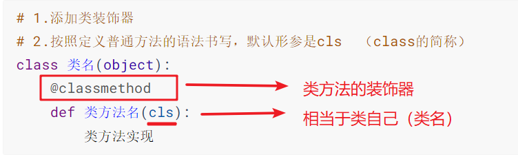

- 调用类方法

  ```python
  # 调用类方法
  # 类方法外部
  类名.类方法名()
  # 类方法内部
  cls.类其他方法名()
  cls.类属性名
  ```

- 案例演示

  ```python
  # 每件工具都有自己的名字--> 每个工具的名字不一样
  # name 属于实例属性
  # 创建了多少个工具对象？--> 记录工具类里面工具的数量 （属性：数量）
  # 工具类的数量属于类属性
  # 输出对象个数：需要使用print语句输出工具数量
  
  # 定义类
  # 每件工具有自己的名字  --->  名字不一样【定义实例的属性】
  # 创建了多少个工具对象？ ---> 计算工具的个数【所有工具数量 ---> 类属性】
  class Tools(object):
      count = 0   # 类属性
      # 设置实例属性
      def __init__(self,name):
          self.name = name  # 某个工具的名字
          Tools.count += 1
  
      # 定义类方法  ---> 输出/打印创建的对象个数 ---> Tools.count 的结果
      @classmethod   # 装饰器：告诉python解释器 这个标记的方法是类方法
      def show_tool_count(cls):
          print(f"工具箱中的工具个数是：{cls.count}")
  
  # 如何获取类属性值？
  print(Tools.count)
  # 创建对象  ---> 往工具箱中放工具的过程
  t1 = Tools("锤子")
  t2 = Tools("斧头")
  t3 = Tools("钳子")
  # 调用类方法  ---> 查看最后的工具数量   ---> 类名.类方法名  类名.类属性名
  Tools.show_tool_count()
  # 如何获取类属性值？
  print(Tools.count)
  
  ```

  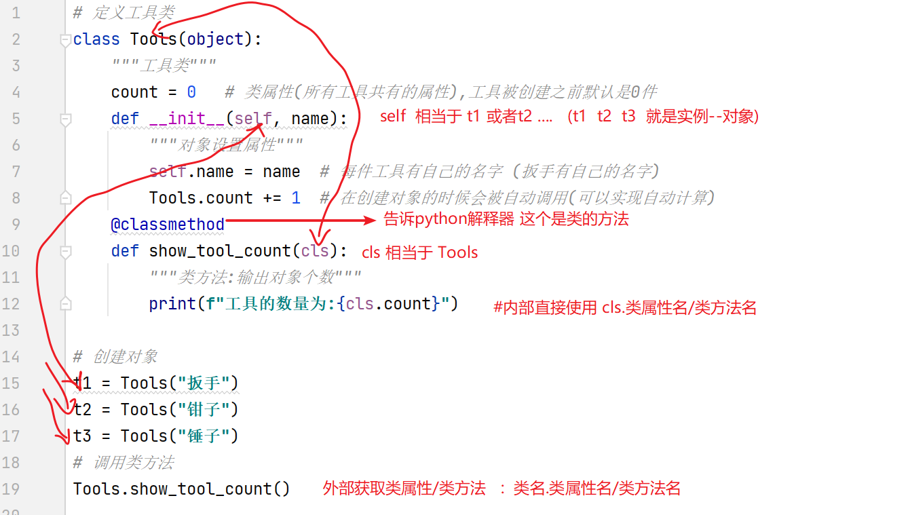

- 综合案例

  ```python
  """
  需求：使用类属性、类方法的知识实现以下功能：
  1. 创建一个学生类Student
  2. 实例属性有姓名name，分数score
  3. 每创建一个对象自动实现学生个数累加
     类属性为：num
  4. 实现__str__方法，打印对象时，输出：学生姓名:xxx, 考试分数:yyy
  5. 设计一个类方法show_num，输出：班级总人数为： xxx
  6. 创建对象，调用方法，验证结果
  7. 示例运行结果：
      班级总人数为： 0
      学生姓名:张三, 考试分数:59
      学生姓名:李四, 考试分数:88
      学生姓名:王五, 考试分数:98
      班级总人数为： 3
  """
  
  # 类名：Student
  # 实例属性：name,score
  # 实例方法：无
  # 类属性：num
  # 类方法：show_num()
  
  # 定义类
  class Student(object):
      """学生类"""
      # 类属性
      num = 0  # 学生数量默认为0
  
      def __init__(self, name, score):
          """初始化方法：实例设置属性"""
          self.name = name  # 姓名
          self.score = score  # 分数
          # 创建学生对象时，数量自动增加1
          Student.num += 1
  
      @classmethod
      def show_num(cls):
          """类方法：输出数量"""
          print(f"班级总人数为：{cls.num}")  # cls.类属性
  
      def __str__(self):
          """打印对象自定义信息"""
          # 获取实例的属性
          return f"学生姓名：{self.name}，考试分数：{self.score}"
  
  
  # 先调用类方法：查看初始值
  Student.show_num()
  # 创建对象
  s1 = Student("张三", 59)
  s2 = Student("李四", 88)
  s3 = Student("王五", 98)
  # 打印对象
  print(s1)
  print(s2)
  print(s3)
  # 调用类方法：最后的值
  Student.show_num()
  
  ```


### 1.3私有属性和私有方法

> 应用场景：在实际测试中，根据需求如果有些属性或者方法不想让其他人（模块）使用时，可以定义为私有属性或者私有方法。
>
> eg: 敏感的账号密码信息的封装

- 定义：属性和方法只有在**类内部使用**时，就可以使用私有属性和私有方式

- 注意：类**外部无法获取**私有属性和调用私有方法(**包括有继承关系子类也无法获取**)

- 语法格式

  ```python
  # 定义私有属性和方法
  私有属性：__属性名
  私有方法：__方法名()
  # 获取私有属性和调用私有方法
  cls/self.__属性名   cls/self.__方法名()
  ```

- 案例演示

  ```python
  # 定义女生类
  class Women(object):
      """女生类"""
  
      def __init__(self, name, age):
          """设置实例属性"""
          self.name = name
          self.__age = age  # 不想让外部人知道年龄
  
      def __secret(self):
          """私有方法:输出女生年龄"""
          print(f"{self.name}的年龄是:{self.__age}")
  
      def friend(self):
          """普通方法"""
          # self.__secret()  # 类内部普通方法可以直接调用私有方法
          print(f"我闺蜜叫:{self.name},她的年龄是:{self.__age}")
  
  # 创建对象
  w1 = Women("小红", 18)
  # 调用方法
  # w1.__secret()  # 不能直接调用：私有方法（只能在类内部使用）
  w1.friend()  # 可以借助于普通方法查看私有属性或者私有方法运行结果
  # 结论: 私有属性和私有方法只能在类的内部使用
  
  ```


### 1.4静态方法

> 没有存在感的方法(可以理解为一个"普通函数" , 只是封装到类中)
>
> - 即不用实例属性，也不用实例方法
> - 既不用类属性，也不用类方法
>
> 适用场景：一般用于对于类的说明，或者对于类中的某个方法的说明
>
> - eg : 开发中用于对某个功能的使用说明

- 语法格式

  ```python
  # 定义
  class 类名(object):
      @staticmethod    # 1.静态方法的装饰器
      def 方法名():     # 2.方法后面括号中默认不需要任何参数
          pass
  # 调用
  类名.静态方法名()
  ```

- 使用说明

  - 需要静态装饰器
  - 定义方法默认不传入任何参数

- 案例演示

  ```python
  # 定义儿童类
  class Children(object):
      """儿童类"""
  
      def __init__(self, name, age):
          self.name = name
          self.age = age
  
      def run(self):
          """实例方法"""
          print(f"{self.name}儿童{self.age}岁了,可以跑步")
  
      @staticmethod  # 静态方法的装饰器
      def eat():
          """静态方法:吃"""
          print("儿童吃东西")
  
      @classmethod
      def drink(cls):
          """类方法"""
          print("喝牛奶")
  
  
  # 创建对象
  ch1 = Children("张三", 2)
  # 调用方法:run
  ch1.run()
  # 调用静态方法
  Children.eat()  # 类名.静态方法名
  ch1.eat()
  # 调用类方法
  Children.drink()
  ch1.drink()
  ```

- Pycharm设置静态方法的快捷操作

  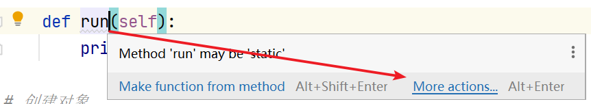

  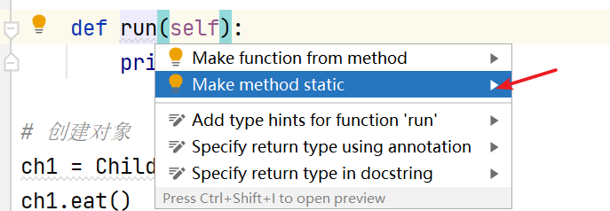

- 综合案例

  ```python
  """
  需求：
  1. 设计一个 Game 类
  2. 属性:
  • 定义一个 top_score 类属性 -> 记录游戏的历史最高分
  • 定义一个 player_name 实例属性 -> 记录当前游戏的玩家姓名
  3. 方法:
  • 静态方法 show_help() -> 显示游戏帮助信息
  • 类方法 show_top_score() -> 显示历史最高分
  • 实例方法 start_game() -> 开始当前玩家的游戏
  4. 主程序步骤:
  ① 查看帮助信息
  ② 查看历史最高分
  ③ 创建游戏对象， 开始游戏
  """
  
  # game游戏案例
  # 定义类
  class Game(object):
      # 定义类属性：存放游戏的历史最高分，初始值0
      top_score = 0
  
      # 定义实例属性
      def __init__(self,play_name):
          self.play_name = play_name
  
      # 定义方法：静态方法
      @staticmethod   # 装饰器：标记给python解释器这个是静态方法
      def show_help():
          print("新手，请查看.....")
  
      # 类方法：获取历史最高分
      @classmethod
      def show_top_score(cls):
          print(f"历史最高分为：{cls.top_score}")
  
      def start_game(self):
          # 开始玩...
          print("玩家开始....")
          # 分数变化，每次递增100分
          Game.top_score += 100
          # 游戏结束...
          print(f"游戏结束....,最后的得分为：{Game.top_score}")
  
  # 查看帮助信息--> 调用show_help方法
  Game.show_help()
  # 查看历史最高分
  Game.show_top_score()
  # 创建玩家对象 ---> 通过类创建对象 --> 实例化
  g1 = Game("张三")
  # 开始玩游戏  ---> 调用玩游戏的方法
  g1.start_game()
  g1.start_game()
  g1.start_game()
  # 思考：为什么对象也可以调用静态方法和类方法？
  # --> 因为对象是由类创建出来的，拥有类的所有属性和方法，所以通过实例直接可以调用
  g1.show_help()
  g1.show_top_score()
  # 再次查看历史最高分
  Game.show_top_score()
  ```

- 案例练习

  ```python
  """
  1. 在animal.py文件中，设计一个Animal类(动物类)
  2. 实例属性有姓名name，通过形参赋值
  3. 重新创建cat.py文件，引入animal模块，然后定义一个Cat类，继承Animal
  4. 实现__str__方法，打印对象时，输出："我是一只猫，名字叫：xxx"
  5. 定义实例方法play，打印："xxx在玩耍"，xxx表示名字
  6. 增加静态方法run，打印："动物们跑起来了"
  7. 创建Cat类对象，调用方法，验证结果
  """
  
  # animal.py
  # 定义一个类
  class Animal(object):
      """动物类"""
      def __init__(self,name):
          """实例属性"""
          self.name = name
          
  # cat.py
  # 导模块
  # import animal  # animal.Animal
  from animal import Animal
  
  class Cat(Animal):
      """猫类"""
      def __str__(self):
          """自定义对象方法"""
          return f"我是一只猫，名字叫：{self.name}"
  
      def play(self):
          """玩耍"""
          print(f"{self.name}在玩耍")
  
      @staticmethod
      def run():
          """静态方法"""
          print("动物们跑起来了")
  
  # 创建对象
  tom = Cat("汤姆")
  # 调用方法:实例方法
  tom.play()
  # 调用方法:静态方法 ---> 类名.静态方法()
  Cat.run()
  # 也可以用  对象.静态方法() 调用 -->  tom.run()
  # 打印对象
  print(tom)
  ```

- 案例练习2

  ```python
  """
  需求：设计 SweetPotato 地瓜类
  1. 地瓜有两个属性：
      状态 state：初始状态为'生的'
      烧烤总时间 cooked_time：初始时间为0
  
  2. 实现__str__方法，打印对象，输出：地瓜状态为：xxx, 烧烤总时间为：yyy 分钟
  3. 定义 cook 方法, 形参为 time，传入本次烧烤时间
      1. 使用 烧烤总时间 对 本次烧烤时间 进行 累加，得到最新烧烤时间
      2. 根据 烧烤总时间, 设置地瓜的状态：
          0 <= 烧烤总时间 < 3 ： 生的
          3 <= 烧烤总时间 < 6 ： 半生不熟
          6 <= 烧烤总时间 < 8 ： 熟了
          大于等于8 ： 烤糊了
  4. 创建对象，调用方法，验证结果
  """
  
  class SweetPotato(object):
      """地瓜类"""
  
      def __init__(self, state="生的", cooked_time=0):
          """设置实例属性"""
          self.state = state  # 地瓜状态
          self.cooked_time = cooked_time  # 烧烤时间
  
      def __str__(self):
          return f"地瓜的状态为：{self.state}，烧烤总时间为：{self.cooked_time}分钟"
  
      def cook(self, time):
          # 计算总时间
          self.cooked_time += time
          # 根据时间设置状态
          if 0 <= self.cooked_time < 3:
              # 设置地瓜状态
              self.state = "生的"
          elif 3 <= self.cooked_time < 6:
              self.state = "半生不熟"
          elif 6 <= self.cooked_time < 8:
              self.state = "熟了"
          elif self.cooked_time >= 8:
              self.state = "烤糊了"
  
  
  # 创建对象
  sp1 = SweetPotato()
  # 调用方法
  sp1.cook(4)
  sp1.cook(3)
  sp1.cook(3)
  # 打印实例对象sp1
  print(sp1)
  ```

## 2. Pytest框架

> 框架：解决一类事物的(工具)功能集合，简称 Framework
>
> 目的：通过pytest框架编写自动化测试脚本，统一管理用例，提高工作效率

### pytest测试框架

- 定义：Python第三方的单元测试框架（测试可以做**自动化测试**）

- 特点：

  - 能够组织多个自动化测试用例执行
  - 方便实现参数化，提供断言简单方便（通过脚本自己去判断对错[预期结果和实际结果]）
  - 能够生成测试报告（通过脚本自动生成报告）

- pytest安装

  - 命令行安装

    ```python
    # 在cmd/终端命令行下输入如下命令回车
    # windows系统
    pip install pytest
    # macOS系统
    pip3 install pytest
    # 查看安装包
    pip show pytest  # windows
    pip3 show pytest  # macOS
    # 查看安装结果
    pytest --version
    ```

    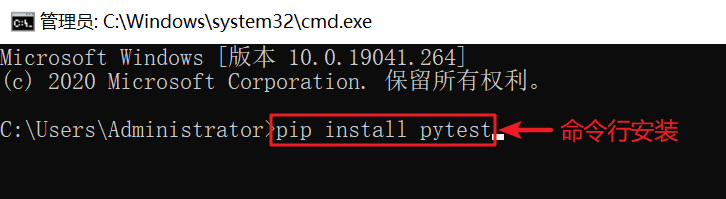

    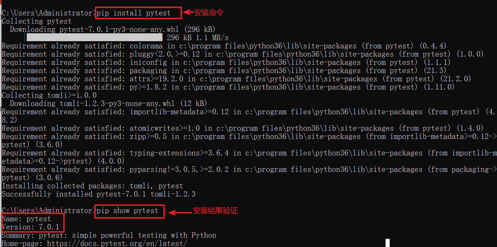

  - pycharm安装

    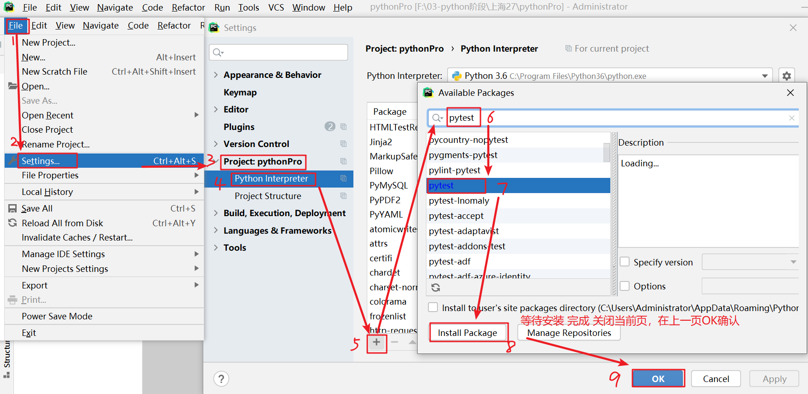

    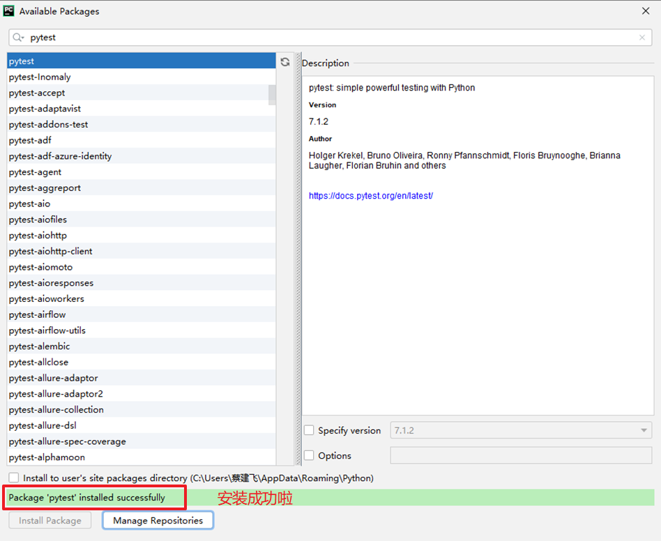

- 安装验证

  - 命令行验证（任选一种即可）：
    - 方式1：`pytest --version`
    - 方式2：`pip show pytest`

  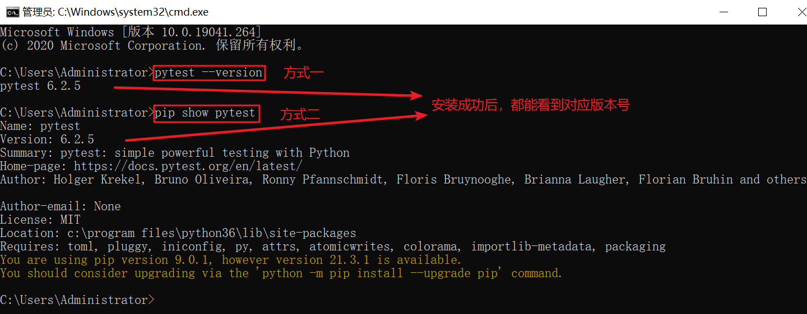

  

### pytest基本使用

> 创建.py文件通过pytest框架编写的代码 （测试用例）
>
> **注意事项**：
>
> - 项目路径下创建**包**【注意不是文件夹】
> - 命令行执行测试用例时，注意被执行文件的路径

- 定义被测函数

  - 创建`api`的包：存放的被测一些模块（开发/测试）

  - 在`api`文件夹下面创建被测py文件：`calc.py`

    ```python
    def add(x, y):
        """加法"""
        return x + y
    ```

- 测试用例定义（创建测试用例过程）

  > 创建`scripts`的包
  >
  > 在该包下面创建py文件，以test开头：`test_add.py`

  - 1.导包：`import pytest`
  - 2.定义测试类（类名建议以**Test**开头，**不能使用中文，不能出现init方法**）
  - 3.定义测试方法，方法名**必须**以test开头

  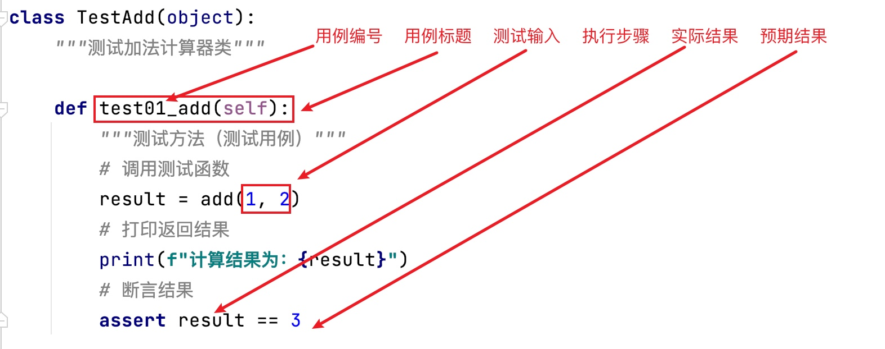

- 测试用例执行

  - pycharm 主程序模式

    - 调用`pytest.main()`，注意必须在 ：`if __name__ == "__main__"`下执行

      ```python 
      pytest.main(["-s","测试模块文件名.py"])
      # -s :在控制台显示print打印信息
      # 测试模块文件名.py :执行这个文件的所有测试类（及对应测试用例）
      # 注意：小括号中必须有[]
      ```

    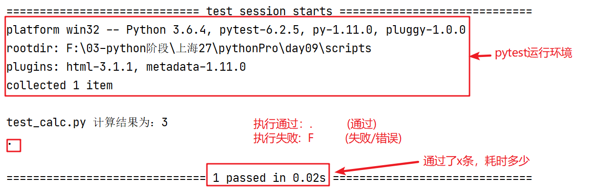

    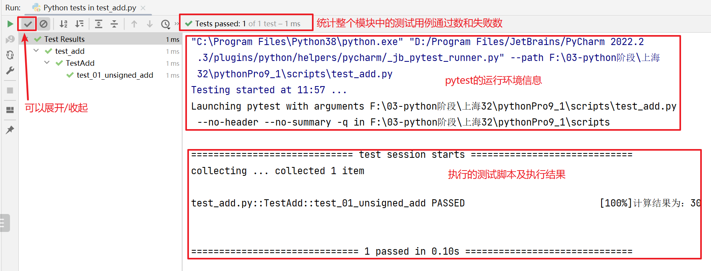

  - **pycharm的终端命令行执行【推荐】**

    > 注意：Windows系统，通过右键管理员权限打开pycharm，否则可能出现执行命令无响应问题

    - `pytest -s 测试模块文件名.py`

      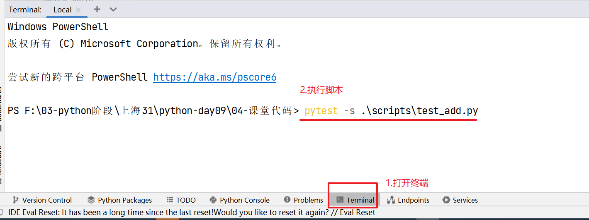

- 案例演示

  ```python
  from api.calc import add  # 快速移动一行代码 ctrl+shift + 上下光标
  import pytest
  
  
  # 定义测试类
  class TestAdd(object):
  
      # 定义测试方法【测试脚本/用例】
      def test01_add(self):
          # 调用被测函数/方法
          res = add(10, 20)  # 快捷导包/模块   alt+enter
          # 打印返回结果
          print(f"计算结果1为：{res}")
          # 断言结果
          assert 30 == res
  
      def test02_add(self):
          res = add(-10, 20)
          print(f"计算结果2为：{res}")
          assert 11 == res  # 会断言失败
  
  
  # 方式1
  # if __name__ == '__main__':
  #     pytest.main(["-s","test_add.py"])  # -s表示pytest命令执行控制台显示print的结果
  ```

### pytest批量执行用例

> 如何批量执行多个模块的测试用例？
>
> - 通过pytest.ini的配置文件可以灵活调整执行哪些用例

- pytest配置文件说明

  - 在项目目录下创建`pytest.ini`的配置文件

- 文件内容第一行为：`[pytest]`

  - 运行pytest的测试用例时会使用该配置文件

- pytest常见配置内容

  ```python
  [pytest]
  # 添加命令行参数 -s  print结果终端打印出来
  addopts = -s --html=report/报告文件名.html
  # 文件搜索路径
  testpaths = ./scripts
  # 文件名称
  python_files = test*.py
  # 类名称
  python_classes = Test*
  # 方法名称
  python_functions = test*
  ```

- 案例演示

  ```python
  # 以pytest框架编写测试脚本
  from api.calc import sub
  
  
  # 定义测试类
  class TestSub(object):
  
      # 定义测试方法
      def test01_sub(self):
          # ①调用函数
          res = sub(10,20)
          # ②打印结果
          print(f"减法结果1：{res}")
          # ③断言结果
          assert -10 == res
  
  
      def test02_sub(self):
          # ①调用函数
          res = sub(-10, 20)
          # ②打印结果
          print(f"减法结果2：{res}")
          # ③断言结果
          assert -30 == res
  
  ```

### setup和teardown的引入

- 引入案例

  ```python
  import time
  
  class TestFixture(object):
      def a1(self):
          """普通方法1"""
          print("开始时间=",time.time())
          time.sleep(1)
      def b1(self):
          """普通方法2"""
          print("结束时间=",time.time())
  
      def test01(self):
          self.a1()  # 执行前：先调用a1
          print("这个是：test01")
          self.b1()  # 执行后：再调用b1
  
      def test02(self):
          self.a1() # 执行前：先调用a1
          print("这个是：test02")
          self.b1()  # 执行后：再调用b1
  ```

- 存在问题：测试用例执行前后都有重复操作，能否避免？

- 解决办法：通过setup和teardown可以解决

### setup和teardown的介绍

> Fixture装置
>
> - setup : 前置处理
> - teatdown : 后置处理
>
> 作用：对测试用例执行环境的初始化（前置）和销毁（后置）操作
>
> - 固定装置：**就是一种 代码结构**
> - 通过有两种不同的级别控制（两种不同的代码结构）

- 方法级别的控制

  - 在类中执行测试用例时，**每个测试用例**分别都需要操作一次的应用可以定义为方法级别

  - 语法格式

    ```python
    # 初始化（前置处理）
    def setup_method(self):
        pass
    # 销毁（后置处理）
    def teardown_method(self):
        pass
    # 注意：执行每个测试用例（方法）前后会被自动执行无需调用
    ```

  - 案例演示

    ```python
    # 以pytest框架编写测试脚本
    from api.calc import sub
    
    
    # 定义测试类
    class TestSub(object):
        # 前置打印打开计算器操作
        def setup(self):
            print("打开计算器....")
        # 后缀打印关闭计算器操作
        def teardown(self):
            print("关闭计算器....")
        # 定义测试方法
        def test01_sub(self):
            # ①调用函数
            res = sub(10,20)
            # ②打印结果
            print(f"减法结果1：{res}")
            # ③断言结果
            assert -10 == res
    
    
        def test02_sub(self):
            # ①调用函数
            res = sub(-10, 20)
            # ②打印结果
            print(f"减法结果2：{res}")
            # ③断言结果
            assert -30 == res
    
    ```

- 类级别的控制

  - 在类中执行测试用例时，**只需要操作一次**的应用可以定义为类级别

  - 语法格式

    ```python
    # 初始化（前置处理）
    def setup_class(self):
        pass
    # 销毁（后置处理）
    def teardown_class(self):
        pass
    # 注意：执行每个测试类前后会被自动执行执行一次
    ```

  - 案例演示

    ```python
    # 以pytest框架编写测试脚本
    from api.calc import sub
    
    
    # 定义测试类
    class TestSub(object):
        # 前置打印打开浏览器操作
        def setup_class(self):
            print("打开浏览器....")
        # 后缀打印关闭浏览器操作
        def teardown_class(self):
            print("关闭浏览器....")
        # 定义测试方法
        def test01_sub(self):
            # ①调用函数
            res = sub(10,20)
            # ②打印结果
            print(f"减法结果1：{res}")
            # ③断言结果
            assert -10 == res
    
    
        def test02_sub(self):
            # ①调用函数
            res = sub(-10, 20)
            # ②打印结果
            print(f"减法结果2：{res}")
            # ③断言结果
            assert -30 == res
    
    if __name__ == '__main__':
        pytest.main(["-s", "test_sub.py::TestSub::test02_sub"])
        # 中括号中指定执行某条测试用例，   "文件名.py::类名::方法名"
    
    ```

- 注意事项

  > - setup_method、teardown_method是针对于普通的用例前置执行的方法【按照用例在每个用例前后都执行】
  > - setup_class、teardown_class是针对于整个类的用例前置执行的方法【按照类级别执行一次】
  > - 上述前后置方法在执行测试用例时自动调用执行
  > - 不是每个前置和后置的操作必须成对出现，关键是看需要哪个就用哪个

## 3.断言

> 定义：让程序代替人去判断代码执行的结果和预期结果是否一致
>
> 目的：提高测试效率（无人值守状态下执行）
>
> 位置：在测试用例中（测试方法）

- pytest断言：在pytest中使用`assert 表达式`直接断言

- 常见断言方法

  ```python
  # 相等表达式右边的是预期结果
  # 1.判断 a==b
  assert a==b
  # 判断 a!=b
  assert a!=b
  # 相等表达式左边边的是预期结果
  # 2.判断b包含a
  assert a in b
  # 判断b不包含a
  assert a not in b
  # 3.判断x为真
  assert x   # assert x == True
  # 判断x为假
  assert not x
  ```

- 案例演示

  ```python
  import pytest
  
  class TestAssert(object):
      """测试断言类"""
  
      def test_demo(self):
          """测试断言方法"""
          info3 = True
          assert 10 == 10  # 判断相等  --> 通过.
          assert 10 != 20  # 判断不相等 --> 通过.
          assert "admin" in "administrator"  # 判断包含  --> 通过.
          assert "admin" not in "administrator"  # 判断不包含 --> 失败 E
          assert info3  # 判断为真 --> 通过.
          assert not info3  # 判断为假 --> 失败 E
  
  if __name__ == '__main__':
      pytest.main(["-s", "test_assert.py"])
  ```

  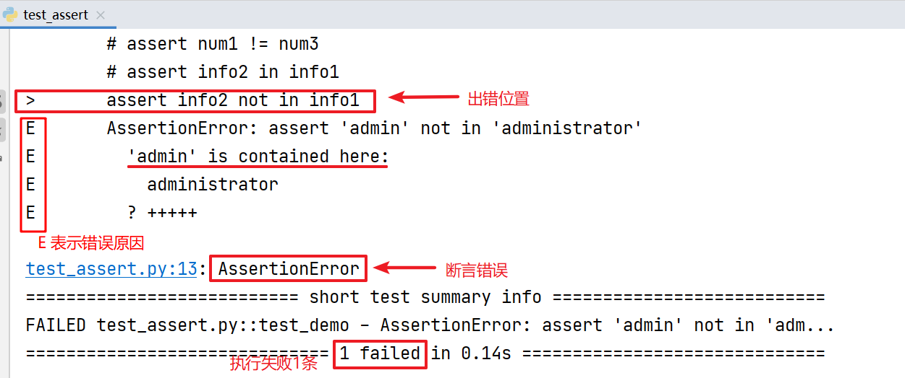

- 断言使用

  - 在测试方法（测试用例）中直接使用断言方法即可
  - 每个测试方法可以使用一个断言，也可以使用多个

- 案例演示

  ```python
  # 1.导包
  import pytest
  from api.calc import add  # 快速移动行代码: ctrl+shift + 上下光标键
  
  
  # 2.定义测试类
  class TestAdd(object):
      """测试类：测试加法功能"""
  
      # 3.定义测试方法：测试用例
      def test01_add(self):
          """方法1：测试脚本（用例）"""
          # 3.1 调用被测函数
          result = add(10, 20)  # 导包快捷键：alt+enter
          # 3.2 打印返回结果
          print(f"计算结果为：{result}")
          # 3.3 断言结果【预期结果和实际是否一致】
          assert result == 30  # result是实际结果（函数实际计算返回的），30是预期结果
  
      def test02_add(self):
          """方法2：测试用例"""
          result = add(-10, 10)
          print(f"计算结果为：{result}")
          assert result == 0
  
      def test03_add(self):
          """方法3：测试用例"""
          result = add(-10, -10)
          print(f"计算结果为：{result}")
          assert result == -21
  
  
  # 方式1:运行测试用例（脚本）
  if __name__ == '__main__':
      # pytest.main(["-s"])
      pytest.main(["-s", "test_add.py"])
  
  ```

  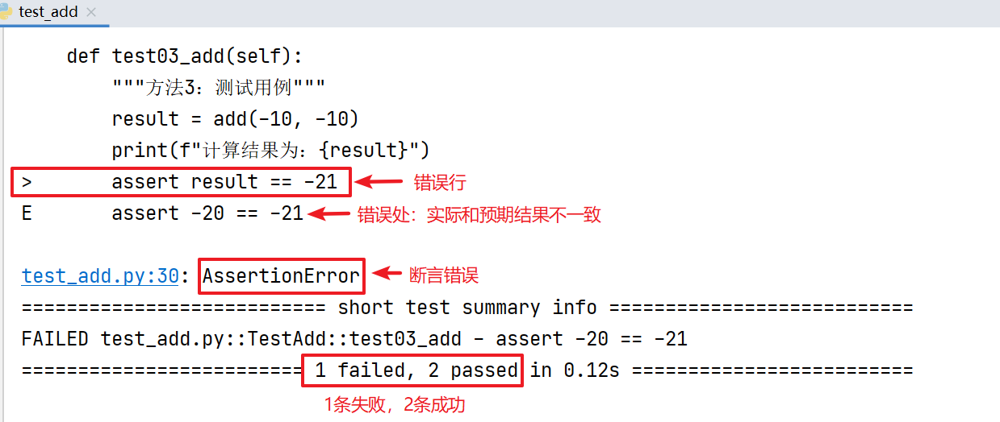

