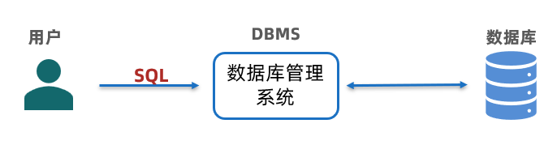
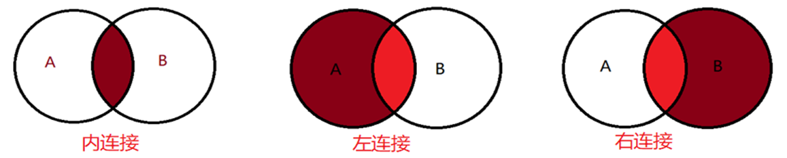

# SQL 笔记

**目标**

- **掌握数据的增删改查操作**

## 1.数据库应用

- **数据库是啥**

  - 在计算机中有组织有规律的存储数据的集合【存储数据的仓库】
  - 分类
    - 关系型数据库：以表格形式存储数据【比如：MySQL、Oracle等】
    - 非关系型数据库：非表格形式存储数据

- **测试中的应用场景**

  - **功能测试：**复杂数据的统计计算及正确性校验
  - **性能测试：**
    - 数据构造：构造批量数据
    - 数据清洗：数据去重及垃圾数据清理

- 如何应用

  

- SQL介绍：【结构化查询语言】

  - 操作关系型数据库的语言
  - **SQL语句关键词：**
    - **数据操作**：insert（增）、delete（删）、update（改）、select（查）
    - **数据定义**：create（创建）、alter（修改）、drop（删除）

## 2.数据库操作[了解]

> 1. 数据库、数据表、数据关系？
>
> - 数据库包含数据表；数据表包含数据
>
> 2. SQL语句规则
>
> - SQL语句不区分大小写
> - SQL语句结束标志是英文格式分号
> - 变量命令构成：字母、数字、下划线【例如：库名、表名、列名等】

### 创建数据库

- 作用：存储数据的集合

- 格式：`create database 数据库名 charset 字符集 collate 排序规则;`

  - 字符集：`utf8`  或者 `uft8mb4`
  - 排序规则：`utf8_general_ci` 或者 `utf8mb4_general_ci`

- 案例

  ```mysql
  # 创建数据库：testdb
  create database testdb charset utf8 collate utf8_general_ci; 
  ```


### 使用数据库[重点]

- 作用：确定正在操作的库对象

- 格式：`use 数据库名;`

  - 通过`select database();`查看当前操作的库

- 案例

  ```mysql
  # 打开库,否则不知道表到哪个库里面了
  use testdb;
  ```

### 修改数据库

- 作用：修改字符集或排序规则
- 格式：`alter database 数据库名 charset 字符集 collate 排序规则;`
- 注意：不能修改库名

### 删除数据库

- 格式：`drop database 数据库名;`

## 3.数据表操作[理解]

### 创建表

- 作用：存储数据的基本结构单元

- 格式：`create table 表名(字段1 数据类型 约束,字段2 数据类型 约束);`

  - 数据类型：表示操作的数据应支持的类型

    ①整数：int   【正整数：int unsigned】

    ②小数：decimal(总位数,小数位数)

    ③字符串：varchar(长度)

    ④时间日期：datetime

  - 约束：表示操作的数据应遵循的规则

    

    ① 主键：唯一表示表中不重复记录（非空+唯一）

    ② 外键：一个表的字段引用了另一个表主键（做表关联使用）

    ③ 唯一：表示该列记录不重复

    ④ 非空：表示该列记录不能为空

    ⑤ 自增：表示该列记录会自动递增（和主键一起使用）

    ⑥ 默认：表示该列记录有默认值

  - 注意事项：

    - 数据类型必填、约束可选；先有数据类型，再有约束
    - 字段（列）之间用英文格式逗号分隔

- 案例

  ```mysql
  # 创建表：student  要求：
  -- 学号是整型无符号类型，学号有主键约束，并且是自增长的
  -- 姓名长度为10
  -- 年龄整型无符号
  -- 身高保留两位有效数字，并且长度为3
  
  create table student (
  	id int unsigned primary key auto_increment, -- 学号
  	name varchar(10), -- 姓名
  	age int unsigned, -- 年龄
  	height decimal(3,2) -- 身高
  );
  ```

### 删除表

- 格式1：`drop table 表名;`
- 格式2：`drop table if exists 表名;`
- 区别：
  - 格式1删除后，如果表不存在再次删除会报错
  - 格式2删除后，再次执行删除不会报错


### 修改表

- 【通过AI自己查询了解】

### 查看表结构

- 作用：操作数据的时候需要确认字段、数据类型、约束信息时用

- 格式：`desc 表名;`    或者  `describe 表名;`

- 案例

  ```mysql
  desc student;
  ```

  

- dbeaver如何调整SQL字体大小

  

## 4.数据操作[重点]

### 插入数据

- 作用：表中新增数据信息

- 格式：

  - 插入单行数据：`insert into 表名 values (值1,值2,...);`
  - 插入多行数据：`insert into 表名 values (值1,值2,...),(值1,值2,...);`
  - **注意事项：**
    - 值的次序和字段名一一对应
    - 主键自增长的数据可以用 `0`代替任意值；否则用实际值输入
    - 整数和小数值不需要加引号，其他类型需要加引号

- 案例

  ```mysql
  # 了解表中有几列，有哪些类型和约束要求
  desc student;
  -- 插入单行或多行数据
  insert into student values (0,"张三",20,1.55);
  insert into student values (0,"李四",25,1.75),(0,"王五",30,1.88);
  -- 如果主键已存在再输入会报错，提示主键值重复
  insert into student values (1,"赵六",22,1.60);
  ```

  


### 修改数据

- 作用：数据需要修改时使用

- 格式：`update 表名 set 字段=值 where 条件;`

  - 注意事项：
    - 被修改的信息在set后面；where 后面条件表示满足指定条件的记录才能被修改
    - 修改数据强烈建议加where条件（一般是：已知字段=值），否则导致整列数据被修改

- 案例

  ```mysql
  # 修改学号为2号人的姓名为：赵四
  update student set name = "赵四" where id = 2;
  ```

  

### 删除数据

- 格式：`delete from 表名 where 条件;`

  - 注意事项：
    - 删除数据时强烈建议加where条件，否则导致整个表数据被清空

- 案例

  ```mysql
  # 删除学号为1的人的信息
  delete from student where id = 1;
  ```

  

### 查询数据

- 作用：在表中查找所需要的数据信息
- 基本格式：`select * from 表名;`
  - *表示任意值；查询结果是整个表的记录信息


## 5.复杂数据查询[重点]

### 5.0 数据准备

- 恢复课堂提供的数据库备份文件（练习用）

  ```shell
  # 【finalshell】在Linux下执行【MySQL软件已经安装在Linux系统中】
  # 备份数据库
  mysqldump -u root -p 数据库名 > 备份后文件名.sql
  # 在finalshell中恢复,先上传到虚拟机中再恢复
  mysql -u root -p 数据库名 < 已备份文件.sql
  ```
  
  
  
- 恢复方式

  ```mysql
  1.把备份文件打开，copy所有内容
  2.粘贴到SQL编辑器中，通过运行SQL脚本的方式执行
  3.注意：在执行SQL脚本之前，需要先打开数据库，最上面添加一行打开数据库的操作：use 数据库名;
  ```

### 5.1条件查询

> 应用场景：按照指定的条件查询表中的数据信息

- 基本格式：`select * from 表名 where 条件;`
- 条件构成
  - 比较运算符：字段对应目标值有大小关系
  - 逻辑运算符：条件之间的逻辑关系
  - 模糊查询：字段对应值模糊匹配
  - 范围查询：字段对应值有范围限制
  - 空判断：字段对应值为空值

#### 条件1：比较运算符

- 场景：条件对应目标值有大小关系
- 运算符：`=    !=   >   <   >=    <=`
- 条件：`字段 比较运算符 值`

#### 条件2：逻辑运算符

- 场景：条件之间有某种组合关系
- 运算符：`and    or     not`
- 条件：`条件1 逻辑运算符 条件2`

#### 条件3：模糊查询

- 场景：条件对应值不清楚（模糊匹配）
- 条件：`字段 like '模糊值'`
  - %：表示任意长度的值
  - _：表示单个字符


#### 条件4：范围查询

- 场景：条件对应值有指定的范围（某个列需要使用多个值）
- 连续范围条件：`字段 between 值1 and 值2`
- 非连续范围条件：`字段 in (值1,值2,...)`


#### 条件5：空判断

- 场景：条件对应值为空（NULL）
- 空值条件：`字段 is null`
- 非空值条件：`字段 is not null`

### 5.2 排序

- 应用场景：对于表中某列数据按照大小规则进行查询所需要的数据
- 语法格式：`select * from 表名 order by 字段 asc/desc;`
  - asc：表示升序，可以省略不写【ascend】
  - desc：表示降序，必须填写 【descend】


### 5.3 聚合函数

> 应用场景：对列表数据需要统计计算时使用

- 基本格式：`select 聚合函数 from 表名;`

- 常见聚合函数：

  ①count()：统计表中所有的记录数（行），通过count(*/字段)表示

  ②max()：计算某列的最大值，通过max(字段)表示

  ③min()：计算某列的最小值，通过min(字段)表示

  ④sum()：计算某列的和，通过sum(字段)表示

  ⑤avg()：计算某列的平均值，通过avg(字段)表示

- 注意事项：

  - count(*)统计所有记录数，包含某列为空值的记录数
  - count(字段)统计某列非空的所有记录数
  - select后面的聚合函数可更多个，多个之间用英文逗号分割

- 案例

  ```mysql
  -- eg:查询students表中学生总数
  select count(*) from students ;
  -- eg:统计students表中学生身份证数量
  select count(card) from students ;
  -- eg：查询女生的最大年龄
  select max(age) from students where sex="女";
  -- eg：查询1班的最小年龄
  select min(age) from students where class = "1班";
  -- eg：查询北京学生的年龄总和
  select sum(age) from students where hometown = "北京";
  -- eg：查询女生的平均年龄
  select avg(age) from students where sex = "女";
  -- 练习1、查询所有学生的最大年龄、最小年龄、平均年龄
  select max(age),min(age),avg(age) from students;
  -- 练习2、一班共有多少个学生
  select count(*) from students where class = "1班";
  -- 练习3、查询3班年龄小于18岁的同学有几个
  select count(*) from students where class = "3班" and age < 18;
  -- 总结：核心目的查啥？有没有修饰词，有修饰词几个？啥关系？
  ```

  

### 5.4 分组查询

> 应用场景：表中数据量过大查询时，可先将数据分组，然后再查询提高查询效率
>
> 共性特点：某列中值相同的会在一个组
>
> 描述属于：某个字段的每种/每个/各种xxxx

- 普通分组查询：`select 字段1,字段2,聚合... from 表名 group by 字段1,字段2,...;`

- 条件分组查询：`select 字段1,字段2,聚合... from 表名 group by 字段1,字段2,... having 条件;`

- where 和 having区别

  ①where是对原始数据的筛选，因而where后面不能带聚合函数的条件，having可以

  ②having是对分组之后的结果进行筛选，因而不能单独使用，必须和分组结合使用

  ③having后面带条件，必须是分组之后的字段对应条件【因为是基于分组结果的再筛选】

- 案例

  ```mysql
  -- eg1:查询各种性别的人数
  -- 分析：
  -- 关键词：查询人数  --> select count(*) from students
  -- 修饰词：各种性别  --> 分组之后（男生组、女生组）--> group by sex
  -- 组合
  select sex,count(*) from students group by sex;
  -- 总结：是否有分组（需求中有各种、每种、每个、各个出现）
  
  -- eg2:查询每个班级中各种性别的人数
  
  -- eg3:查询每个班级中各种性别的人数,并按照班级升序排列
  -- 分析：【注释快捷键：ctrl + /】
  -- 关键词：查询人数 select count(*) from students
  -- 修饰词：每个班级、各种性别  group by class,sex
  select class,sex,count(*) from students group by class,sex order by class asc;
  
  -- eg4:查询男生总人数（两种方式实现）
  select sex,count(*) from students where sex = "男";
  -- 分组形式：先按照性别分组，然后再去查找男生
  select sex,count(*) from students group by sex having sex = "男";
  
  -- eg5:查询班级平均年龄大于22岁的班级有哪些
  -- 关键词：查询班级  select class from students
  -- 修饰词：平均年龄大于22 --> avg(age) > 22
  -- 修饰词：谁的平均年龄？班级的 （计算每个班级的xxx）
  select class,avg(age) from students group by class having avg(age) > 22;
  
  -- eg6:查询每个班级中女生的平均年龄大于22岁的班级有哪些
  -- 关键词：查询班级  select class from students
  -- 修饰词：每个班级、女生、平均年龄大于22 --> group by class  、sex = "女" 、avg(age)>22
  -- 组合
  select class from students group by class,sex having sex = "女" and avg(age)>22;
  select class from students where sex = "女"  group by class having avg(age)>22;  -- 不推荐
  -- eg7:查询女生的平均年龄大于22岁的班级有哪些[和6一样]
  select class from students group by class,sex having sex = "女" and avg(age)>22;
  ```

  

### 5.5 分页查询

> 应用场景：将批量数据按照指定的页数进行筛选【分页常常和排序结合使用对应求最大最小值条件的应用】

- 语法格式：`select * from 表名 limit start,count;`

  ① start：是下标/索引，表示从第几条开始（数据位置），默认从0 开始计数

  ② count：需要显示的记录数

- 案例

  ```mysql
  -- eg1：查询前3行学生信息
  select * from students limit 0,3;
  select * from students limit 3;
  
  -- eg2：查询第4到第6行学生信息
  -- 起始位置：3 最终显示数量：3
  select * from students limit 3,3;
  
  -- eg3：查询学生信息表中年龄最大的学生信息
  -- 修饰词：年龄最大的学生信息 （条件） --> max(age) --> 这个是结果，无法构成条件（字段和值才能构成条件）
  -- 分析：按照年龄从大到小排序，再通过分页的形式获取第一条记录
  select * from students order by age desc limit 0,1;
  ```

  

### 5.6 连接查询

> 应用场景：将相关联多张表进行连接起来查询所需要的数据，即单张表无法满足要求

```yacas
1.连接查询中，对于表或者字段可以起别名，目的简化编写SQL
2.表起别名：表名 as 别名  字段起别名：字段 as 别名
3.关键词 as 可以省略不写，同时表起别名后，使用字段时需要用： 别名.字段名
```


- 连接查询分类

  

  - 内连接：`select * from 表1 inner join 表2 on 表1.字段 = 表2.字段 `
  - 外连接
    - 左连接：`select * from 表1 left join 表2 on 表1.字段 = 表2.字段 `
    - 右连接：`select * from 表1 right join 表2 on 表1.字段 = 表2.字段 `

- 案例

  ```mysql
  -- 例1：查询学生信息及学生的成绩，通过内连接的形式查询
  -- 分析：
  -- 关键词：查询学生信息  查询学生成绩
  select * from students s inner join scores s2 on s.studentNo = s2.studentno ;
  -- 例2：查询课程信息及课程的成绩
  
  -- 例3：查询学生信息及学生的课程对应的成绩
  -- 关键词：查询学生信息，查询成绩
  select s.*,s2.courseNo,s2.score from students s 
  inner join scores s2 on s.studentNo = s2.studentno ;
  
  -- 例4：查询王昭君的成绩，要求显示姓名、课程号、成绩
  select st.name,co.name,sc.score from scores sc
  inner join students st on sc.studentno = st.studentNo 
  inner join courses co on sc.courseNo = co.courseNo 
  where st.name = "王昭君";
  
  -- 例5：查询王昭君的数据库（的）成绩，要求显示姓名、课程名、成绩
  -- 关键词：查询成绩  --> select * from scores
  -- 修饰词：王昭君、数据库 --> name = "王昭君" and  name = "数据库"
  -- 组合
  select st.name,co.name,sc.score from scores sc
  inner join students st on sc.studentno = st.studentNo 
  inner join courses co on sc.courseNo = co.courseNo 
  where st.name = "王昭君" and  co.name = "数据库";
  
  -- 例6：查询所有学生的数据库成绩，要求显示姓名、课程名、成绩
  select st.name,co.name,sc.score from scores sc
  inner join students st on sc.studentno = st.studentNo 
  inner join courses co on sc.courseNo = co.courseNo 
  where co.name = "数据库";
  
  -- 例7：查询男生中最高的成绩，要求显示姓名、课程名、成绩
  -- 关键词：查成绩  --> select * from scores
  -- 修饰词：男生 --> sex = "男"   
  -- 修饰词：最高的成绩 --> 按照成绩从高到低排序后，选择第1条 --> order by score desc limit 1
  -- 组合
  select st.name,co.name,sc.score from scores sc
  inner join students st on sc.studentno = st.studentNo 
  inner join courses co on sc.courseNo = co.courseNo 
  where st.sex = "男"
  order by sc.score desc 
  limit 1;
  
  
  -- 例1:查询所有学生的成绩，包括没有成绩的学生（的信息）
  -- 关键词：查询成绩
  -- 问题：还需要查询学生的信息,成绩信息和学生信息谁要显示全部？ --> 学生信息需要显示全部
  select * from scores sc
  right join students st on sc.studentno = st.studentNo;
  -- 能否用左连接？
  select * from students st
  left join scores sc on sc.studentno = st.studentNo;
  
  -- 例2:查询所有学生的成绩，包括没有成绩的学生，需要显示课程名
  select st.*,sc.score,co.name from students st
  left join scores sc on sc.studentno = st.studentNo
  left join courses co on sc.courseno = co.courseno;
  
  select * from scores sc
  right join courses co on sc.courseNo = co.courseNo 
  right join students st on sc.studentno = st.studentNo;
  
  ```

  

### 5.7 子查询

- 应用场景：涉及多表关联，想办法在一张表中查到结果【过滤条件或临时表需要另一个SQL查询的场景】
- 子查询构成
  - 主查询：写在括号外主要查询的结果
  - 子查询：写在括号内充当过滤条件或临时表的SQL查询

### 总结：编写SQL次序

**select (结果字段)--> from (表名)--->inner join ... on ...(多表连接) --->where (条件)---> group by (分组字段) --->having（条件）---> order by(排序字段)--->limit (分页)**