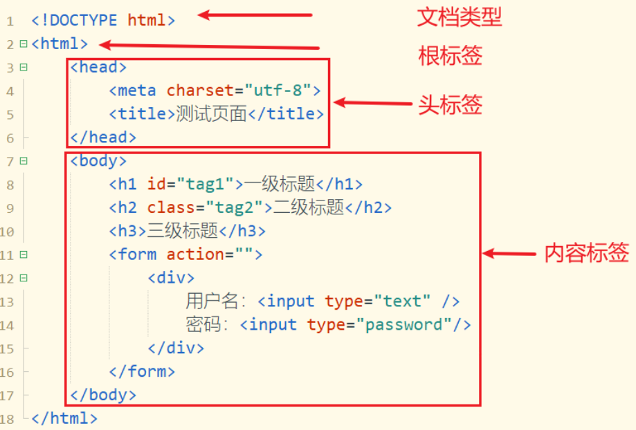
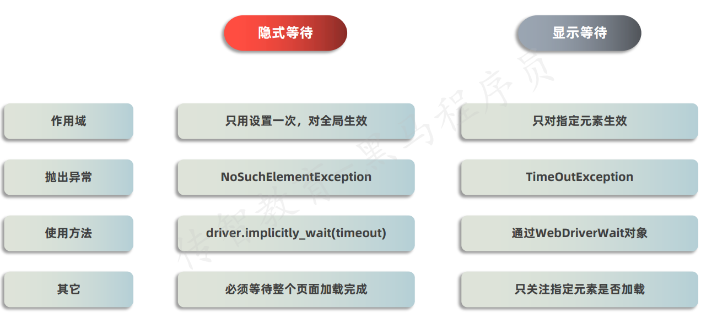
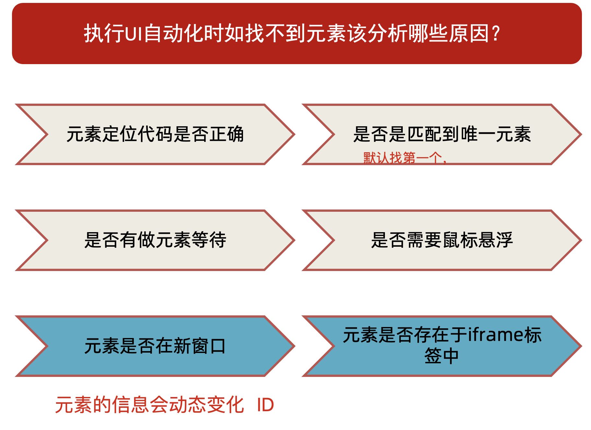
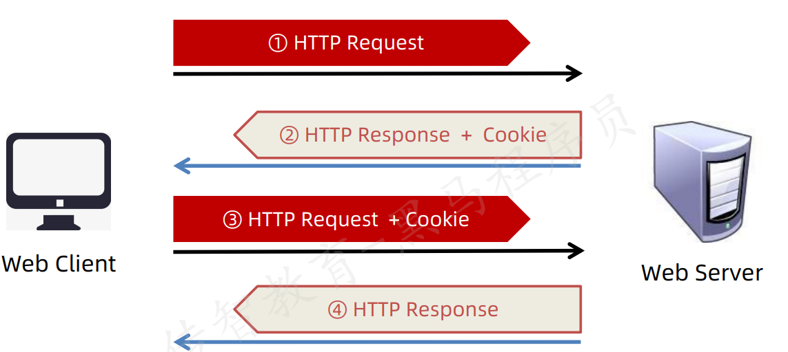

# Selenium学习


## 3.页面元素

- 人操作页面流程

  ```yacas
  1.打开浏览器
  2.输入访问地址（URL）
  3.页面信息操作
  4.关闭/退出浏览器
  ```

- **页面构成三大核心技术**

  > 查看页面元素/页面代码内容：F12  或者  Fn + F12

  - HTML（HyperText Markup Language）：超文本标签语言，主要用来实现页面的内容。
  - CSS（Cascading Style Sheets）：层叠样式表，主要让页面显示内容更加美观。
  - JS（JavaScript）：一门脚本语言，主要用于实现页面动态效果。

- HTML 标签的基本组成

  ```html
  # 双标签
  <标签名 属性名1='属性值1 属性值2' 属性名2='属性值'>文本内容</标签名>
  
  # 单标签
  <标签名 属性='属性值' >
  ```

  **前置**：了解前端基础，认识什么是**标签名**, 什么是**属性名**, 什么是**属性值**，什么是**文本内容** 即可。

  ```yacas
  标签名：HTML文档内容的基本构成块
  属性：给标签提供的额外信息（控制标签的行为或外观），位于标签的内部的键值，多个属性通过空格分开
  ```

  

- 元素定位的方式

  ```yacas
  1. ID  标签的ID 属性
  2. name  标签的 name 属性
  3. class_name  标签的 class 属性
  4. tag_name   标签的名字
  5. link_text  a 标签(超链接)中的文本内容
  6. partial_link_text  a 标签(超链接)中的部分文本内容
  7. xpath 路径表达式(使用最多)
  8. css 使用css选择器定位
  ```
## 选择元素基本方法

### 根据`id`选择元素

  - 根据规范，`id`不能重复，是唯一的，根据id选择元素是最快的
  - 语法:`element = wd.find_element(By.ID, 'id')

    ```python
    from selenium import webdriver
    from selenium.webdriver.common.by import By
    
    # 创建 WebDriver 对象
    wd = webdriver.Chrome()
    
    # 调用WebDriver 对象的get方法 可以让浏览器打开指定网址
    wd.get('https://www.byhy.net/cdn2/files/selenium/stock1.html')
    
    # 根据id选择元素，返回的就是该元素对应的WebElement对象
    element = wd.find_element(By.ID, 'kw')
    
    # 通过该 WebElement对象，就可以对页面元素进行操作了
    # 比如输入字符串到 这个 输入框里
    element.send_keys('通讯\n')
    
    input('按回车退出')
    ```

### 根据元素`class`选择元素

- `class`可以一次性选择多个元素
  - 语法:`elements = wd.find_elements(By.CLASS_NAME, 'class')`
  - 如果找不到元素，`elements`变量的值为空列表
  - 可以利用空列表特性来判断元素是否存在
- 想要只选择单个元素:
  - 语法:`element = wd.find_element(By.CLASS_NAME, 'class')`
  - 会获取匹配的第一个元素
- `find_element()`和`find_elements()`区别:
  - `find_element()`会返回第一个匹配的元素，如果没有会抛出异常
  - `find_elements()`会返回所有匹配的元素组成的列表，如果没有会返回空列表
  - `find_element()`更适合用来查找唯一元素，`find_elements()`更适合用来查找多个元素
- `text`属性:
  - 使用元素的`text`属性，可以获取元素的文本内容:
  - 语法:`element.text`
    - 例如:`print(element.text)`,这行代码就可以打印`element`元素的文本内容

### 根据`tag`名选元素

- 和`class`属性一样，`tag`属性值可以有多个，多个用空格隔开
- 语法:`elements = wd.find_elements(By.TAG_NAME, 'tag')`

### 根据`a`标签定位页面元素

- 语法：`element = wd.find_element(By.LINK_TEXT, 'link_text')`
  - 根据`a`标签的文本内容来定位元素
  - 例如：
  ```python
  element = wd.find_element(By.LINK_TEXT, '新闻')
  ```
- 语法：`element = wd.find_element(By.PARTIAL_LINK_TEXT, 'partial_link_text')`
  - 根据`a`标签的部分文本内容来定位元素
  - 例如：
  ```python
  element = wd.find_element(By.PARTIAL_LINK_TEXT, '新')
  ```
### 通过`WebElement`对象选择元素

  - `WebDirver`对象选择的是整个页面，`WebElement`对象选择是某个元素内部，可以先通过id确定外层元素，在对内层元素进行操作

  ```python
  import time
  from selenium import webdriver
  from selenium.webdriver.common.by import By
  
  # 创建 WebDriver 对象
  wd = webdriver.Edge()
  wd.get('https://www.bilibili.com/?spm_id_from=333.337.0.0')
  # 定位外层元素
  element = wd.find_element(By.ID, 'nav-searchform')
  # 定位内层元素
  input_element = element.find_element(By.TAG_NAME, 'input')
  input_element.send_keys('自动化测试\n')
  time.sleep(5)
  input('按回车退出')
  wd.quit()
  ```

  - 如上例子就是先定位bilibili首页的搜索框，再对搜索框进行输入操作
### 等待元素出现
#### 隐式等待
  - `webdriver`对象提供了`implicitly_wait()`方法，设置隐式等待时间，当元素不存在时，会等待一段时间，如果元素存在，则立即返回
  - 语法:`wd.implicitly_wait(10)` 10秒内，如果元素不存在，则每隔0.5秒检查一次，如果元素存在，则立即返回
#### 显式等待
- 定位**指定**元素时，如果能定位到元素则直接返回该元素，不触发等待
- 定位**指定**元素时，如果不能定位到元素，则会等待一段时间，如果在等待时间内定位到元素，则立即返回
- 定位**指定**元素时，如果不能定位到元素，则会抛出异常
- 语法:
  - 导包:`from selenium.webdriver.support.wait import WebDriverWait`
  - `element = WebDriverWait(wd, 10).until(lambda x: x.find_element(By.CSS_SELECTOR, 'CSS_SELECTOR参数'))`
  - 10秒内，如果元素不存在，则每隔0.5秒检查一次，如果元素存在，则立即返回
  - 如果10秒内元素还没有出现，则会抛出异常
  - 例子：
  ```python
  from selenium import webdriver
  from selenium.webdriver.common.by import By
  from selenium.webdriver.support.wait import WebDriverWait
  
  # 初始化WebDriver
  wd = webdriver.Edge()
  wd.get('http://121.43.169.97:8848/login.html')
  
  # 使用显式等待定位用户名输入框，最多等待10秒
  username_input = WebDriverWait(wd, 10).until(
      lambda x: x.find_element(By.CSS_SELECTOR, '#username')
  )
  
  # 对定位到的元素进行操作
  username_input.send_keys('testuser')
  
  # 关闭浏览器
  wd.quit()
  ```
- 个人理解：后面的until中传入一个逻辑，这个逻辑可以由开发者自己定义，在规定的时间内去获取一个非空的结果，并将结果传给变量，这么传递可以极大提升等待条件的灵活性，比如可以根据元素的`text`属性、`class`属性、`id`属性等去等待元素的出现。


## CSS selector

### 验证`CSS selector`

- 想要验证表达式正不正确可以在页面开发者模式下按`ctrl`+`f`进入搜索界面，把表达式扔进去验证
- 一般会出现`1 of n`，`n`表示有几个元素可以被当前表达式匹配到，前面的1表示当前匹配到第几个

### 选择元素

- 选择单个元素语法:`element = wd.find_element(By.CSS_SELECTOR, 'CSS_SELECTOR参数')`
- 选择多个元素语法:`elements = wd.find_elements(By.CSS_SELECTOR, 'CSS_SELECTOR参数')`
- `CSS_SELECTOR`同样可以根据tag名、id 属性和 class属性 来 选择元素:
  - 例如,选择所有tag名为div的元素:
    - `wd.find_elements(By.CSS_SELECTOR, 'div')`
    - 等价于`wd.find_elements(By.TAG_NAME, 'div')`
  - 根据`id`属性选择元素的语法是在`id`号前加一个`#`
    - 例如,选择id为kw的元素:`wd.find_element(By.CSS_SELECTOR, '#kw')`
    - 等价于`wd.find_element(By.ID, 'kw')`
- 根据`class`属性选择元素的语法是在`class`属性名前加一个`.`
  - 比如要选择所有`class`值为`people`的元素:
    - 可以是`wd.find_elements(By.CLASS_NAME, 'people')`
    - 也可以是`wd.find_elements(By.CSS_SELECTOR, '.people')`
      - `.people`就是代表所有class值为`people`的元素

### 选择**子元素**和**后代元素**

- 子元素:`CSS selector`选择子元素语法是在选择元素的后面加上`>`
- 后代元素:`CSS selector`选择后代元素语法是在选择元素的后面加上` `(一个或多个空格)
  - 也可以通过多个`>`，通过选择子元素的子元素来选择后代元素
  - ` `和`>`可以混用

### 根据属性选择元素

- `CSS selector`选择属性的语法是在属性名前加一个`[`，属性名后加一个`]`
- 例如:选择所有`href`属性值为`https://www.byhy.net/` 的元素:
  - `wd.find_elements(By.CSS_SELECTOR, '[href="https://www.byhy.net/"]')`
- 也可以只写一个`href`属性，表示选择所有有`href`属性的元素:
  - `wd.find_elements(By.CSS_SELECTOR, '[href]')`
- 属性选择可以和标签叠加，例如可以在`href`前写一个`div`标签，表示选择所有标签名为`div`且带有`href`属性的元素:
  - `wd.find_elements(By.CSS_SELECTOR, 'div[href]')`
- 属性包含选择,例如选择所有`href`属性值包含`byhy`的元素:
  - `wd.find_elements(By.CSS_SELECTOR, '[href*="byhy"]')`
  - `*`表示属性值包含`byhy`
  - `wd.find_elements(By.CSS_SELECTOR, '[href^="byhy"]')`
  - `^`表示属性值以`byhy`开头`
  - `wd.find_elements(By.CSS_SELECTOR, '[href$="byhy"]')`
  - `$`表示属性值以`byhy`结尾
- 如果要包含多个属性限制，可以直接在后面加上新的属性限制:
  - `wd.find_elements(By.CSS_SELECTOR, 'div[href*="byhy"][class="people"]')`
  - 如上就表示选择标签名为`div`且`href`属性值包含`byhy`，并且`class`属性值为`people`的元素


### 选择语法联合使用

- 即前面的选择语法可以叠加使用以便更精准的找到对应元素
  - 例如:`wd.find_elements(By.CSS_SELECTOR, 'div.people > span[href*="byhy"]')`
  - 如上例子意思是寻找`span`标签且属性`href`的值包括`byhy`,并且是`div`标签且`class`属性为`people`的子元素的元素
- 组选择
  - 想要同时筛选多种条件的元素进入同一个列表，不同条件用`,`隔开
    - 例如:`wd.find_elements(By.CSS_SELECTOR, 'div.people, div.animal ')`
    - 表示寻找`div`标签且`class`属性为`people`或者`class`属性为`animal`的元素
    - 注意不存在如下写法:
      - `wd.find_elements(By.CSS_SELECTOR, 'div > .people, .animal')`
      - 该写法表示分别匹配 `div` 下的 `.people` 和任意位置的 `.animal`，而不是 `div` 下的 `.people` 或 `.animal`
      - 如下图:

      ```mermaid
      graph LR
        A[CSS selector] --> B[div]
        B --> C[class]
        C --> D[people]
        A --> F[class]
        F --> G[animal]
      ```

- 按次序选择子节点
  - 想要选择的元素是**父元素的第n个子节点**时:
    - 使用`nth-child(n)`
    - 比如选择`span`标签的第3个子节点:
    - `wd.find_elements(By.CSS_SELECTOR, 'span:nth-child(3)')`
    - 如果不加限制，直接写`:nth-child(3)`，表示选择位置为第二个的所有元素
  - 想要选择的元素是**父元素的倒数第n个子节点**时:
    - 使用`nth-last-child(n)`
    - 比如选择`span`标签的第3个子节点:
    - `wd.find_elements(By.CSS_SELECTOR, 'span:nth-last-child(3)')`
  - 想要选择的元素是**选择父元素下第 n 个特定类型的子节点**时:
    - 使用`nth-of-type(n)`
    - 比如选择`span`标签的第3个子节点:
    - `wd.find_elements(By.CSS_SELECTOR, 'span:nth-of-type(3)')`
    - 注意与`nth-child(n)`的区别:
      - `span:nth-child(3)` :意思是选择`span`标签元素的第3个子节点
      - `span:nth-of-type(3)` :意思是选择`span`标签元素的第3个元素
  - 想要选择的元素是**选择父元素下第 n 个特定类型的倒数第 n 个子节点**时:
    - 使用`nth-last-of-type(n)`
  - 奇数节点和偶数节点
    - 如果要选择的是父元素的 偶数节点，使用 `nth-child(even)`
      - `even`:表示偶数节点
    - 如果要选择的是父元素的 奇数节点，使用 `nth-child(odd)`
      - `odd`:表示奇数节点

### 兄弟节点选择

- 相邻兄弟节点选择
  - 使用`+`可以选择指定元素身后第一个符合条件的兄弟元素
  - 例子:`h2 + p`:选择紧跟`h2`标签后面第一个`p`元素

  ```html
  <div class="container">
    <h2>标题</h2>
    <p>段落1（被选中）</p> <!-- 紧接在 h2 后 -->
    <p>段落2</p>
    <div>分隔块</div>
    <p>段落3</p>
  </div>
  ```

- 通用兄弟节点选择
  - 使用`~`可以选择后续所有满足条件的兄弟节点
  - 例子:`h2 ~ p`:选择所有紧跟在`h2`标签后面的`p`元素

  ```html
  <div class="container">
    <h3>小标题</h3>
    <p>说明文字（被选中）</p>
    <div>信息块</div>
    <p>补充内容（被选中）</p>
    <p>备注（被选中）</p>
  </div>
  ```

## frame切换/窗口切换

### frame切换

- `iframe`元素:
  - `frame` 元素 或者`iframe`元素的内部 会包含一个 被嵌入的 另一份html文档，想要操作被嵌入的HTML文档就必须切换操作范围到被嵌入文档中
- `switch_to.frame()`:
  - 语法:`wd.switch_to.frame(frame_reference)`
  - `frame_reference`可以是frame元素的name或者id
  - 也可以填写`frame`元素对应的`WebElement`对象，例如:
    - `wd.switch_to.frame(wd.find_element(By.TAG_NAME, "iframe"))`
    - 如上表示切换到`tag`名为`iframe`的元素对应的`WebElement`对象
- `switch_to.default_content()`:
  - 用于切换回最外层HTML中
  - 语法:`wd.switch_to.default_content()`

### 切换到新的窗口

- 切换新窗口:
  - 语法:`wd.switch_to.window(handle)`
  - `handle`:窗口句柄，可以通过`wd.window_handles`属性获取
  - 可以通过循环来进入目标操作窗口:

  ```python
  for handle in wd.window_handles:
      # 先切换到该窗口
      wd.switch_to.window(handle)
      # 得到该窗口的标题栏字符串，判断是不是我们要操作的那个窗口
      if 'Bing' in wd.title:
          # 如果是，那么这时候WebDriver对象就是对应的该该窗口，正好，跳出循环，
          break
  ```

- 回到原来窗口
  - `mainWindow = wd.current_window_handle`:保存当前窗口变量句柄
  - `switch_to.window(mainWindow)`:回到原来窗口
  - 如上两句就可以通过保存的句柄快速回到原来窗口

## 选择框

常见的选择框包括: radio框、checkbox框、select框

### radio框

- 单选框，在几个选项中始终有一个被勾选的
- 获取当前选择元素:
  - 在css_selector中添加`:checked`
    - 表示选择`checked`状态的元素，对 `radio` 和 `checkbox` 类型的input有效
  - 例子:

    ```html
    <div id="s_radio">
      <input type="radio" name="teacher" value="小江老师">小江老师<br>
      <input type="radio" name="teacher" value="小雷老师">小雷老师<br>
      <input type="radio" name="teacher" value="小凯老师" checked="checked">小凯老师
    </div>
    ```

    ```python
    # 获取当前选中的元素
    element = wd.find_element(By.CSS_SELECTOR,'#s_radio input[name="teacher"]:checked')
    print('当前选中的是: ' + element.get_attribute('value'))
    # 点选 小雷老师
    wd.find_element(By.CSS_SELECTOR,'#s_radio input[value="小雷老师"]').click()
    ```

- 选择元素:
  - 使用`click()`方法即可

### checkbox框

- 多选框，在多个选项中可以选中多个或者不选
- 与`radio`不同，`checkbox`不存在始终为`checked`状态的元素
- 获取当前选择元素,与`radio`一样:
  - 在css_selector中添加`:checked`即可获取当前已被勾选的元素
- 选择元素:
  - 使用`click()`方法即可

### select框

- `select`与前两个标签均不同，radio框及checkbox框都是input元素，只是里面的type不同而已，select框 则是一个新的select标签
- 对于Select 选择框， Selenium 专门提供了一个 Select类 进行操作，可以这样导入
  - `from selenium.webdriver.support.select import Select`
  - 实例化时传入`select`元素对应的`WebElement`对象
  - `select = Select(wd.find_element(By.ID, 'ss_single'))`
- `Select`类提供了如下常用的 属性 和 方法
  - `all_selected_options`
    - 返回所有 当前选中的`option`元素 对应的 `WebElement` 对象
  - `select_by_value`
    - 通过`value`属性的值来选择,例如:

    ```html
    <option value="foo">Bar</option>
    ```

    - 可以通过`select.select_by_value('foo')`来选择该选项
  - `select_by_index`
    - 根据选项的 次序 选择元素
    - 语法:`select.select_by_index(index)`
    - `index`:选项的索引，从0开始
  - `select_by_visible_text`
    - 根据选项的 可见文本 ，选择元素
    - 语法:`select.select_by_visible_text(text)`
    - `text`:选项的文本，例如:

    ```html
    <option value="foo">Bar</option>
    ```

    - 可以通过`select.select_by_visible_text('Bar')`来选择该选项
  - `deselect_by_value`
    - 根据选项的value属性值， 去除 选中元素
  - `deselect_by_index`
    - 根据选项的次序，去除 选中元素
  - `deselect_by_visible_text`
    - 根据选项的可见文本，去除 选中元素
  - `deselect_all`
    - 去除 选中所有元素
- `Select`单选框
  - 对于 select单选框，操作比较简单:不管原来选的是什么，直接用Select方法选择即可
- `Select`多选框
  - 根据自己想要选择的，可以先去除全部选择，再选择想要选择的，来确保准确性，避免误选

## 实战技巧

### 操作元素

#### 一般方法

- `click()`方法:点击元素，鼠标左键点击
- `send_keys()`方法:输入字符串到元素中
- `clear()`方法:清空元素中的内容
- `element.text`属性:获取元素的文本内容
- `get_attribute()`方法:获取元素的属性值
  - 语法:`element.get_attribute('属性名')`
  - 获取整个元素对应的HTML代码:`element.get_attribute('outerHTML')`
  - 获取元素内部的HTML代码:`element.get_attribute('innerHTML')`
  - 获取输入框内的文字:`element.get_attribute('value')`
  - 有时候元素的文本内容没有展示或者没有完全展示在页面中，这时候用`.text`可能会有问题
    - 解决方法:使用`get_attribute()`方法获取元素的属性值，属性值为`textContent`或`innerText`

#### ActionChains 类方法

- 个人理解:**ActionChains的实例化实际上是一个指定了操作对象的动作链，可以按照既定的步骤逐步记录对对象的元素进行操作，最后通过perform统一提交给操作对象执行**
- 导包:`from selenium.webdriver.common.action_chains import ActionChains`
- perform() 方法:所有 ActionChains 的动作必须通过 .perform() 才会执行
- context_click():右击

  ```python
  # 定位元素（假设页面有一个按钮）
  element = wd.find_element(By.CSS_SELECTOR, "#right-click-button")
  
  # 创建动作链并执行右击
  actions = ActionChains(wd)
  actions.context_click(element).perform()
  ```

- double_click():双击

  ```python
  # 定位元素（假设页面有一个文本区域）
  element = wd.find_element(By.CSS_SELECTOR, "#text-area")
  
  # 创建动作链并执行双击
  actions = ActionChains(wd)
  actions.double_click(element).perform()
  ```

- drag_and_drop():拖动

  ```python
  # 定位拖拽的源元素和目标元素
  source = wd.find_element(By.CSS_SELECTOR, "#drag-element")
  target = wd.find_element(By.CSS_SELECTOR, "#drop-zone")
  
  # 创建动作链并执行拖放
  actions = ActionChains(wd)
  actions.drag_and_drop(source, target).perform()
  ```

- move_to_element():鼠标悬停

  ```python
  # 定位需要悬停的元素（如导航栏菜单）
  element = wd.find_element(By.CSS_SELECTOR, "#hover-menu")
  
  # 创建动作链并执行悬停
  actions = ActionChains(wd)
  actions.move_to_element(element).perform()
  ```

#### 直接执行javascript

- 可以直接让浏览器运行一段javascript代码，并且得到返回值
- `execute_script()`方法:执行javascript代码，并返回结果
- 语法:`wd.execute_script(script, *args)`
  - `script`:要执行的javascript代码，可以是字符串，也可以是文件路径
  - `args`:传递给javascript代码的参数，可以是多个参数，也可以是一个参数，也可以是一个参数列表
  - 执行如下代码可以让元素滚动到可视部分:`wd.execute_script("arguments[0].scrollIntoView({block:'center',inline:'center'})", element)`

#### 冻结界面

- 情景:有时候需要选择鼠标悬停才出现的菜单栏内元素，但是鼠标移开菜单栏就会消失，此时就需要冻结界面让菜单栏不消失
- 可以使用debug状态下页面冻结的特性来完成页面冻结
  - 在 开发者工具栏 console 里面执行如下js代码:

  ```javascript
  setTimeout(function(){debugger}, 5000)
  ```

  - 代码表示在 5000毫秒后，执行 debugger 命令，执行命令后鼠标悬停至动态菜单栏，就可以定位到对应元素了

#### 弹出对话框

- 弹出的对话框有三种类型，分别是 Alert（警告信息）、confirm（确认信息）和prompt（提示输入）
- **Alert**:
  - `Alert` 弹出框，目的就是显示通知信息，只需用户看完信息后，点击 OK（确定） 就可以了
  - 模拟用户点击 OK 按钮:
    - `wd.switch_to.alert.accept()`
  - 获取弹出框信息:
    - `wd.switch_to.alert.text`
- **Confirm**:
  - `Confirm`弹出框，主要是让用户确认是否要进行某个操作
  - 模拟用户点击 OK 按钮，与`alert`相同:
    - `wd.switch_to.alert.accept()`
  - 模拟用户点击 Cancel 按钮:
    - `wd.switch_to.alert.dismiss()`
- **Prompt**:
  - Prompt 弹出框 是需要用户输入一些信息，提交上去
  - 输入信息:
    - `wd.switch_to.alert.send_keys('信息')`
  - 完整流程:
    - 定位触发元素并触发弹出框
      - `wd.find_element(By.CSS_SELECTOR, '表达式').click()`
    - 获取 alert 对象
      - `alert = wd.switch_to.alert`
    - 打印 弹出框 提示信息(可选)
      - `print(alert.text)`
    - 输入信息
      - `alert.send_keys('信息')`
    - 点击 OK 按钮 提交
      - `alert.accept()`
    - 或者点击 Cancel 按钮 取消
      - `alert.dismiss()`
  - 举例:

  ```python
  from selenium import webdriver
  from selenium.webdriver.common.by import By
  
  wd = webdriver.Chrome()
  wd.implicitly_wait(5)
  wd.get('https://www.byhy.net/cdn2/files/selenium/test4.html')
  
  
  # --- prompt ---
  wd.find_element(By.ID, 'b3').click()
  
  # 获取 alert 对象
  alert = wd.switch_to.alert
  
  # 打印 弹出框 提示信息
  print(alert.text)
  
  # 输入信息，并且点击 OK 按钮 提交
  alert.send_keys('web自动化 - selenium')
  alert.accept()
  
  # 点击 Cancel 按钮 取消
  wd.find_element(By.ID, 'b3').click()
  alert = wd.switch_to.alert
  alert.dismiss()
  ```

### 其他技巧

- 获取窗口大小
  - `wd.get_window_size()`
- 改变窗口大小
  - `wd.set_window_size(x, y)`
- 获取当前页面标题
  - `wd.title`
- 获取当前页面URL
  - `wd.current_url`
- 截屏
  - `wd.get_screenshot_as_file("照片名字")`

- 手机模式
  - 可以通过 desired_capabilities 参数，指定以手机模式打开chrome浏览器
  - 参考代码:

  ```python
  from selenium import webdriver
  
  mobile_emulation = { "deviceName": "iPhone 14 Pro Max" }
  
  chrome_options = webdriver.ChromeOptions()
  
  chrome_options.add_experimental_option("mobileEmulation", mobile_emulation)
  
  driver = webdriver.Chrome(options=chrome_options)
  
  driver.get('http://www.baidu.com')
  
  input()
  driver.quit()
  ```

- 上传文件
  - 通常，网站页面上传文件的功能，是通过 type 属性 为 file 的 HTML input 元素实现的,例如:

  ```html
  <input type="file" multiple="multiple">
  ```

  - 使用selenium自动化上传文件，我们只需要定位到该input元素，然后通过 send_keys 方法传入要上传的文件路径即可

  ```python
  # 先定位到上传文件的 input 元素
  ele = wd.find_element(By.CSS_SELECTOR, 'input[type=file]')
  
  # 再调用 WebElement 对象的 send_keys 方法
  ele.send_keys(r'h:\g02.png')
  ```

  - 多个文件多次调用即可

#### 获取元素信息
- 获取元素大小
  - `element.size`
- 获取文本
  - `element.text`
- 元素是否可见
  - `element.is_displayed()`
- 元素是否可用
  - `element.is_enabled()`
- 元素是否选中
  - `element.is_selected()`


## Xpath选择器

### 语法简介

- Xpath 是 XML 和 HTML 文档的查询语言，Xpath 可以用来在文档中定位元素和属性，某些场景下CSS选择会很麻烦，这时候就用Xpath
- Xpath 的语法规则:
  - 语法:`wd.find_element(By.XPATH, 'Xpath表达式')`
  - 绝对路径:
  - `/`:和Linux系统的文件系统类似，整个HTML文档根节点用`/`表示,例如定位某元素:
    - `/html/body/div`
    - 如上Xpath表示，从HTML文档的根节点开始，依次选择`html`下的`body`下的`div`元素，最后选中到`div`元素
  - 相对路径:
  - `//`:`//`表示从当前节点开始，选择所有匹配的元素，例如:`//div`表示选择所有`div`元素
  - 相对路径可以叠加，例如:`//div/a`表示选择所有`div`元素下的`a`元素，对比CSS选择器就是`div a`
- 通配符:
  - 如果要选择所有子节点，可以使用`*`通配符，例如:`//div/*`表示选择所有`div`元素下的所有子节点
  - CSS选择同样，`div *`表示选择所有`div`元素下的所有子节点

### 根据属性选择

- 通用格式:`[@属性名='属性值']`
- 根据`id`:`//*[@id='id值']`:意思是选择`id`属性值为`id值`的元素
- 根据`class`:`//*[@class='class值']`:意思是选择所有`class`属性值为`class值`的元素
  - `//select[@class='single_choice']`:选择所有`class`属性值为`single_choice`的`select`元素
- 根据其他属性:可以利用某些元素特有的属性，例如`//*[@multiple]`:意思是选择所有带有`multiple`属性的元素
- 根据文本内容:
  - 语法:`//*[text()='文本内容']`
  - 例如:`//*[text()='新闻']`:选择所有文本内容为`新闻`的元素
  - 注意:根据文本选择不要带`@`
### 按次序选择

#### 某类型第n个元素

- 通用格式:`[序号]`
- 举例:`//p[2]`:选择所有`p`元素中的第二个`p`元素
  - 这里要注意的是，与CSS选择不同，这里Xpath选择的是 匹配整个文档中所有 `<p>` 元素的第二个
  - CSS选择:`p:nth-child(2)`: 匹配每个父元素下第二个子元素，且该子元素必须是 `<p>`

#### 第n个元素

- 与通配符叠加使用:`*[序号]`
- 举例:`//*[2]`:选择所有文档中第2个元素，不管元素类型

#### 某类型 倒数第n个元素

- 通用格式:`[last()-(n-1)]`
- 举例:`//p[last()-1]`:选择所有`p`元素中的倒数第二个`p`元素

#### 范围选择

- 通用格式:`[position()>=n] or [position()<=last()-(n-1)]`:表示选择前n个元素或者后n个元素
- 举例:`//*[@class='multi_choice']/*[position()<=3]`:选择所有`class`属性值为`multi_choice`的元素下的前3个元素

#### 组选择、父节点、兄弟节点

- 组选择
  - Xpath的组选择是由`|`来分隔不同条件，CSS则是`,`
  - 举例:`/div/div/a | /div/div/span`:选择`div`元素下的`div`元素下的`a`元素或者`span`元素
  - 相对应的CSS选择:`div>div>a, div>div>span`
- 选择父节点
  - 某个元素使用`/..`就可以选择父节点，这是CSS选择器无法实现的
  - 举例:`//*[@id='china']/..`:表示选择id属性值为`china`的元素，然后选择该元素父节点
- 兄弟节点选择
  - 选择元素后续的兄弟节点:`following-sibling::`
  - CSS选择器后续第一个兄弟是使用`+`，后续所有兄弟使用`~`
  - 举例:`//*[@class='single_choice']/following-sibling::div`
    - 表示选择class属性值为`single_choice`的元素，然后选择该元素后续所有`div`标签兄弟节点
  - 等价于CSS选择:`[class='single_choice'] ~ div`
  - 选择前兄弟节点:`preceding-sibling::`
    - `//*[@class='single_choice']/preceding-sibling::[1]`:表示选择class属性值为`single_choice`的元素，然后选择该元素前一个兄弟节点
    - CSS选择无法选择前兄弟节点

#### 注意点

- 要在某个元素内部使用xpath选择元素， 需要 在xpath表达式最前面加个点
- 举例:

```python
# 先寻找id是china的元素
china = wd.find_element(By.ID, 'china')

# 再选择该元素内部的p元素
elements = china.find_elements(By.XPATH, '//p')

# 打印结果
for element in elements:
    print('----------------')
    print(element.get_attribute('outerHTML'))
```

- 如上在寻找的时候，出现的不是china内部的p元素， 而是所有的p元素
- 修改:`elements = china.find_elements(By.XPATH, './/p')`


## UI自动化常见面试问题

> 能有效应对面试中的一些常规测试场景问题

1. 功能测试和UI自动化测试啥关系？

   ```yacas
   功能测试包含UI自动化（更趋向于页面级的功能测试）
   ```

2. UI自动化包含哪些？

   ```yacas
   - web自动化测试
   - 移动端自动化测试
   ```

3. UI自动化测试前提？

   ```yacas
   - 项目需要大量的回归测试（原版本的复测）
   - 项目需求变更不频繁
   - 项目周期比较长
   ```

4. UI自动化测试时机？

   ```yacas
   一般在手工测试完成后，项目趋于稳定时可以介入UI自动化【版本回归】
   ```

5. UI自动化测试优劣势？

   ```yacas
   优势:
   1. 节省人力成本
   2. 提高测试效率【执行】
   3. 提高测试质量
   4. 构造一些测试数据
   5. 项目文档辅助
   劣势:
   1.对于测试人员要求较高
   2.前期投入成本高【人+时间】
   3.对项目要求比较高【不适合频繁的需求变更】
   ```

6. 元素等待

- 固定等待：等待指定的时间（编写简单，但控制时间不精准）

- 隐式等待：整个webdriver生命周期（全局）对所有元素都生效，会等待指定时间，直到元素出现或超时

- 显示等待：对特定元素等待，而不是对整个页面的等待，按照指定频率和时间查找元素，直到元素出现或超时

  > 面试题目：隐式等待和显示等待的区别？

  

7. 定位元素问题

> 面试：定位不到元素如何分析？



8. 验证码处理

> 面试题：在自动化测试中，出现验证码怎么处理？
>
> - 去掉验证码或使用万能验证码
> - 通过记录cookie形式处理
> - 通过OCR识别技术实现【成功率低，难度大】

```yacas
cookie是啥？
1.Cookie是Web服务器生成并发送到用户浏览器的一小段文本。浏览器会将这些信息片段以“键/值”对（key-value pairs）的形式保存在本地的某个目录下的文本文件中。
2.Cookie可以用来存储用户的登录状态【解决http协议无状态特征】,当用户访问受保护的资源时，服务器可以检查Cookie来确定用户是否已经登录，避免反复登录。
```



9. 错误截图

- 页面级测试如何确定是否通过（一般截图）

```python
driver.get_screenshot_as_file(图片的路径)
# 1. 图片的格式 使用 png
# 2. 如果路径包含目录,目录必须存在
```