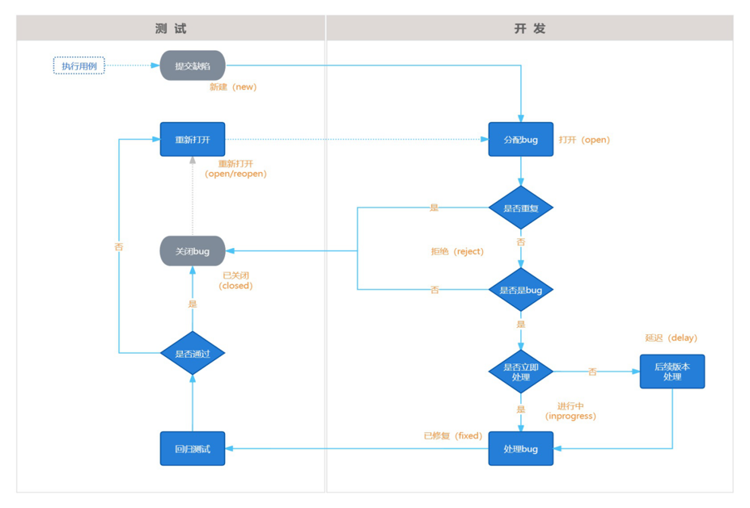
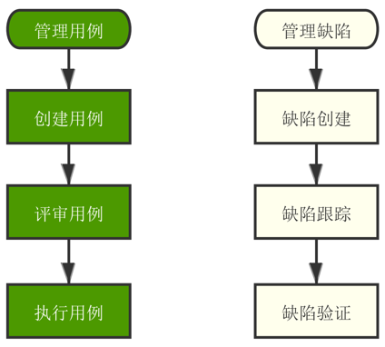
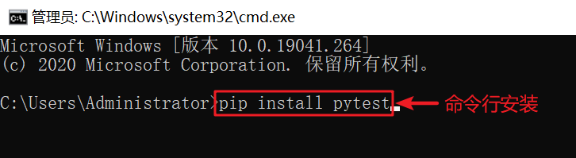
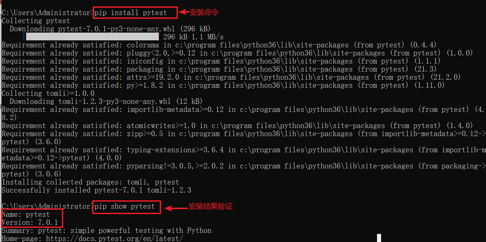
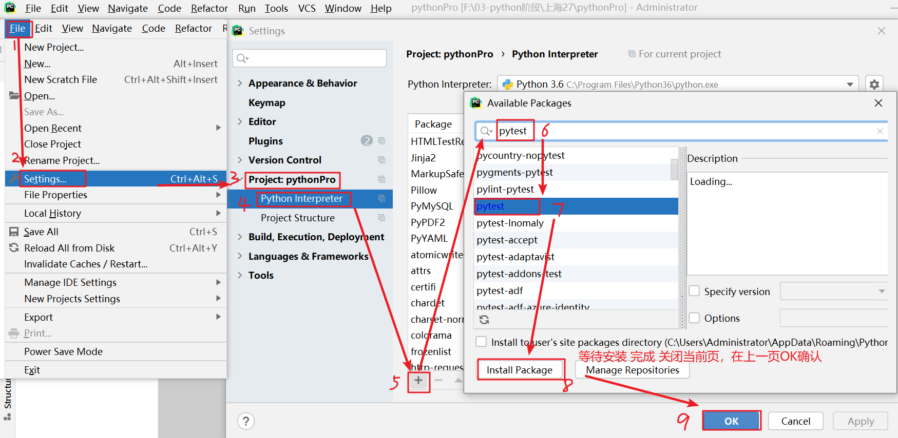
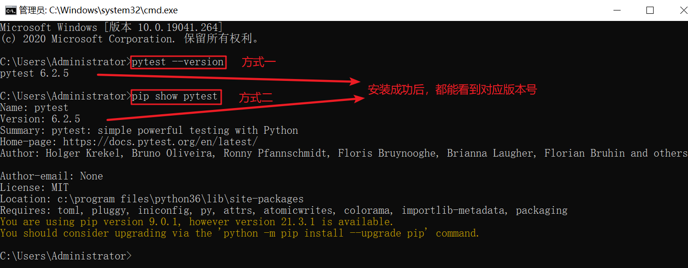
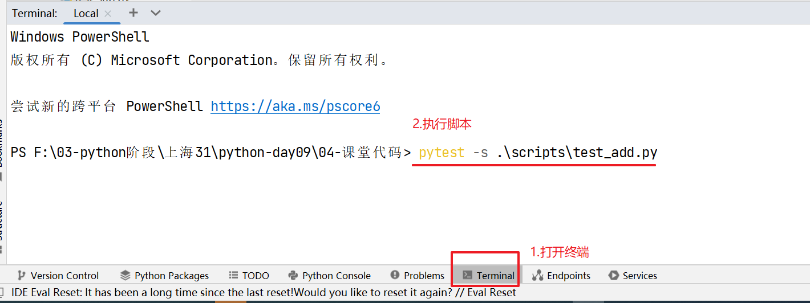
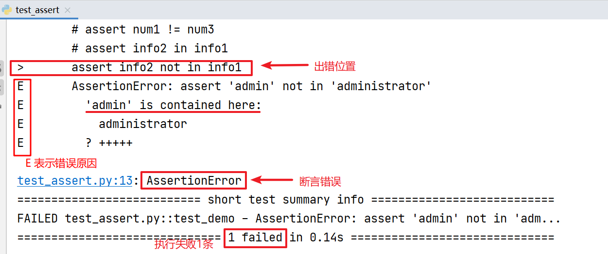
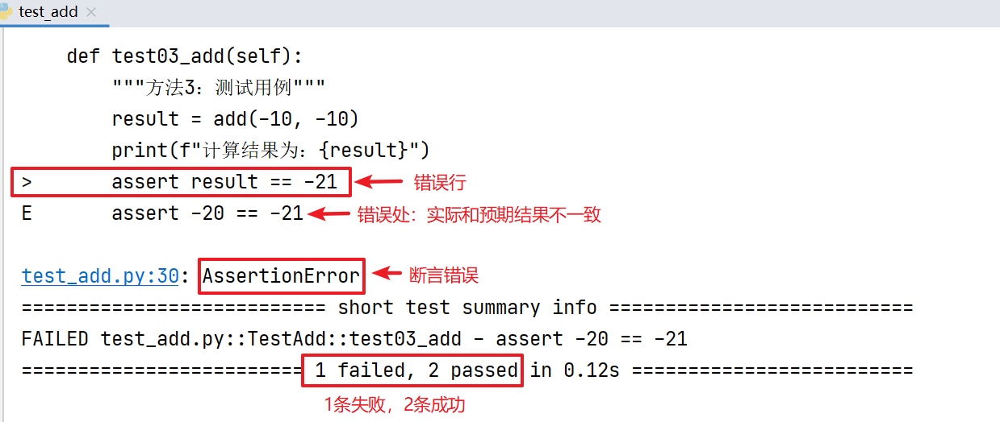

# 测试理论学习

## 基础知识

- 软件：控制计算机硬件的工具
- 软件系统构成：客户端+服务端+数据库
- 软件测试：用技术手段验证软件是否满足使用需求
- 软件测试目的：减少软件BUG，保障软件质量，降低软件潜在风险
- 主流技能：
  - 功能测试
  - 自动化测试
  - 接口测试
  - 性能测试

### 软件测试分类

- 按阶段划分：
  - 单元测试：针对程序源代码进行测试（开发）
  - 集成测试（接口测试技能）：又称组装测试，针对模块之间功能交互进行测试
  - 系统测试（功能测试技能）：对整个系统进行全面测试
  - 验收测试：以用户代表为主进行验证，是否符合预期需求（用户）
- 按代码可见度划分：
  - 黑盒测试：
    - 源代码不可见
    - UI功能可见
    - 只关注数据输入结果输出
  - 白盒测试：
    - 源代码可见
    - 代码逻辑可见
    - UI功能不可见
    - 只关注代码本身语法逻辑
  - 灰盒测试
    - 部分源代码可见
    - UI功能不可见
    - 输入输出+部分代码逻辑
  - 其他测试
    - 冒烟测试：对核心功能进行验证
      - 保障提测内容具有可测性

        ```mermaid
        graph LR
        A[开发编码] ---> B[自测]
        B ---> C[提测]
        C ---> D[冒烟测试]
        D ---> E[全面测试]
        E ---> F[软件测试]
        A ---> F
        D --->|不通过| A
        ```

    - 回归测试:对已修复的BUG/更新后的功能再次进行测试
      - 保障修复后的功能不影响其他功能
      - 保障修复后的功能符合需求

        ```mermaid
        graph LR
        A[开发编码] ---> B[软件测试]
        B ---> C[发现缺陷]
        C ---> D[开发修复]
        D ---> E[回归测试]
        E ---> F[结束]
        A ---> D
        E --->|不通过| D
        ```

### 质量模型

- 功能性：软件是否具有某方面能力
- 性能：多用户同时使用能否满足要求（时间，资源）
- 兼容性：在不同设备/平台上能否正常使用
- 易用性：易学易用，用户粘性好
- 安全性：敏感数据存储/传输安全
- 可靠性：长时间运行稳定，不出现异常
- 可维护性：代码质量好，文档完善
- 可移植性：在不同平台上运行稳定

### 测试流程

- 需求评审
- 测试计划设计
- 测试用例设计
- 测试用例执行
- 缺陷管理
- 测试报告

## **测试用例设计**

- 测试用例：用户使用的案例
- 为了特定的目的编写的可执行文档
- 写测试用例的目的：
  - 防止漏测
  - 实施测试的标准
  - 测试人员工作量化的体现

### 测试用例编写格式说明(八要素)

- 用例编号：项目_模块_编号(英文简称)
- 用例标题：预期结果(测试点)
- 模块/项目：所属项目或模块
- 优先级：表示用例的重要程度或者影响力p0-p4(p0最高)
- 前置条件：要执行此条测试用例，有哪些前置操作，没有可以不写(没有它无法进行)
- 测试步骤：描述操作步骤(怎么做的过程)
- 测试数据：操作的数据，没有可以为空
- 预期结果：期望达到的结果

### 如何编写测试用例

- 明确测试目的
- 基于需求覆盖各种可能场景
- 根据用例模板编写对应文档

### 测试用例设计方法（针对黑盒测试）

- 等价类划分
- 边界值分析
- 判断表法
- 场景法(流程图)
- 错误推断法

### **等价类划分法**

- 适用场景：针对有批量数据测试的场景，无法穷举测试时可以使用
- 页面功能常常包括以下元素：
  - 输入框（典型代表）
  - 下拉列表
  - 单选复选框
- 等价类：在所有测试数据中，按具有某种**共同特征**的数据集合进行划分
  - 有效等价类：满足需求的数据集合 --> (全部满足)
  - 无效等价类：不满足需求的数据集合 --> (只要有一个不满足即可)
- 步骤
  - 1.明确需求 --> 搞清楚测试目的和条件
  - 2.划分有效和无效等价类 --> 有效  无效
  - 3.提取数据编写测试用例 --> 选择不同类里面一组数据写用例
- 通过选取不同等价类中的代表性案例，就可以实现对测试用例的覆盖
- 选取无效案例时，确保只有一个条件不满足，多个条件不满足没有意义

### **边界值分析法**

- 适用场景：针对有边界范围的批量测试无法穷举时，数据的输入场景（重点在边界）
- 范围节点：
  - 上点：边界上的点（刚好等于）
  - 离点：举例上点最近的点（刚好大于，刚好小于）
  - 内点：区间范围内的点（区间范围内的数据）
- 步骤：
  - 明确需求（测试目的+测试条件）
  - 确定有效和无效等价类
  - 确定边界范围值（和步骤2合并）
  - 提取数据编写测试用例
- 可以和等价类划分法结合使用
- 范围优化：
  - 结论：7个点优化成5个点
  - 上点，内点必选
  - 离点：根据范围区间开闭，选择开内闭外，即开区间选择内部的离点，闭区间选择外部的离点
  - 可以说是上点和离点的属性是相反的，上点有效时，离点无效；上点无效时，离点有效

### **判定表法**

- 定义：是一种以表格形式表达多条件逻辑判断的工具
- 组成：
  - 条件桩：列出问题中的所有条件，列出条件的次序无关紧要。
  - 动作桩：列出问题中可能采取的操作（可以有多个），操作的排列顺序没有约束。
  - 条件项：列出条件对应的取值，所有可能情况下的真假值。
  - 动作项：列出条件项的、各种取值情况下应该采取的动作结果。
- 规则：
  - 判定表中贯穿条件项和动作项的一列就是一条规则
  - 假设有n个条件，每个条件的取值有两个(0,1)，全组合有2的n次方种规则
- 步骤：
  - 明确需求
  - 画出判断表：
    - 列出条件桩和动作桩
    - 填写条件项，对条件进行全组合
    - 根据条件项的组合确定动作项
  - 根据规则编写测试用例
- 适用场景：
  - 有多个输入条件，多个输出结果，输入条件之间有组合关系，输入条件和输出结果之间有依赖(制约/因果)关系
  - 适用条件个数不宜过多（不超过4个，如果超过建议使用因果图法）

### **场景法(流程图法)**

- 说明：场景法也可以叫流程图法，是用流程图描述用户的使用场景，然后通过覆盖流程路径来设计测试用例
- 适用场景：
  - 根据用户正常使用的各种业务场景（功能组合），验证产品是否满足需求的过程
  - 一般开发提测之后，先进行业务流程测试
- 使用步骤：
  - 根据流程图找出路径（多少条）
  - 根据路径编写用例（每条路径对应一条用例）

### **错误推测法**

- 通过经验/智慧推测系统可能出现的问题
- 一般遵循2/8原则，即80%的问题源于20%的模块（已经出现过问题的模块）
- 适用场景：
  - 时间紧迫：时间紧张且任务量大时，根据之前项目类似经验找出易出错的模块重点测试
  - 时间宽裕：通过该方法列出之前出现问题较多的模块再次测试1

## 软件的缺陷及管理

- 定义：软件在使用过程中存在的任何异常问题都叫软件的缺陷，简称bug
- 缺陷判断标准：
  - 软件未实现需求(规格)说明书中明确要求的功能 –> 少功能
  - 软件实现的功能超出需求(规格)说明书指明的范围 –> 多功能
  - 软件出现了需求(规格)说明书中指明不应该出现的错误 –> 功能错误
  - 软件未实现需求(规格)说明书中虽未明确指明但应该实现的要求 –> 隐性功能错误
  - 软件难以理解，不易使用，运行缓慢，用户体验不好 –> 不易使用
- 缺陷原因分析：
  - 需求分析问题：需求描述不易理解，有歧义、错误等
  - 设计问题：设计文档存在错误或者缺陷
  - 编码问题：代码出现错误
  - 运行阶段：软硬件系统本身故障导致软件缺陷
- 缺陷的生命周期：缺陷注入、缺陷发现、缺陷清除

### 缺陷报告的构成和编写

- 【前置】用例执行步骤
  - 待测用例：准备待测试用例，最后添加一列执行结果
  - 待测软件：开发提测后，运行待测软件
  - 判断结果：判断实际结果是否和预期一致，一致测试通过（pass），不一致（fail）提交缺陷报告
- 缺陷构成的核心要素：
  - 缺陷的标题：
    - 描述缺陷的核心问题
    - 测试条件+实际结果（预期结果）
  - 缺陷的预置条件：
    - 缺陷产生的前提
    - 和用例预置条件一致
  - 缺陷的复现步骤：
    - 复现缺陷的过程
    - 测试步骤+测试数据
  - 缺陷的预期结果
    - 希望得到的结果
    - 和用例预期结果一致
  - 缺陷的实际结果
    - 实际得到的结果
    - 和用例预期结果不一致
  - 缺陷的必要附件
    - 图片，日志等信息（证据）
    - 可选项
- 缺陷的其他要素
  - 缺陷报告编号：
    - 缺陷的唯一性标志
    - 根据工具自动生成
  - 严重程度：(破坏程度：主要给产品，开发看)
    - 严重（S1）：主功能
    - 一般（S2）：次要功能
    - 微小（S3）：易用性、界面
    - 建议（S4）：建议性问题
  - 缺陷优先级：(严重程度，主要给开发看)
    - P0:2小时内修复
    - p1:24小时内修复
    - p2:3~5天内修复
    - p3:当前版本修复
    - p4:未来版本修复
  - bug问题：
    - 功能问题（代码错误、设计缺陷、数据）
    - 兼容性问题、性能问题、易用性问题
    - 其他问题（UI界面、架构等）
  - 缺陷状态：(缺陷的生命周期)
    - New:新建
    - Open:打开
    - Closed:关闭
    - Postponed:延期
    - Reopened:重新打开

### 缺陷管理

- 面试官提问：
  - 你是如何处理缺陷的？
  - 测试和开发是如何交互的？
- 缺陷跟踪流程：
  - 目的：搞清楚工作中如何跟开发协同处理bug，直到bug修复完成（关闭）
    
- 缺陷报告编写规范
  - 准确性：描述的信息是正确的
  - 简洁易懂：描述的简单易理解
  - 具体：有细节且是真实有效的
  - 次序清晰：描述缺陷的过程有条件，有先后顺序
- 注意事项
  - 可复现：缺陷可以复现
  - 唯一性；一个缺陷上报一个问题
  - 规范性：符合公司或者项目规范
- bug不可复现怎么办？
  - 从严重级出发，严重级别低，可以暂时不考虑（后续尝试复现）；级别高，需要分析排查
  - 思考自己的测试过程，是否和设计步骤，思考测试环境
  - 寻求协助：测试老员工，开发协助（记录出现问题的时间，查询对应时段的日志，分析日志）
  - 如果没有日志，需要开发给一个有调试日志的版本，后续连续跟踪三个版本后，再未复现，此时放弃
  - 后续版本再次出现，直接转/提正式bug，详细描述你的复现过程
- 不可复现的bug如何处理？
  - 由内到外：替换+排除+外援

### 缺陷管理工具

- 主流：
  - 国内：禅道（部分免费）
  - 国外：JIRA（收费）
- 其他：
  - QC,TAPD,PingCode,Bugzilla...
- 禅道介绍：
  - 特点：
    - 国产、免费、开源、简单、轻量级
    - 三管融合(产品管理、项目管理、质量管理)
- 使用流程：


## 项目实战

### 如何展开测试

- 需求评审
  - 看懂理解，达成一致
  - 找出重点，预估时间
  - 谁主导 -->产品经理（评审会）
  - 谁参与 --> 产品，开发测试
  - 评审目的 -->
    - 对于需求的理解一致
    - 找重点，预估时间
- 编写测试计划
  - 预估重点时间
  - 谁写？测试负责人
  - 写什么？时间范围方法资源
- 用例编写
  - 提取测试点+质量模型+用例设计方法
  - 基于分析编写用例
- 用例执行
  - 用例准备，添加执行结果
  - 缺陷管理，提交BUG
- 缺陷管理
  - 跟踪缺陷管理
- 测试报告
  - 测试完成标志
  - 谁写？每个人都写，最后由一人汇总
  - 写什么？过程记录【用例数，BUG数，资源】
  - 自动化后可由代码生成测试报告

## web自动化优化

> 思考：实际项目如果直接按照操作步骤写代码存在什么问题？
>
> - 代码量大，而且冗余比较多
> - 维护成本高，出错不易排查

> 如何解决上述问题？--> 代码的封装思想 【通过函数/面向对象思想将独立功能的代码块进行封装】
>
> - PO：page object【页面对象】 --> 将独立的单个页面封装到函数/类中
> - script：--> 管理测试用例

- 核心业务初步封装实现

  - 基本事项

    ```markdown
    1. 减少重复代码编写，方便维护
    2. 对于公共操作封装函数方便别人调用
    3. 隐藏函数（代码）内部细节
    ```

  - 项目结构：搭建web自动化项目目录结构

    - `page`：存放具体的页面每个操作（每个页面一个模块）
    - `script`：存放页面的测试脚本/用例（操作过程）
    - `config.py`：项目的配置信息
    - `tools.py`：公共操作(全局)

  - 实现难点

    - 页面元素定位容易出差
    - 时间等待没有，导致错误
    - 函数的思想不熟悉【page包、script包、tools模块、config模块分别干啥的？】

    ```markdown
    1. 定义函数的时候为啥需要参数？ 如果函数中需要有变化的数据，就考虑使用形参
    2. 编写函数代码的范围不清楚（缩进）？是函数内部的操作，就需要缩进并放在函数里面，否则不需要
    3. 代码内部逻辑不清楚？
    - page模块：当前页面的操作
    - script模块：具体测试过程【参考测试用例里面的测试步骤+测试数据+预期结果】
    ```


## UI自动化封装思想

> 代码编写过程思考问题：
>
> 1. 为什么需要封装（函数/类）？
>
> 2. UI自动化代码怎么封装？
> 3. 封装的难点？

- 问题1：为什么需要封装（函数/类）？

```markdown
1.为什么需要封装（函数/类）？
- 解决代码冗余/重复编写的问题，提高测试效率
- 方便自己或者别人使用（调用）
- 可以隐藏代码内部细节，简化复杂度
```

- 问题2：UI自动化代码怎么封装？

```markdown
2.怎么封装？
- 前置工作
	- 明确UI自动化测试框架（Web）：Python（语言） + Selenium/Appium（库/工具） + Pytest 框架
	- 将框架中对应的工具分别安装即可
- 具体封装过程
	- 创建项目的目录结构：page包（独立页面的操作步骤）、script包（测试用例）、config.py文件、tools.py文件
	- 编程思想：分层思想（将页面具体操作和测试场景对应的数据分离，让测试更灵活，能动态覆盖多种场景）
- 举例说明
```

- 问题3：封装的难点？

```markdown
3. UI自动化测试过程中碰到了哪些问题？如何解决的？
- 碰到的问题：
	- 对于复杂页面定位元素出现定位不到
	- 页面出现frame框架，导致页面嵌套定位不到
	- 断言不好处理，尤其弹窗，时间特别短不好抓取元素
- 解决方法：
	- 代码操作太快，没有添加等待，导致失败，添加强制等待、隐式等待、显示等待
	- 通过切换frame操作解决
	- 通过f12将页面无关联的代码收起来，操作后快速截取js代码及html代码；问开发要对应页面源代码
```
- config配置文件
```markdown
- 配置文件：config.py
	- 配置测试环境、生产环境、测试数据、日志配置等
  - 可以将项目默认的配置信息，如：测试环境、生产环境、测试数据、日志配置等，写在config.py文件中
```


## 抓包
目的：定位前后端问题
### 网络传输协议(HTTP/HTTPS)
- 说明：请求和响应的内容各自包括三个部分。
#### 请求
- 请求行：请求方法、URL、协议版本
- 请求头：请求的元数据，如：请求的来源、请求的类型、请求的时间等
- 请求体：请求的具体数据，如：表单数据、JSON数据等  

- URL（网址）=协议://主机地址(IP地址或域名):端口号/路径?参数名=参数值&参数名=参数值
- 示例：


- 默认端口号：https默认端口号为443，http默认端口号为80
  - 如果端口号不写，默认使用http协议，端口号为80；如果使用https协议，端口号为443
- 请求方法：
  - http请求中四个常见请求方法：GET、POST、PUT、DELETE
  - `GET`：获取资源
  - `POST`：提交数据
  - `PUT`：更新资源
  - `DELETE`：删除资源

- 请求参数：
  - 格式：参数名=参数值
  - 多个参数用“&”连接

#### 响应
- 响应状态码：
  - 2xx：成功,如200、201
  - 3xx：重定向,如301、302
  - 4xx：客户端错误,如404（未找到）、400（请求错误）、401（未授权）、403（禁止访问）
  - 5xx：服务器错误,如500、502
  - 一般客户端出问题，状态码以4开头；服务器端出问题，状态码以5开头
- 常见响应码：


- 响应体：
  - 响应的：服务器返回给客户端的数据内容。常见内容：HTML、Json、TXT、图片等

### HTTP相关介绍

> 协议：网络通信使用一套规则。【扩展计算机网络：网络七层模型（理论）、TCP/IP四层模型（实际）】
>
> HTTP：超文本（文字、图片、音频、视频）传输协议，访问网络中资源常使用的一种协议。默认端口号：80
>
> HTTPS：安全的超文本传输协议。默认端口号：443
>
> HTTP包含：HTTP请求（**请求行**、请求头、**请求体**） + HTTP响应（**响应行**、响应头、**响应体**）

- **URL：** 表示网络资源的存储位置

  - 构成：`协议://域名或IP:端口号/资源路径?查询参数`
  - 必填：`协议://域名或IP:端口号`   如果是协议默认的端口号，可以不写

- 网络协议：计算机通信的规则

  - 常见应用层协议：HTTP、SSH等

- HTTP介绍

  - 超文本传输协议：传输html页面文档信息的协议【默认端口80，安全传输用HTTPS协议，默认端口443】
  - HTTP构成
    - HTTP请求：请求行、请求头、请求体
    - HTTP响应：响应行、响应头、响应体
  - **HTTP常见请求方法**
    - GET：从服务器获取资源（查）
    - POST：在服务器新建一个资源（增）
    - PUT：在服务器更新资源（改）
    - DELETE：从服务器删除资源（删）
  - 请求头：表示请求体数据类型
    - application/json： JSON数据格式
    - application/x-www-form-urlencoded： 表单默认的提交数据格式
  - **响应状态码**
    - 2xx：成功 【200】
    - 3xx：重定向 【301、302】
    - 4xx：客户端错误 【401、403、404】
    - 5xx：服务器端错误 【500、503】

- **面试题**

  > 1. HTTP请求方法中，get请求和post请求有啥区别？
  >
  > 2. 常见HTTP的响应状态码有哪些？分别表示啥意思？
  >
  > 3. HTTP和HTTPS区别？
  
  ```yacas
  1.http请求方法中，get请求和post请求有啥区别？
  - 是否有请求体：一个有请求体一个没有请求体
  - 参数位置：发送请求携带参数位置不同
  - 参数大小：携带参数大小一个受限制，一个不受限制
  - 是否安全：一个不安全，一个相对安全
  - 方法作用：get查询、post任意
  - 是否缓存：get有缓存，post没有
  - 支持编码：get请求的URL编码是ASCII，post请求的请求体数据编码任意类型
  ```

  ### 抓包工具
- 抓包（packet capture）：使用工具抓取客户端与服务器交互数据包的操作
- 数据包：客户端与服务器相互交互的内容
- 常见抓包工具：F12，**Charles**，Fiddler等
- 为什么抓包？
  - 定位前后端bug
  - 弱网测试
  - 绕过界面限制进行测试
- 如何区分前后端bug？
  ① 如果抓不到请求或请求有误是前端问题；
  ② 如果有请求但是没响应，那就是后端的问题；
  ③ 如果有请求也有响应，需要查看响应信息，如果返回报错了，则需要具体分析报错内容。

- 工具介绍
**Charles**是一款在Mac下常用的数据包截取工具，在做移动开发时，为了调试移动端与服务端的网络通讯协议， 常常需要截取网络数据包来进行分析
原理：

在客户端和服务端设置代理服务，使用工具截取数据包，这就是抓包


## Charles抓包

> 作用：常常用于分析定位bug
>
> - **会抓包并过滤**（重点掌握这个）
> - 模拟弱网测试
> - 绕过界面（拦截请求修改），模拟测试后台接口
>
> Charles和Fiddler区别：
>
> - 支持的操作系统比较多：Windows、macOS、Linux
> - Charles收费（免费试用时间30天）


### 抓取HTTPS的数据包设置

1. 浏览器运行允许HTTPS代理

   

2. Charles设置`Proxy -- SSL Proxying Settings` 

   

3. 电脑安装Charles的根证书

   


### 抓包并设置过滤

```yacas
抓包步骤：
- 打开Charles工具，开启代理设置（Proxy Settings...）
- 打开默认浏览器(浏览器也需要设置代理)，输入待抓包的地址，回车/刷新
- 查看会话列表抓取到的数据包（按照域名找到对应的数据包）
```

- 开启代理（`Proxy --> Proxy setting--> enable transparent HTTP proxying`）

  

- 设置过滤抓包（`Proxy --> Recording Settings...`）

  > **注意：添加过滤时，Host里面存放的只能是IP或域名**

  

- 抓取对应数据包

  > 通过工具栏，清除工具，清除会话信息之后再操作浏览器抓取新包
  >
  > - 抓取线上tpshop首页数据包并过滤

  

### 手机抓包步骤

> 前提：如果是使用Charles抓移动端数据包， 一定要保证手机和电脑（安装Charles电脑）连的是**一个局域网**（ 同一个WIFI）
>
> 注意：细节实现过程参考`Charles抓包工具V2.0`文档
>
> - **如果手机端抓取HTTPS的数据包，需要安装Charles证书到电脑和手机端，Android7.0以上版本需要root才行**

#### 设置步骤

- 开启Charles代理

- 设置手机WiFi代理服务器

- 手机端安装Charles的证书

- 执行手机APP测试（手机浏览器访问HTTPS数据包测试）

#### 设置步骤截图

- 手机WiFi代理

  

- charles安装证书到移动端

  

  

- 浏览器下载安装：`http://chls.pro/ssl`

  

  
  
  

#### 设置手机白名单

> 手机设置代理后，无法访问外网时可以设置白名单


### 常见应用场景

#### 定位前后端bug

> 能够根据抓包工具定位前后端bug
>
> 面试：如何定位前后端bug？

- **问题分析**
  
  ```yacas
  # 发现bug，无法确定是前端还是后端的问题？
  bug:个人信息中性别信息前后台页面显示不一致
  # 通过抓包去定位，怎么抓包？
  1.浏览器输入访问服务器地址，回车发送请求，查看抓包工具中是否有数据包
  2.确定需要抓取哪个页面的数据包【上述问题的数据源于登录成功的接口响应--> 个人信息】
  3.抓取登录成功的数据包【进入登录页面，Charles中清空其他数据包，直接登录成功操作】
  4.进入Charles查看当前服务器地址下面的第一个/第二个数据包基本就是登录的数据包
  5.进一步查看数据包中请求体数据是否是页面输入的数据，如果是那就是登录的数据包
  6.看响应体的数据，从中获取与性别有关的字段值【需要对比数据库看是否和数据库存储的一致】
  ```
  
  - 数据库截图+抓包响应截图
  
  
  
  
  
- **定位思路**
  
  **①确认请求是否有问题，请求有问题-->前端**
  
  ```yacas
  如何确定请求的问题？ - 请求数据和页面输入的是否一致【用例中的测试数据】
  ```
  
  **②确认响应是否有问题，响应有问题-->后端**
  
  ```yacas
  如何确定响应的问题？ - 返回的数据和数据库是否一致
  ```
  
  **③请求响应都没有问题，但页面显示错-->前端**


- 练习题

  ```yacas
  问题：下单成功了，但是进入我的订单中查看不到定单信息，请问怎么分析定位？
  分析：
  1.先抓包，提交订单的数据包，看请求数据（商品信息、收货人信息、配送信息等）是否和页面显示一致；再看响应数据（订单号、订单时间等）是否和页面提示的信息一致；
  2.再抓包，查看订单列表信息的数据包，请请求的URL等信息是否正确【API接口文档】；再看响应数据中是否有对应的订单编号，如果搜索不到，说明是后端问题
  3.最后再去查数据库， 看下单的订单数据是否再订单表中存在，如果存在，说明数据库没有问题，可能是web服务器出现问题；如果不存在可能是数据库的问题或者web服务执行SQL没有成功等原因导致。
  ```

  


#### 弱网设置

> 弱网延时和带宽设置--> 模拟不同网络


- 使用fiddler时可以计算延迟时间（1KB或者1MB）

  

- Charles设置弱网操作界面

  

- 具体模拟测试步骤

  - 不开启弱网，用正常网络访问页面，抓取对应数据包查看传输时间【Duration】
  - 设置好弱网参数后，开启弱网，再次访问上述同一页面，抓取对应数据包查看传输时间
  - 对比两次访问的【Duration】时间变化

  

#### 绕过界面做接口测试

> 场景：页面部分异常数据，在前端做限制了，无法测试，可以绕过界面做接口验证测试。

- 项目案例

  ```yacas
  例如：
  1.注册登录中如果手机号超过11位长度测试，如果超过11位，页面可能无法输入测试，可以绕过界面测试
  2.购物车商品数量有上限200的限制，页面无法输入201，可以绕过页面做接口结果测试
  ```

  - 拦截请求：测试后台接口【后台逻辑正确】
  - 拦截响应：测试页面显示【变形、报错】

- 操作步骤

  


## Pytest框架

> 框架：解决一类事物的(工具)功能集合，简称 Framework
>
> 目的：通过pytest框架编写自动化测试脚本，统一管理用例，提高工作效率

### pytest测试框架

- 定义：Python第三方的单元测试框架（测试可以做**自动化测试**）

- 特点：

  - 能够组织多个自动化测试用例执行
  - 方便实现参数化，提供断言简单方便（通过脚本自己去判断对错[预期结果和实际结果]）
  - 能够生成测试报告（通过脚本自动生成报告）

- pytest安装

  - 命令行安装

    ```python
    # 在cmd/终端命令行下输入如下命令回车
    # windows系统
    pip install pytest
    # macOS系统
    pip3 install pytest
    # 查看安装包
    pip show pytest  # windows
    pip3 show pytest  # macOS
    # 查看安装结果
    pytest --version
    ```

    

    

  - pycharm安装

    

    

- 安装验证

  - 命令行验证（任选一种即可）：
    - 方式1：`pytest --version`
    - 方式2：`pip show pytest`

  

  

### ==pytest基本使用:black_flag:==

> 创建.py文件通过pytest框架编写的代码 （测试用例）
>
> **注意事项**：
>
> - 项目路径下创建**包**【注意不是文件夹】
> - 命令行执行测试用例时，注意被执行文件的路径

- 定义被测函数

  - 创建`api`的包：存放的被测一些模块（开发/测试）

  - 在`api`文件夹下面创建被测py文件：`calc.py`

    ```python
    def add(x, y):
        """加法"""
        return x + y
    ```

- 测试用例定义（创建测试用例过程）

  > 创建`scripts`的包
  >
  > 在该包下面创建py文件，以test开头：`test_add.py`

  - 1.导包：`import pytest`
  - 2.定义测试类（类名建议以**Test**开头，**不能使用中文，不能出现init方法**）
  - 3.定义测试方法，方法名**必须**以test开头

  

- 测试用例执行

  - pycharm 主程序模式

    - 调用`pytest.main()`，注意必须在 ：`if __name__ == "__main__"`下执行

      ```python 
      pytest.main(["-s","测试模块文件名.py"])
      # -s :在控制台显示print打印信息
      # 测试模块文件名.py :执行这个文件的所有测试类（及对应测试用例）
      # 注意：小括号中必须有[]
      ```

    

    

  - **pycharm的终端命令行执行【推荐】**

    > 注意：Windows系统，通过右键管理员权限打开pycharm，否则可能出现执行命令无响应问题

    - `pytest -s 测试模块文件名.py`

      

- 案例演示

  ```python
  from api.calc import add  # 快速移动一行代码 ctrl+shift + 上下光标
  import pytest
  
  
  # 定义测试类
  class TestAdd(object):
  
      # 定义测试方法【测试脚本/用例】
      def test01_add(self):
          # 调用被测函数/方法
          res = add(10, 20)  # 快捷导包/模块   alt+enter
          # 打印返回结果
          print(f"计算结果1为：{res}")
          # 断言结果
          assert 30 == res
  
      def test02_add(self):
          res = add(-10, 20)
          print(f"计算结果2为：{res}")
          assert 11 == res  # 会断言失败
  
  
  # 方式1
  # if __name__ == '__main__':
  #     pytest.main(["-s","test_add.py"])  # -s表示pytest命令执行控制台显示print的结果
  ```

### ==pytest批量执行用例:black_flag:==

> 如何批量执行多个模块的测试用例？
>
> - 通过pytest.ini的配置文件可以灵活调整执行哪些用例

- pytest配置文件说明

  - 在项目目录下创建`pytest.ini`的配置文件

- 文件内容第一行为：`[pytest]`

  - 运行pytest的测试用例时会使用该配置文件

- pytest常见配置内容

  ```python
  [pytest]
  # 添加命令行参数 -s  print结果终端打印出来
  addopts = -s --html=report/报告文件名.html
  # 文件搜索路径
  testpaths = ./scripts
  # 文件名称
  python_files = test*.py
  # 类名称
  python_classes = Test*
  # 方法名称
  python_functions = test*
  ```

- 案例演示

  ```python
  # 以pytest框架编写测试脚本
  from api.calc import sub
  
  
  # 定义测试类
  class TestSub(object):
  
      # 定义测试方法
      def test01_sub(self):
          # ①调用函数
          res = sub(10,20)
          # ②打印结果
          print(f"减法结果1：{res}")
          # ③断言结果
          assert -10 == res
  
  
      def test02_sub(self):
          # ①调用函数
          res = sub(-10, 20)
          # ②打印结果
          print(f"减法结果2：{res}")
          # ③断言结果
          assert -30 == res
  
  ```

### setup和teardown的引入

- 引入案例

  ```python
  import time
  
  class TestFixture(object):
      def a1(self):
          """普通方法1"""
          print("开始时间=",time.time())
          time.sleep(1)
      def b1(self):
          """普通方法2"""
          print("结束时间=",time.time())
  
      def test01(self):
          self.a1()  # 执行前：先调用a1
          print("这个是：test01")
          self.b1()  # 执行后：再调用b1
  
      def test02(self):
          self.a1() # 执行前：先调用a1
          print("这个是：test02")
          self.b1()  # 执行后：再调用b1
  ```

- 存在问题：测试用例执行前后都有重复操作，能否避免？

- 解决办法：通过setup和teardown可以解决

### setup和teardown的介绍

> Fixture装置
>
> - setup : 前置处理
> - teatdown : 后置处理
>
> 作用：对测试用例执行环境的初始化（前置）和销毁（后置）操作
>
> - 固定装置：**就是一种 代码结构**
> - 通过有两种不同的级别控制（两种不同的代码结构）

- 方法级别的控制

  - 在类中执行测试用例时，**每个测试用例**分别都需要操作一次的应用可以定义为方法级别

  - 语法格式

    ```python
    # 初始化（前置处理）
    def setup_method(self):
        pass
    # 销毁（后置处理）
    def teardown_method(self):
        pass
    # 注意：执行每个测试用例（方法）前后会被自动执行无需调用
    ```

  - 案例演示

    ```python
    # 以pytest框架编写测试脚本
    from api.calc import sub
    
    
    # 定义测试类
    class TestSub(object):
        # 前置打印打开计算器操作
        def setup(self):
            print("打开计算器....")
        # 后缀打印关闭计算器操作
        def teardown(self):
            print("关闭计算器....")
        # 定义测试方法
        def test01_sub(self):
            # ①调用函数
            res = sub(10,20)
            # ②打印结果
            print(f"减法结果1：{res}")
            # ③断言结果
            assert -10 == res
    
    
        def test02_sub(self):
            # ①调用函数
            res = sub(-10, 20)
            # ②打印结果
            print(f"减法结果2：{res}")
            # ③断言结果
            assert -30 == res
    
    ```

- 类级别的控制

  - 在类中执行测试用例时，**只需要操作一次**的应用可以定义为类级别

  - 语法格式

    ```python
    # 初始化（前置处理）
    def setup_class(self):
        pass
    # 销毁（后置处理）
    def teardown_class(self):
        pass
    # 注意：执行每个测试类前后会被自动执行执行一次
    ```

  - 案例演示

    ```python
    # 以pytest框架编写测试脚本
    from api.calc import sub
    
    
    # 定义测试类
    class TestSub(object):
        # 前置打印打开浏览器操作
        def setup_class(self):
            print("打开浏览器....")
        # 后缀打印关闭浏览器操作
        def teardown_class(self):
            print("关闭浏览器....")
        # 定义测试方法
        def test01_sub(self):
            # ①调用函数
            res = sub(10,20)
            # ②打印结果
            print(f"减法结果1：{res}")
            # ③断言结果
            assert -10 == res
    
    
        def test02_sub(self):
            # ①调用函数
            res = sub(-10, 20)
            # ②打印结果
            print(f"减法结果2：{res}")
            # ③断言结果
            assert -30 == res
    
    if __name__ == '__main__':
        pytest.main(["-s", "test_sub.py::TestSub::test02_sub"])
        # 中括号中指定执行某条测试用例，   "文件名.py::类名::方法名"
    
    ```

- 注意事项

  > - setup_method、teardown_method是针对于普通的用例前置执行的方法【按照用例在每个用例前后都执行】
  > - setup_class、teardown_class是针对于整个类的用例前置执行的方法【按照类级别执行一次】
  > - 上述前后置方法在执行测试用例时自动调用执行
  > - 不是每个前置和后置的操作必须成对出现，关键是看需要哪个就用哪个

## 3.==断言:black_flag:==

> 定义：让程序代替人去判断代码执行的结果和预期结果是否一致
>
> 目的：提高测试效率（无人值守状态下执行）
>
> 位置：在测试用例中（测试方法）

- pytest断言：在pytest中使用`assert 表达式`直接断言

- 常见断言方法

  ```python
  # 相等表达式右边的是预期结果
  # 1.判断 a==b
  assert a==b
  # 判断 a!=b
  assert a!=b
  # 相等表达式左边边的是预期结果
  # 2.判断b包含a
  assert a in b
  # 判断b不包含a
  assert a not in b
  # 3.判断x为真
  assert x   # assert x == True
  # 判断x为假
  assert not x
  ```

- 案例演示

  ```python
  import pytest
  
  class TestAssert(object):
      """测试断言类"""
  
      def test_demo(self):
          """测试断言方法"""
          info3 = True
          assert 10 == 10  # 判断相等  --> 通过.
          assert 10 != 20  # 判断不相等 --> 通过.
          assert "admin" in "administrator"  # 判断包含  --> 通过.
          assert "admin" not in "administrator"  # 判断不包含 --> 失败 E
          assert info3  # 判断为真 --> 通过.
          assert not info3  # 判断为假 --> 失败 E
  
  if __name__ == '__main__':
      pytest.main(["-s", "test_assert.py"])
  ```

  

- 断言使用

  - 在测试方法（测试用例）中直接使用断言方法即可
  - 每个测试方法可以使用一个断言，也可以使用多个

- 案例演示

  ```python
  # 1.导包
  import pytest
  from api.calc import add  # 快速移动行代码: ctrl+shift + 上下光标键
  
  
  # 2.定义测试类
  class TestAdd(object):
      """测试类：测试加法功能"""
  
      # 3.定义测试方法：测试用例
      def test01_add(self):
          """方法1：测试脚本（用例）"""
          # 3.1 调用被测函数
          result = add(10, 20)  # 导包快捷键：alt+enter
          # 3.2 打印返回结果
          print(f"计算结果为：{result}")
          # 3.3 断言结果【预期结果和实际是否一致】
          assert result == 30  # result是实际结果（函数实际计算返回的），30是预期结果
  
      def test02_add(self):
          """方法2：测试用例"""
          result = add(-10, 10)
          print(f"计算结果为：{result}")
          assert result == 0
  
      def test03_add(self):
          """方法3：测试用例"""
          result = add(-10, -10)
          print(f"计算结果为：{result}")
          assert result == -21
  
  
  # 方式1:运行测试用例（脚本）
  if __name__ == '__main__':
      # pytest.main(["-s"])
      pytest.main(["-s", "test_add.py"])
  
  ```

  
